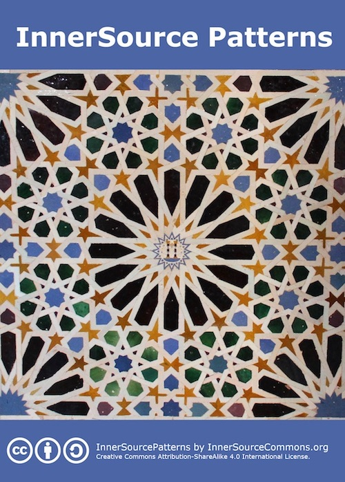

# InnerSource Patterns

This repository contains the InnerSource Patterns collected by the [InnerSource Commons][isc-website]. These patterns are InnerSource best practices codified in a specific format to make it easy to understand, evaluate, and reuse them.

If you are here for the first time, you may start by reading our most mature patterns, published at [innersourcecommons.gitbook.io/innersource-patterns](https://innersourcecommons.gitbook.io/innersource-patterns/).

Below you find [what a pattern is](#what-are-innersource-patterns), a [list of known patterns](#list-of-patterns), and [how to use these patterns](#how-can-you-use-innersource-patterns) in your organization.

You are already using InnerSource in your company and want to share your ideas and experiences with the world? We would love to [welcome your contributions](#how-to-contribute)!

[isc-website]: http://innersourcecommons.org

## Mission Statement

Our mission in this working group

- Collect and document agreed upon best practices of how to do InnerSource - in the form of patterns
- Continuously publish the most mature patterns as an ebook

## List of Patterns

The below lists all known patterns. They are grouped into three [maturity levels](https://github.com/InnerSourceCommons/InnerSourcePatterns/blob/master/meta/contributor-handbook.md#maturity-levels).

### Maturity Level 3: Validated

*Note: We don't have patterns in this stage yet, but are [actively working on leveling up patterns](https://github.com/InnerSourceCommons/InnerSourcePatterns/issues/186) into this maturity.*

### Maturity Level 2: Structured

* [30 Day Warranty](patterns/2-structured/30-day-warranty.md) - *a pattern for getting a reluctant code-owning team to accept code submissions from outside their team.*
* [Common Requirements](patterns/2-structured/common-requirements.md) - *Common code in a shared repository isn't meeting the needs of all the project-teams that want to use it; this is solved through requirements alignment and refactoring.*
* [Contracted Contributor](patterns/2-structured/contracted-contributor.md) - *Associates wanting to contribute to InnerSource are discouraged from doing so by their line management. Relief is provided by formal contracts and agreements.*
* [Dedicated Community Leader](patterns/2-structured/dedicated-community-leader.md) - *Select people with both communications and technical skills to lead the communities to ensure success in starting an InnerSource initiative.*
* [Gig Marketplace](patterns/2-structured/gig-marketplace.md) - *Establish a marketplace by creating an intranet website that lists specific InnerSource project needs as "Gigs" with explicit time and skill requirements. This will enable managers to better understand their employee’s time commitment and professional benefits thereby increasing the likelihood of garnering approval to make InnerSource contributions.*
* [Maturity Model](patterns/2-structured/maturity-model.md) - *Teams have started adopting InnerSource. The practice is spreading to multiple departments. Understanding of what constitutes an InnerSource project are wide spread though. The solution is to provide a maturity model to allow for teams to go through a self check and discover patterns and practices that they are not yet aware of.*
* [InnerSource License](patterns/2-structured/innersource-license.md) - *Two legal entities that belong to the same organization want to share software source code with each other but they are concerned about the implications in terms of legal liabilities or cross-company accounting. An InnerSource License provides a reusable legal framework for the sharing of source code within the organization. This opens up new collaboration options, and makes the rights and obligations of the involved legal entities explicit.*
* [InnerSource Portal](patterns/2-structured/innersource-portal.md) - *Create an intranet website that indexes all available InnerSource project information. This will enable potential contributors to more easily learn about projects that might interest them and for InnerSource project owners to attract an outside audience.*
* [Praise Participants](patterns/2-structured/praise-participants.md) - *Thank contributors effectively to engender further engagement from them and to encourage others to contribute*
* [Repository Activity Score](patterns/2-structured/repository-activity-score.md) - *The repository activity score is a numeric value that represents the (GitHub) activity of an InnerSource project.*
* [Review Committee](patterns/2-structured/review-committee.md) - *The InnerSource working model is a radical departure from more traditional approaches, for developers and managers alike. By establishing a review committee as an interface between the InnerSource initiative and all senior managers of business units participating in it, the latter are more likely to familiarise themselves with the initiative and support it, as it affords them a certain level of oversight and control without fostering micromanagement.*
* [Service vs. Library](patterns/2-structured/service-vs-library.md) - *Teams in a DevOps environment may be reluctant to work across team boundaries on common code bases due to ambiguity over who will be responsible for responding to service downtime. The solution is to realize that often it's possible to either deploy the same service in independent environments with separate escalation chains in the event of service downtime or factor a lot of shared code out into one library and collaborate on that.*
* [Trusted Committer](patterns/2-structured/trusted-committer.md) - *Many InnerSource projects will find themselves in a situation where they consistently receive feedback, features, and bug-fixes from contributors. In these situations project maintainers seek ways to recognize and reward the work of the contributor above and beyond single contributions.*
* [Standard Base Documentation](patterns/2-structured/project-setup/base-documentation.md) - *New contributors to an InnerSource project have a hard time figuring out who maintains the project, what to work on, and how to contribute. Providing documentation in standard files like README.md/CONTRIBUTING.md enables a self service process for new contributors, so that they can find the answers to the most common questions on their own.*
* [Issue Tracker Use Cases](patterns/2-structured/project-setup/issue-tracker.md) - *The InnerSource host team fails to make not only plans and progress but also context for changes transparent. This is solved by increasing the use cases for the project issue tracker to also serve brainstorming, implementation discussion, and feature design.*
* [Communication Tooling](patterns/2-structured/project-setup/communication-tooling.md) - *An InnerSource project is being used outside the original development team but users are having trouble getting help and getting in touch with the project team. The idea is to setup and document standard communication tooling that allows for discussions to become visible, archived and searchable.*
* [Cross-Team Project Valuation](patterns/2-structured/crossteam-project-valuation.md) - *It's hard to sell the value of cross-team InnerSource projects that don't provide a direct impact on company revenue. Here's a data-driven way to represent your project that both articulates its value and amplifies it.*
* [Transparent Cross-Team Decision Making using RFCs](patterns/2-structured/transparent-cross-team-decision-making-using-rfcs.md) - *InnerSource projects that want to achieve high participation rates and make the best possible decisions for everybody involved need to find ways to create participatory systems throughout the full software lifecycle. Publishing internal Requests for Comments (RFCs) documents allows for discussions early on in the design process, and increases the chances to build solutions with a high degree of commitment from all involved parties.*
* [Start as an Experiment](patterns/2-structured/start-as-experiment.md) - *Start your InnerSource initiative as a time limited experiment to make it easier for managers unfamiliar with InnerSource to endorse and support the initiative.*

### Maturity Level 1: Initial

* [Modular Code](patterns/1-initial/modular-code.md) - *Management does not want to spend the extra resources needed to develop modular components and make them available in a visible repository for others to use.*
* [Improve Findability](patterns/1-initial/improve-findability.md) - *People can't find the internally developed solutions that they need due to poor naming conventions. This causes frustration in finding inner source solutions and a reduction in code reuse.*
* [Overcoming Project Management Time Pressures](patterns/1-initial/overcoming-project-management-time-pressures.md) - *Project management believes timeline pressure and commitments on feature content does not allow for developers to spend the time needed to develop shareable code and provide support.*
* [Introducing Metrics in InnerSource](patterns/1-initial/introducing-metrics-in-innersource.md) - *Involve all stakeholders in designing and interpreting metrics to measure the current status in terms of health and performance of the InnerSource initiative.*
* [Shared Code Repo Different from Build Repo](patterns/1-initial/shared-code-repo-different-from-build-repo.md) - *Deal with the overhead of having shared code in a separate repository that isn't the same as the project-specific one that is tied to production builds.*
* [InnerSource Portal - Hygiene](patterns/1-initial/innersource-portal-hygiene.md) - *Allow generation of an official badge for projects intending to be recognised as InnerSource project within your company.*
* [Overcome Acquisition Based Silos - Developers](patterns/1-initial/overcome-acquisition-based-silos-developer.md)
* [Overcome Acquisition Based Silos - Managers](patterns/1-initial/overcome-acquisition-based-silos-manager.md)
* [Discover Your InnerSource](patterns/1-initial/discover-your-innersource.md)
* [Junkyard Styled Inner Sourcing](patterns/1-initial/junkyard-styled-innersourcing.md)
* [Incentive Alignment](patterns/1-initial/developer-incentive-alignment-for-innersource-contribution.md)
* [Change the Developers Mindset](patterns/1-initial/change-the-developers-mindset.md)
* [Change the Middle-Management Mindset](patterns/1-initial/change-the-middle-management-mindset.md)
* [Share Your Code to Get More Done - Likely Contributors Variant](patterns/1-initial/share-your-code-to-get-more-done.md)
* [Code Consumers](patterns/1-initial/code-consumers.md)
* [Explaining InnerSource to Management by anchoring it to Agile / DevOps / Lean](patterns/1-initial/concept-anchor.md)
* [Reluctance to Receive Contributions](patterns/1-initial/reluctance-to-accept-contributions.md) - *Core owner of shared asset is reluctant to take contributions due to the required maintenance that comes with them. Summary pattern that lays out four children patterns with three to be defined.*
* [Include Product Owners](patterns/1-initial/include-product-owners.md) - *Engaging and educating Product Owners about InnerSource can help them modify their actions (e.g., in the space of KPIs) to help InnerSource collaboration work better.*
* [Assisted Compliance](patterns/1-initial/assisted_compliance.md) - *Helping repo owners be compliant by writing their CONTRIBUTING.md for them as a pull request.*
* [Open Source Trumps InnerSource](patterns/1-initial/open-source-trumps-innersource.md) - *Developers disregard InnerSource projects because they consider open source projects to be superior. Introducing a required evaluation of InnerSource projects before choosing an open source project increases the likelihood of the InnerSource projects to be adopted.*
* [Transparent Governance Levels](patterns/1-initial/governance-levels.md) - *There are projects in multiple stages of InnerSource adoption. Contributors get confused when working with projects that are at different stages.*
* [Contained InnerSource](patterns/1-initial/contained-innersource.md) - *Apply InnerSource methods to facilitate collaboration in a cross-divisional project but don't invest in soliciting contributions from outside of that project.*
* [Good First Project](patterns/1-initial/good-first-project.md) - *An InnerSource program has been launched at an organization, and to get off to a successful start it requires some good first projects that lend themselves to InnerSource-style development. Assessing the InnerSource-readiness (fitness) of the candidate projects can help in selecting projects that have the potential to help demonstrate the power of InnerSource.*
* [InnerSource Guidance Group](patterns/1-initial/innersource-guidance-group.md) - *A highly divergent set of development standards in different teams can slow down collaboration betweens these teams. A InnerSource Guidance Group that establishes broad governance and behavioral guidelines can help to reduce these frictions.*

#### Donuts (needing a solution)

* [How to Defeat the Hierarchical Constraints](patterns/1-initial/defeat-hierarchical-constraints.md)
* [Project Management Time Pressures](patterns/1-initial/overcoming-project-management-time-pressures.md)
* [Organizational Mindset Change](patterns/1-initial/organizational-mindset-change.md)
* [Bad Weather For Liftoff](patterns/1-initial/bad-weather-for-liftoff.md)
* [Incentive mechanisms to foster voluntary contribution](patterns/1-initial/incentive-mechanisms-for-voluntary-contribution.md)
* [Duplicated Projects](patterns/1-initial/duplicated-projects.md)

## What are InnerSource Patterns?

Patterns are a way of describing a repeatable, proven solution to a problem with a context. They follow a simple form that helps people wanting to implement the solution to understand the constraints on the problem, the forces that must be balanced and the resulting context (the situation you are left with after the solution is applied). In inner sourcing, patterns can provide a way for the InnerSource Commons participants to concisely share information with each other, improving the practice of inner sourcing. Each of the patterns are divided into Title, Problem Statement, Context, Forces, and Solutions as their main sections.

* [`What are patterns?` Youtube videos](http://bit.ly/innersource_patterns_videos) - Watch a set of 2-5 min youtube videos explaining InnerSource Patterns
* [Pattern Discussion Webinar](https://youtu.be/i-0IVhfRVFU) - We held a webinar 2017-03-16 to live-discuss a donut pattern (go to 24:30 for the discussion). This is an illustration of the review process we follow. Also see the [June 1, 2017 O'Reilly Webinar on InnerSource Patterns](http://www.oreilly.com/pub/e/3884).
* [Pattern Template File](meta/pattern-template.md) - View a skeleton inner source pattern to get an idea on what goes into a new pattern!
* [Introduction to InnerSource Patterns (2016 Fall Summit presentation)](https://drive.google.com/open?id=0B7_9iQb93uBQbnlkdHNuUGhpTXc) - *Tim Yao and Padma Sudarsan* (PDF). Detailed pattern background and examples -- Get a detailed understanding of why and how to interact with our patterns. Also see the [Introduction to InnerSource Patterns (2017 Fall Summit)](https://drive.google.com/open?id=0B7_9iQb93uBQWmYwMFpyaGh4OFU) *Tim Yao and Bob Hanmer* (PDF).

## How can you use InnerSource Patterns?

Patterns must be used in a thoughtful manner. They cannot be blindly applied. In most cases, you will need to adapt the given solution to your own situation; but the information given in the pattern, defining the context (immovable constraints) and forces (constraints that can be changed and balanced against each other), should help you do this. Note that you will also need to determine if there are additional constraints (company context and company forces) that apply to your particular company/organization that must be added to the pattern (as a kind of filter). These additional constraints may require additional solution steps to be applied.

The pattern form is useful for describing proven patterns but it can also be used for *brainstorming solutions* where patterns are not yet established, since the form gives a structured way for thinking about a problem. You could also create a *donut pattern* (filling in the problem, context, forces and resulting context fields but leaving the solution blank) as a way of asking the InnerSource Commons community for help (to find a proven solution or to brainstorm things to try).

## How to Contribute?

We welcome your contribution - be it small or huge! To learn more about how you can become a contributor, please see our [CONTRIBUTING.md](CONTRIBUTING.md) file.

## Related References

* [A pattern language for pattern writing](http://hillside.net/index.php/a-pattern-language-for-pattern-writing), Meszaros and Doble

## Licensing

InnerSourcePatterns by [InnerSourceCommons.org](http://innersourcecommons.org) is licensed under a [Creative Commons Attribution-ShareAlike 4.0 International](http://creativecommons.org/licenses/by-sa/4.0/) License.
