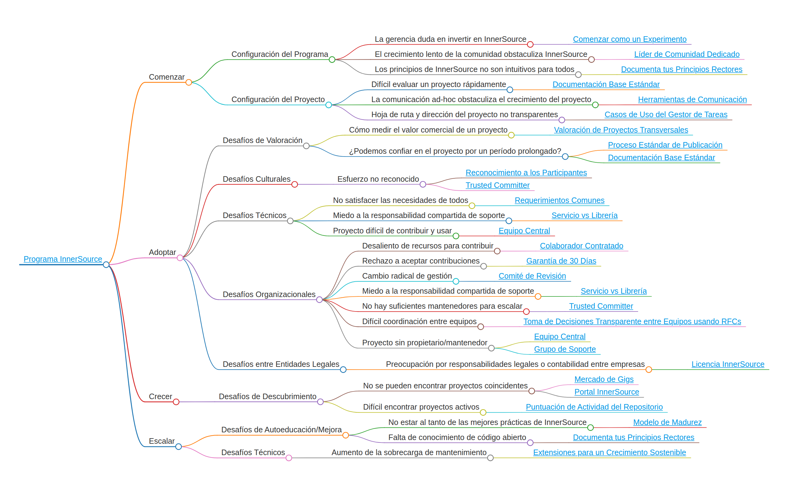

# Tabla de Contenidos

<!--
Do not edit toc.md directly!!!
Instead edit toc_template.md
-->

<!--
  NOTE:
  Paths in here are relative to this file, and not relative to the root specified in .gitbook.yaml.
-->

* [Introducción](./introduction.md)
* [Tabla de Contenidos](./toc.md)
* [Explorar Patrones](./explore-patterns.md)
* [Contribuir a este libro](./contribute.md)

## Patrones 

* [Casos de Uso del Issue Tracker](../../translation/es/patterns/issue-tracker.md) - El equipo anfitrión de InnerSource no logra hacer transparentes no solo los planes y el progreso sino también el contexto de los cambios. Esto se resuelve aumentando los casos de uso del issue tracker del proyecto para también servir en lluvia de ideas, discusión de implementación y diseño de funcionalidades.
* [Colaborador Contratado](../../translation/es/patterns/contracted-contributor.md) - Los colaboradores que desean contribuir a InnerSource son desalentados por su gerencia directa. La solución se proporciona mediante contratos y acuerdos formales.
* [Comenzar como Experimento](../../translation/es/patterns/start-as-experiment.md) - Inicia tu iniciativa InnerSource como un experimento con tiempo limitado para facilitar que los gerentes no familiarizados con InnerSource respalden y apoyen la iniciativa.
* [Comité de Revisión](../../translation/es/patterns/review-committee.md) - El modelo de trabajo InnerSource es un cambio radical respecto a los enfoques más tradicionales, tanto para desarrolladores como para gerentes. Al establecer un comité de revisión como interfaz entre la iniciativa InnerSource y todos los gerentes senior de las unidades de negocio participantes, es más probable que estos últimos se familiaricen con la iniciativa y la apoyen, ya que les proporciona cierto nivel de supervisión y control sin fomentar la microgestión.
* [Documenta tus Principios Rectores](../../translation/es/patterns/document-your-guiding-principles.md) - La explicación habitual de InnerSource como "aplicación de mejores prácticas de open source dentro de una organización" no funciona bien con personas que carecen de experiencia en open source. Como solución, los principios más importantes de InnerSource se documentan y publican ampliamente.
* [Documentación Base Estándar](../../translation/es/patterns/base-documentation.md) - Los nuevos contribuidores a un proyecto InnerSource tienen dificultades para identificar quién mantiene el proyecto, en qué trabajar y cómo contribuir. Proporcionar documentación en archivos estándar como README.md/CONTRIBUTING.md/COMMUNICATION.md permite un proceso de autoservicio para nuevos contribuidores, permitiéndoles encontrar respuestas a las preguntas más comunes por sí mismos.
* [Equipo Central (Core Team)](../../translation/es/patterns/core-team.md) - Incluso cuando un proyecto InnerSource es ampliamente necesario, las contribuciones y el uso pueden verse obstaculizados porque el proyecto es difícil de trabajar. Establece un equipo central dedicado a ocuparse de los elementos fundamentales del proyecto. Su trabajo permite que los contribuyentes agreguen y utilicen las funciones que aportan valor a sus escenarios.
* [Extensiones para un Crecimiento Sostenible](../../translation/es/patterns/extensions-for-sustainable-growth.md) - Un proyecto InnerSource está recibiendo demasiadas contribuciones, haciendo difícil su mantenimiento. Al ofrecer un mecanismo de extensiones fuera del proyecto principal, los mantenedores permiten escalar las capacidades del proyecto con un costo y mantenimiento mínimos.
* [Garantía de 30 Días](../../translation/es/patterns/30-day-warranty.md) - Al aceptar contribuciones de fuera de tu propio equipo, existe una aversión natural a asumir la responsabilidad del código no escrito por el equipo mismo. A través de la Garantía de 30 Días, el equipo contribuyente se compromete a proporcionar correcciones de errores al equipo receptor, lo que aumentará el nivel de confianza entre ambos equipos y hace más probable que se acepten las contribuciones.
* [Herramientas de Comunicación](../../translation/es/patterns/communication-tooling.md) - Los usuarios de un proyecto InnerSource tienen dificultades para obtener ayuda y contactar con el equipo anfitrión. Mediante el uso consistente de herramientas de comunicación asincrónica, el proyecto hace que las discusiones sean visibles, archivadas y buscables, lo que conduce a un mejor nivel de soporte para los usuarios.
* [Licencia InnerSource](../../translation/es/patterns/innersource-license.md) - Dos entidades legales que pertenecen a la misma organización quieren compartir código fuente entre sí pero están preocupadas por las implicaciones en términos de responsabilidades legales o contabilidad entre empresas. Una Licencia InnerSource proporciona un marco legal reutilizable para compartir código fuente dentro de la organización. Esto abre nuevas opciones de colaboración y hace explícitos los derechos y obligaciones de las entidades legales involucradas.
* [Líder de Comunidad Dedicado](../../translation/es/patterns/dedicated-community-leader.md) - Selecciona personas con habilidades tanto de comunicación como técnicas para liderar las comunidades y asegurar el éxito al iniciar una iniciativa InnerSource.
* [Mercado de Gigs](../../translation/es/patterns/gig-marketplace.md) - Establece un mercado creando un sitio web interno que liste necesidades específicas de proyectos InnerSource como "Gigs" con requisitos explícitos de tiempo y habilidades. Esto permitirá a los gerentes comprender mejor el compromiso de tiempo de sus empleados y los beneficios profesionales, aumentando así la probabilidad de obtener aprobación para realizar contribuciones InnerSource.
* [Modelo de Madurez](../../translation/es/patterns/maturity-model.md) - Los equipos han comenzado a adoptar InnerSource. La práctica se está extendiendo a múltiples departamentos. Sin embargo, la comprensión de lo que constituye un proyecto InnerSource varía. La solución es proporcionar un modelo de madurez que permita a los equipos realizar una autoevaluación y descubrir patrones y prácticas que aún no conocen.
* [Portal InnerSource](../../translation/es/patterns/innersource-portal.md) - Los contribuidores potenciales no pueden descubrir fácilmente proyectos InnerSource que les interesen. Al crear un sitio web en la intranet que indexe toda la información disponible de proyectos InnerSource, permitirás que los contribuidores aprendan sobre proyectos que podrían interesarles y que los propietarios de proyectos InnerSource atraigan una audiencia externa.
* [Proceso Estándar de Liberación](../../translation/es/patterns/release-process.md) - Los equipos pueden dudar en adoptar un proyecto InnerSource si no están seguros de su madurez. Para abordar esto, las notas de versión consistentes y los artefactos publicados son cruciales. Estas prácticas demuestran una fuerte dedicación al proyecto, generando confianza y asegurando a los usuarios un compromiso continuo con un software sostenible y bien gestionado.
* [Puntuación de Actividad del Repositorio](../../translation/es/patterns/repository-activity-score.md) - Los contribuidores potenciales quieren encontrar proyectos InnerSource activos que necesiten su ayuda. Al calcular una puntuación de actividad del repositorio para cada proyecto, se puede crear una lista clasificada de proyectos (por ejemplo, en el Portal InnerSource), para que los contribuidores potenciales puedan determinar más fácilmente a qué proyecto quieren contribuir.
* [Reconocimiento a los Participantes](../../translation/es/patterns/praise-participants.md) - Cuando recibes una contribución InnerSource, es importante agradecer al contribuidor por su tiempo y esfuerzo. Extender tu gratitud no solo reconoce efectivamente la contribución sino que también genera mayor compromiso del contribuidor y otros. Reconocer las contribuciones positivas de los contribuidores a tu proyecto InnerSource motiva a estos contribuidores (y sus gerentes) a continuar invirtiendo en el esfuerzo.
* [Requerimientos Comunes](../../translation/es/patterns/common-requirements.md) - El código común en un repositorio compartido no satisface las necesidades de todos los equipos de proyecto que desean utilizarlo; esto se resuelve mediante la alineación de requerimientos y la refactorización.
* [Servicio vs Biblioteca](../../translation/es/patterns/service-vs-library.md) - Los equipos en un entorno DevOps pueden mostrarse reacios a trabajar a través de los límites del equipo en bases de código comunes debido a la ambigüedad sobre quién será responsable de responder ante la interrupción del servicio. La solución es comprender que a menudo es posible implementar el mismo servicio en entornos independientes con cadenas de escalamiento separadas en caso de interrupciones del servicio, o bien extraer gran parte del código compartido en una biblioteca y colaborar en ella.
* [Soporte Grupal](../../translation/es/patterns/group-support.md) - ¿Qué sucede si un equipo o individuo deja de mantener un proyecto InnerSource? Mantén el proyecto activo formando un grupo de personas interesadas.
* [Toma de Decisiones Transparente Entre Equipos usando RFCs](../../translation/es/patterns/transparent-cross-team-decision-making-using-rfcs.md) - Los proyectos InnerSource que buscan alcanzar altas tasas de participación y tomar las mejores decisiones posibles para todos los involucrados necesitan encontrar formas de crear sistemas participativos a lo largo de todo el ciclo de vida del software. La publicación de documentos internos de Solicitud de Comentarios (RFC) permite discusiones desde el inicio del proceso de diseño y aumenta las probabilidades de construir soluciones con un alto grado de compromiso de todas las partes involucradas.
* [Trusted Committer](../../translation/es/patterns/trusted-committer.md) - Muchos proyectos InnerSource se encontrarán en una situación donde reciben constantemente retroalimentación, funcionalidades y correcciones de errores de los contribuidores. En estas situaciones, los mantenedores del proyecto buscan formas de reconocer y recompensar el trabajo del contribuidor más allá de las contribuciones individuales.
* [Valoración de Proyectos Cross-Team](../../translation/es/patterns/crossteam-project-valuation.md) - Es difícil vender el valor de los proyectos InnerSource cross-team que no proporcionan un impacto directo en los ingresos de la empresa. Aquí hay una forma basada en datos para representar tu proyecto que articula y amplifica su valor.

## Apéndice

* [Plantilla de Patrones](../../meta/pattern-template.md)
* [Glosario](../../meta/glossary.md)
* Extras
  * [Plantilla de README](../../translation/es/templates/README-template.md)
  * [Plantilla de CONTRIBUTING](../../translation/es/templates/CONTRIBUTING-template.md)
  * [Plantilla de COMMUNICATION](../../translation/es/templates/COMMUNICATION-template.md)
  * [Plantilla de RFC](../../translation/es/templates/rfc.md)

## Recursos

* [Este libro en GitHub](https://github.com/InnerSourceCommons/InnerSourcePatterns)
* [InnerSource Commons](http://innersourcecommons.org)
