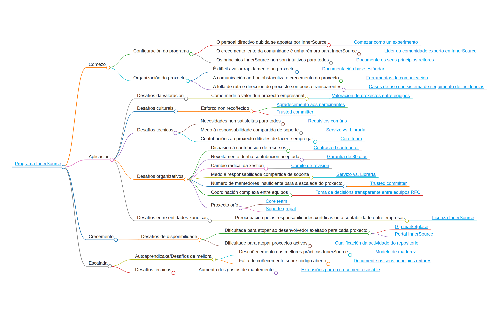

# Explore os modelos

A comunidade InnerSource Commons aporta cada vez máis modelos a este libro; o que é incrible!

Pero, como facilitar que os/as lectores/as descubran os modelos que poden axudalos/as na súa situación particular?

Para isto proporcionamos este mapa conceptual, que **clasifica os modelos en función das diferentes fases dun programa InnerSource** e dos desafíos que poden xurdir nas respectivas fases.

## Mellore este mapa conceptual

Se vostede detecta algo neste mapa conceptual que lle resulta incorrecto, pode [abrir unha incidencia](https://github.com/InnerSourceCommons/InnerSourcePatterns/issues) na que describa o problema xunto co arranxo que se debería levar a cabo.

Ademais, se ten outras ideas para dar a coñecer estes modelos ou desexa mellorar este mapa conceptual, revise a documentación do noso enfoque de [Categorización de modelos](https://github.com/InnerSourceCommons/InnerSourcePatterns/blob/main/pattern-categorization/README.md) e verifique como [contribuír a este libro](./contribute.md).

## Referencias

A idea de categorizar modelos como este baséase, parcialmente, na descrición en [*Thoughts on an InnerSource Pattern Language*](https://drive.google.com/file/d/13AY8glCOdpLOVuz7cVD6QOB8d2xbHCS1/view) [Reflexións arredor do modelo InnerSource] de Tim Yao, Bob Hanmer e Padma Sudarsan (2018). Para obter máis detalles, pode consultar a diapositiva 15 da presentación.
