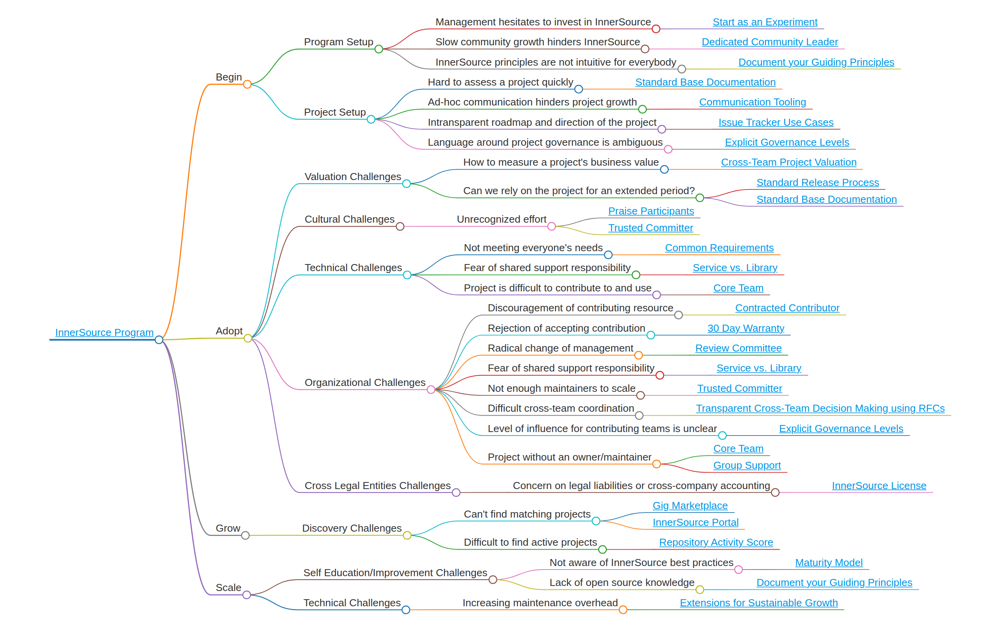

# Índice

<!--
Non edite toc.md directamente!!!
No canto diso edite toc_template.md
-->

<!--
  NOTA:
  As rutas son relativas a este ficheiro, non relativas ao directorio raíz especificado en .gitbook.yaml.
-->

* [Introdución](./introduction.md)
* [Índice](./toc.md)
* [Explore os modelos](./explore-patterns.md)
* [Contribúa a este libro](./contribute.md)

## Modelos 

<<PATTERNS_HERE>>

## Apéndice

- [Prototipo de modelo](../../meta/pattern-template.md)
- Extras
  - [Prototipo README](../../translation/gl/templates/README-template.md)
  - [Prototipo CONTRIBUTING](../../translation/gl/templates/CONTRIBUTING-template.md)

## Recursos

- [O libro en GitHub](https://github.com/InnerSourceCommons/InnerSourcePatterns)
- [InnerSource Commons](http://innersourcecommons.org)
