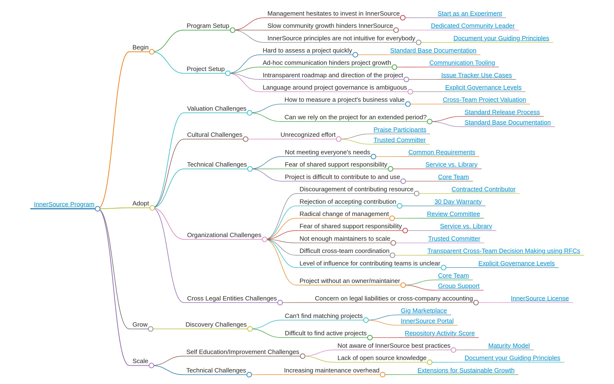

# 目次

<!--
Do not edit toc.md directly!!!
Instead edit toc_template.md
-->

<!--
  NOTE:
  Paths in here are relative to this file, and not relative to the root specified in .gitbook.yaml.
-->

* [イントロダクション](./introduction.md)
* [目次](./toc.md)
* [パターンの一覧](./explore-patterns.md)
* [この本へのコントリビューション](./contribute.md)

## パターン

* [30日の保証期間](../../translation/japanese/patterns/30-day-warranty.md) - 自分のチーム以外からのコントリビューションを受け入れる場合、チームが書いていないコードの責任を持つことに抵抗があることは自然なことでしょう。 「30日の保証期間」プラクティスを利用すると、コードにコントリビュートしたチームはコードを受け取ったチームに対してバグフィックスを提供することを承諾することになります。 そうすることで、両チーム間の信頼度が高まり、コントリビューションが受け入れられる可能性が高くなります。
* [RFCを用いたチーム横断的な意思決定の透明化](../../translation/japanese/patterns/transparent-cross-team-decision-making-using-rfcs.md) - 高い参加率を達成し、関係者全員にとって最良の意思決定を行いたいインナーソースプロジェクトは、ソフトウェアのライフサイクル全体を通して参加型のシステムを構築する方法を見つける必要があります。内部のRFC(Requests for Comments)ドキュメントを公開することで、設計プロセスの早い段階から議論を行うことができ、関係者全員が高いコミットメントを持ってソリューションを構築できる可能性が高まります。
* [イシュートラッカーの使い方を多様化する](../../translation/japanese/patterns/issue-tracker.md) - インナーソースのホストチームは、計画や進捗だけでなく、変更の背景も透明化することができていません。これは、プロジェクトのイシュートラッカーのユースケースを増やし、ブレーンストーミング、実装の議論、機能設計にも使えるようにすることで解決することができます。
* [インナーソースポータル](../../translation/japanese/patterns/innersource-portal.md) - 潜在的なコントリビューターは、彼らが興味を持っているインナーソースプロジェクトを簡単に見つけることができません。すべての利用可能なインナーソースプロジェクトの情報をインデックス化するイントラネットのウェブサイトを作成することにより、あなたはコントリビューターが彼らに興味があるかもしれないプロジェクトについて知ることができ、インナーソースプロジェクトのオーナーは、外部のオーディエンスを引き付けることができます。
* [インナーソースライセンス](../../translation/japanese/patterns/innersource-license.md) - 同じ組織に属する2つの法人は、ソフトウェアのソースコードを互いに共有したいと考えていますが、法的責任や会社間の会計処理の観点からの影響を懸念しています。
* [ギグマーケットプレイス](../../translation/japanese/patterns/gig-marketplace.md) - イントラネットのウェブサイトを作成し、特定のインナーソースプロジェクトのニーズを、時間とスキルの要件を明示した「ギグ」としてリストアップすることで、マーケットプレイスを確立する。 これにより、管理者がインナーソースのコントリビューションを行うための承認を与え可能性が増え、従業員の時間のコミットメントと専門的な利点をよりよく理解することができます。
* [クロスチームプロジェクト評価](../../translation/japanese/patterns/crossteam-project-valuation.md) - 会社の収益に直接的な影響を提供していないクロスチームのインナーソースプロジェクトの価値を評価して社内に売り込むことは困難です。 ここでは、あなたのプロジェクトの価値を明確に表現し、それを大きくするためのデータ駆動型の方法を紹介します
* [コアチーム](../../translation/japanese/patterns/core-team.md) - インナーソースのプロジェクトが広く必要とされていても、プロジェクトが難しいためにコントリビューションや活用に支障をきたす場合があります。プロジェクトの基本的な項目を専門に担当するコアチームを設立してください。コアチームの作業により、コントリビューターは自分のシナリオに価値をもたらす機能を追加し、使用することができます。
* [コミュニケーションツーリング](../../translation/japanese/patterns/communication-tooling.md) - インナーソースのプロジェクトは、開発チームの外で使用されていますが、ユーザーはヘルプを得たり、プロジェクトチームと連絡を取ったりするのに苦労しています。 このアイデアは、ディスカッションが可視化され、アーカイブされ、検索可能になることを可能にする標準的なコミュニケーションツールを設定し、文書化することです。
* [コントラクトコントリビューター](../../translation/japanese/patterns/contracted-contributor.md) - インナーソースにコントリビュートしたい社員がいますが、彼らの直属の上司はその活動に抵抗を示しています。正式な契約と合意をすることによって救済することができるかもしれません。
* [コントリビューションの功労を称える](../../translation/japanese/patterns/praise-participants.md) - インナーソースのコントリビューションの後、その時間と努力に対してコントリビューターに感謝することは重要です。 このパターンは、コントリビューションを効果的に認めるだけでなく、コントリビューターや他の人たちのさらなる関与を引き出すためのガイダンスを提供します。
* [サービス対ライブラリ](../../translation/japanese/patterns/service-vs-library.md) - DevOps環境のチームは、サービスのダウンタイムに対応する責任が誰にあるのかが曖昧になるため、チームの境界を越えて共通のコードベースで作業することに消極的になる場合があります。解決策としては、同じサービスを独立した環境で展開し、サービスダウン時のエスカレーション・チェーンを別々に構築するか、多くの共有コードを1つのライブラリに集約し、その上で共同作業を行うことが挙げられます。
* [スタンダード・ベース・ドキュメンテーション](../../translation/japanese/patterns/base-documentation.md) - インナーソースプロジェクトへの新しいコントリビューターは、誰がプロジェクトを維持し、何に取り組み、どのようにコントリビューションすればよいかを理解するのに苦労しています。README.md/CONTRIBUTING.md のような標準ファイルでドキュメントを提供することで、新しいコントリビューターのためのセルフサービスなプロセスを可能にし、よくある質問に対する答えを自分自身で見つけることができるようにします。
* [リポジトリアクティビティスコア](../../translation/japanese/patterns/repository-activity-score.md) - 潜在的なコントリビューターは、彼らの助けを必要とするアクティブなインナーソースプロジェクトを見つけたいと思っています。各プロジェクトのリポジトリのアクティビティスコアを計算することで、プロジェクトのランク付けされたリストを作成することができます (参考: インナーソースポータル )、そのため、潜在的コントリビューターは、彼らがコントリビュートしたいプロジェクトをより簡単に決定できます。
* [レビュー委員会](../../translation/japanese/patterns/review-committee.md) - インナーソースの作業モデルは、開発者と管理者のための、より伝統的なアプローチからの抜本的な変革です。インナーソースイニシアチブとそれに参加するビジネスユニットのすべてのシニアマネージャーの間のインタフェースとしてレビュー委員会を確立することにより、マイクロマネジメントを助長することなく、監視と制御の一定レベルを与えるように、イニシアチブに慣れ親しみ、それをサポートできるようになる可能性が高くなります。
* [信頼されたコミッター (トラステッドコミッター)](../../translation/japanese/patterns/trusted-committer.md) - 多くのInnerSourceプロジェクトは、コントリビューターからフィードバック、機能、バグフィックスを一貫して受け取る状況にあります。このような状況で、プロジェクトのメンテナーは、単一のコントリビューションを越えてコントリビューターの仕事を認識し、報酬を与える方法を模索します。
* [共通要件](../../translation/japanese/patterns/common-requirements.md) - 共有リポジトリにある共通のコードは、それを使いたいすべてのプロジェクトチームのニーズを満たしていません。これは、要件の調整とリファクタリングによって解決されます。
* [基本原則ガイダンスの文書化](../../translation/japanese/patterns/document-your-guiding-principles.md) - 「オープンソースのベストプラクティスを組織内に適用する」という通常のインナーソースの説明は、オープンソースのバックグラウンドがない人々にはうまく機能しません。 解決策として、インナーソースの最も重要な原則を文書化し広く公開しましょう。
* [実験として始める](../../translation/japanese/patterns/start-as-experiment.md) - インナーソースイニシアチブを期間限定の実験として開始し、インナーソースに慣れていないマネージャーがイニシアチブを承認およびサポートしやすくします。
* [成熟度モデル](../../translation/japanese/patterns/maturity-model.md) - チームはインナーソースを採用し始めました。このプラクティスは、複数の部門に広がっています。しかし、インナーソースプロジェクトを構成する概念への理解は様々です。解決策は、チームがセルフチェックを経て、まだ気づいていないパターンやプラクティスを発見できるよう、成熟度モデルを提供することです。
* [正式なコミュニティリーダー](../../translation/japanese/patterns/dedicated-community-leader.md) - インナーソースの取り組みを成功させるために、コミュニケーションとテクニカルの両方のスキルを持つ人をコミュニティのリーダーとして選ぶ。

## 付録

* [パターンテンプレート](../../meta/pattern-template.md)
* その他
  * [README テンプレート](../../translation/japanese/templates/README-template.md)
  * [CONTRIBUTING テンプレート](../../translation/japanese/templates/CONTRIBUTING-template.md)

## リソース

* [GitHub](https://github.com/InnerSourceCommons/InnerSourcePatterns)
* [InnerSource Commons](http://innersourcecommons.org)
