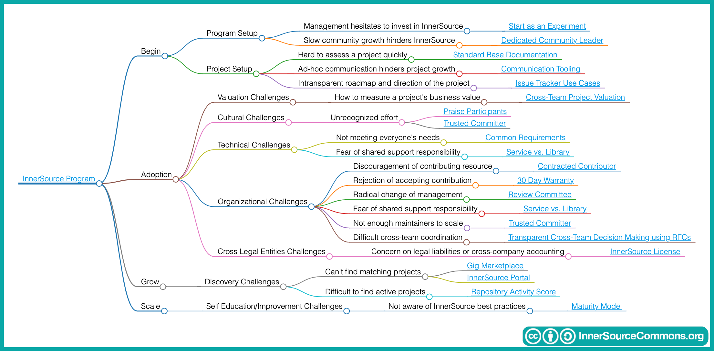

<!--
Do not edit toc.md directly!!!
Instead edit toc_template.md
-->

<!--
  GOTCHA !!!
  Paths in here are relative to this file, and not relative to the root specified in .gitbook.yaml.
-->

# Table of Contents

* [Table of Contents](../book/toc.md)

## Patterns

<<PATTERS_HERE>>

## Appendix

* [Contribute to this book](../book/contribute-to-this-book.md)
* [Pattern Template](../meta/pattern-template.md)
* Extras
  * [README Template](../patterns/2-structured/project-setup/templates/README-template.md)
  * [CONTRIBUTING Template](../patterns/2-structured/project-setup/templates/CONTRIBUTING-template.md)

## Resources

* [This book on GitHub](https://github.com/InnerSourceCommons/InnerSourcePatterns)
* [InnerSource Commons](http://innersourcecommons.org)
