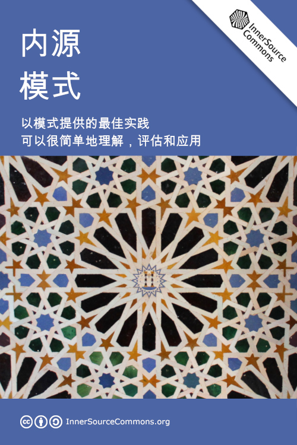

# 介绍


你正在阅读《内源模式》的早期版本，可能仍然会发现破碎的链接、拼写错误或其他错误。
请帮助我们解决这些问题，以便尽可能制作出最好的图书:)。了解如何[为这本书做贡献](contribute.md).


欢迎来到**内源模式**。

这本书包含了内源的最佳实践，并以特定的格式进行编纂，以便于理解、评估和在你的环境中应用它们。我们称这种格式为**模式**。

[InnerSource Commons](http://innersourcecommons.org)多年来收集了这些模式，在本书中发布了最成熟的模式，社区成员对每个模式进行了评审，至少有一个已知的模式使用实例。

在这篇介绍中，我们解释了[内源是什么](#内源是什么)，[内源模式是什么](#内源模式是什么)，以及[如何在你的组织中使用这些模式](#如何使用这些模式) 。

如果你已经在你的公司使用内源，并想把你的经验贡献给本书，我们很乐意[欢迎你的贡献](contribute.md)!

## 内源是什么?

我们将内源定义为。

> 在一个组织的范围内使用开源的原则和实践进行软件开发。

内源从开发开源软件中吸取经验教训，并将其应用于企业内部开发软件的方式。由于开发人员已经习惯于在世界级的开源软件上工作，人们强烈希望将这些实践带回防火墙内，并将其应用于公司可能不愿意公开发布的软件。

对于那些主要构建闭源软件的公司来说，内源可以成为一个很好的工具，帮助打破孤岛，鼓励和扩大内部协作，加速新工程师的入职成长，并找到机会将软件贡献给开源世界。

## 内源模式是什么?

模式是一种描述在某一背景下对某一问题的可重复的、经过验证的解决方案的方式。模式遵循一种简单的形式，在实施解决方案的过程中，协助你了解问题的限制，了解你需要平衡的限制条件，以及由此产生的结果--应用解决方案所创造的情况。

模式可以为InnerSource Commons的参与者提供一种简明的信息分享方式，改善内源的实践。模式分为标题、问题陈述、背景、约束和解决方案，作为其主要部分。

* ["什么是模式？"Youtube视频](http://bit.ly/innersource_patterns_videos) - 观看一组2-5分钟的Youtube视频，解释内源模式。
* [模式讨论网络研讨会](https://youtu.be/i-0IVhfRVFU) - 我们在2017-03-16举行了一次网络研讨会，现场讨论一个甜甜圈模式(进入24:30的讨论)。这是对我们所遵循的评审过程的说明。也可参见[2017年6月1日O'Reilly网络研讨会上的内源模式](http://www.oreilly.com/pub/e/3884) 。
* [模式模板](../../meta/pattern-template.md) --查看一个内源模式的骨架，了解新模式的内容!
* [内源模式介绍（2016年秋季峰会演讲）](https://drive.google.com/open?id=0B7_9iQb93uBQbnlkdHNuUGhpTXc) - *Tim Yao和Padma Sudarsan* (PDF)。详细的模式背景和例子 -- 详细了解为什么以及如何与我们的模式互动。也可参见[内源模式介绍(2017年秋季峰会)](https://drive.google.com/open?id=0B7_9iQb93uBQWmYwMFpyaGh4OFU) *Tim Yao和Bob Hanmer* (PDF)。

## 如何使用这些模式?

模式的使用必须经过深思熟虑。它们不能被不加区分地应用。在大多数情况下，你需要根据你的情况来调整给定的解决方案；但模式中给出的信息，定义了背景（不可移动的约束）和力量（可以改变和相互平衡的约束），应该有助于你应用这些模式。请注意，你还需要确定是否有额外的约束（公司背景和公司力量）适用于你的特定公司/组织，必须添加到模式中（作为一种过滤器）。这些额外的制约因素可能需要额外的解决步骤来应用。

模式的形式对于描述成熟的解决方案是很有用的，但它也可以用于*脑力激荡的新解决方案*，创建哪些尚未建立的模式。这是因为模式的解剖提供了一个以结构化方式思考问题的框架。你也可以创建一个*甜甜圈模式*（填写问题、背景、约束和结果等字段，但在解决方案留空），作为向InnerSource Commons社区寻求帮助的一种方式（找到一个成熟的解决方案或做一次集思广益的尝试）。

## 如何贡献?

请参考: [为这本书做贡献](./contribute.md)

## 致谢

本书是世界各地无数[开源贡献者](https://github.com/InnerSourceCommons/InnerSourcePatterns/graphs/contributors)多年工作的成果。他们愿意公开分享他们在公司所面临的挑战，以及内源如何帮助他们解决这些挑战，使本书成为其他人在内源旅程中的宝贵资源。

我们要特别提到内源模式工作组。他们孕育了内源模式的质量，并帮助其他人作出贡献。最后，他们还将一些可用的模式汇编成了这本书。

本书的标题图片由[Sebastian Spier](https://spier.hu)创作，并改编自[Tony Hisgett - Alhambra 6](https://www.flickr.com/photos/hisgett/29345405788/)的图片，可根据[CC BY 2.0](https://creativecommons.org/licenses/by/2.0/)获得。

 **感谢所有的贡献者! 并祝内源日快乐 :)**

## Licensing

InnerSourcePatterns by [InnerSourceCommons.org](http://innersourcecommons.org) is licensed under a [Creative Commons Attribution-ShareAlike 4.0 International](http://creativecommons.org/licenses/by-sa/4.0/) License.

## 翻译校对

* **2022-12-21** 翻译[姜宁](https://github.com/willemjiang)
* **2022-12-28** 校对[龙文选](https://github.com/hncslwx)
