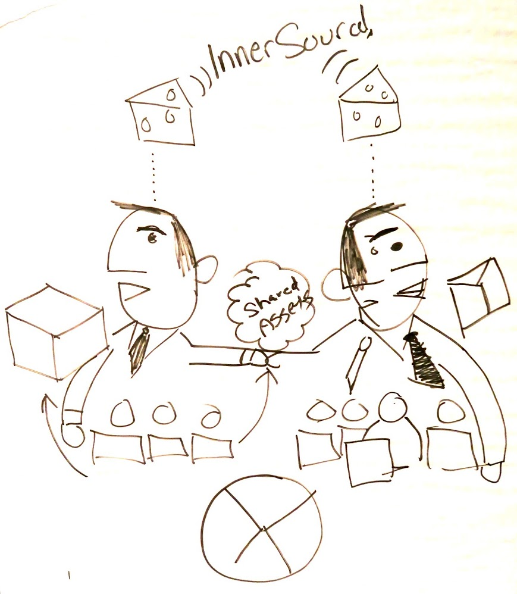

## Title

Change the Middle-Management Mindset

## Patlet

Middle managers often resist InnerSource due to misunderstanding and misaligned incentives. To overcome this resistance, educate them on the benefits, include InnerSource participation in their performance metrics, and demonstrate how it enhances their reputation, reduces team friction, and boosts overall productivity.

## Problem

The InnerSource program does not live up to its expectations because middle management is reluctant to allocate resources to it. Expectations of the program are faster go-to-market, increased quality, reduced duplicative development, better integration capabilities, and increased developer satisfaction. Middle management often misunderstands InnerSource's value, fears losing control, and struggles to understand how it fits their metrics. This gap prevents developers from contributing, hindered by managers' misaligned incentives and lack of strategic understanding.

## Story

A software development team at a large enterprise was eager to join an InnerSource project benefiting multiple teams. However, their middle manager hesitated to allocate time, citing quarterly deadlines and unclear ROI. Despite the developers' enthusiasm and potential for code reuse, theusing frustration and missed collaboration opportunities.

## Context

This pattern applies when:

* **Top-down support exists, but it lacks middle-management buy-in:** Senior leadership endorses InnerSource, but there's a gap between top-down support and developer objectives. Top-level management may have determined a new KPI around InnerSource, but it's not effectively cascaded down to middle management, leaving them unclear on implications for their teams.
* **Developers are eager to participate**: Individual contributors want to engage in InnerSource projects but face resistance from their direct managers, who control their time and priorities.
* **Misaligned incentive structures**: Middle management metrics omit cross-team collaboration and InnerSource, providing no clear benefit for managers to support these activities.
* **Control vs. collaboration tension**: Middle managers struggle to shift from controlling team output to enabling InnerSource communities, fearing loss of oversight and priorities.
* **Resource allocation conflicts**: Middle managers support InnerSource but often deprioritize it for other high-priority goals and quarterly commitments.
* **Short-term thinking prevails**: Organizations often favor quick duplication over reuse and collaboration, with managers preferring the "fast and easy" rewrite approach over collaborative development.
* **Developer contributions face resistance**: Developers contribute to InnerSource projects, but Product Owners, Product Managers, or Scrum Masters may discover this and put barriers between developers and the InnerSource project.
* **Established programs need manager adoption**: Organizations have InnerSource programs, but face challenges with middle management adoption and support.
* **Performance systems lack collaboration metrics**: Existing performance systems don't measure or reward cross-team collaboration.
* **Shared infrastructure opportunities**: Teams collaborate on shared platforms, services, or infrastructure for mutual benefits.
* **Recognition programs exist but aren't leveraged**: Organizations can adapt existing gratitude and recognition programs to motivate managers to support InnerSource.

## Forces

* **Manager resistance**: Middle managers may not see the value in letting team members work on external projects.
* **Lack of visibility**: Contributions to InnerSource projects may not be visible to direct managers or HR
* **Misaligned metrics**: Performance evaluation systems don't account for cross-team collaboration
* **Resource allocation**: Teams are expected to maintain full capacity on their primary projects
* **Recognition gaps**: No clear path for acknowledging voluntary contributions
* **Career progression**: InnerSource work may not directly contribute to promotion opportunities
* **Accountability challenges**: Middle managers cannot account for time spent on InnerSource activities in their objectives and need clear metrics to justify the investment
* **Goal misalignment**: Organizational goals rarely cascade to middle management, who typically write their own goals or have them set by their superiors
* **Educational gaps**: Middle managers may lack understanding of what InnerSource implies and need formal training to see the value proposition
* **Fear of loss**: Managers fear losing team members to other projects, having competing priorities, or becoming irrelevant
* **Control concerns**: Managers worry about losing oversight and prioritization in a more distributed environment like InnerSource, where it's less clear what developers are working on.
* **Priority management**: Middle managers struggle with how to manage competing priorities in a more open, collaborative model
* **Perceived complexity**: Managers may view InnerSource as creating an unmanageable "wild west" environment

## Sketch

## Solutions

### Manager Education and Value Demonstration

* **Educational outreach**: Provide formal training to help managers understand InnerSource benefits and value
* **Demonstrate time savings**: Show how InnerSource practices free up time for core development work.
* **Strategic alignment**: Clarify how InnerSource contributions align with broader organizational goals
* **Make managers look good**: Demonstrate how InnerSource can make the manager look good and improve team efficiency.
* **Friction reduction**: Show how InnerSource reduces technical friction (e.g., standardizing library versions) and improves team productivity

### Performance Management Integration

* **OKR integration**: Use [Objectives and Key Results (OKR)](https://en.wikipedia.org/wiki/OKR) to form horizontal teams across Business Units and align middle-management goals with quarterly objectives (L2s). OKRs provide a broader view than KPIs, fostering durable cross-unit teams connected to quarterly goals they set.
* **Cascading goals**: Ensure InnerSource goals cascade down from high-level organizational objectives without conflicting with existing team goals
* **Manager recognition**: Reward managers who promote InnerSource participation and enable their teams' involvement
* **Team efficiency metrics**: Demonstrate how InnerSource reduces friction and improves team productivity
* **Performance measurement**: Include InnerSource participation in performance reviews and manager evaluations

### Strategic Alignment and Communication

* **Focus on reuse and collaboration**: Frame InnerSource benefits around measurable reuse and collaboration metrics rather than abstract concepts.
* **End-of-life process integration**: Incorporate InnerSource into EOL processes to reduce redundancy and demonstrate resource efficiency
* **Clear ownership definition**: Define what code pieces teams own and identify opportunities to consolidate competing solutions

### Community Building and Recognition

* **Trusted evangelists**: Identify and empower core team members and influencers to act as ambassadors for InnerSource contributions
* **Champions program**: Recruit champions from all groups, including middle-management champions who have successfully implemented InnerSource
* **Badge system**: Implement recognition badges in organizational directories to highlight InnerSource contributors, or even cardboard cut-outs of champions with InnerSource t-shirts
* **Cross-BU accountability**: Create goals that transcend individual business units and demonstrate top-down support

### Events and Engagement

* **Dedicated InnerSource events**: Organize hackathons and innovation days for developers to collaborate on cross-team projects with management support. Include ShipIt Days, innovation days with 10% time, and InnerSource days focused on contributing to others' code.
* **Gamification**: Create point systems for InnerSource contributions: opening an issue = 1 point, filing a PR = 5 points, merging a PR = 20 points, with rewards like two weeks off in Hawaii (paid, with family), 3-6 months off to innovate, or 6 months part-time.
* **Fellows program**: Establish programs allowing trusted committers one day weekly for cross-platform work, reporting success instead of loss.
* **CEO recognition**: Create annual InnerSource awards with significant recognition from senior leadership

### Process and Architecture Integration

* **Globalization teams example**: Teams managing countries with compliance constraints are often good at InnerSource but may fade during restructuring.
* **InnerSource readiness checklist**: Middle Management should partner with developers and justify InnerSource spending based on KPIs.
* **Built-in collaboration**: Design processes where delivery teams collaborate across product teams with clear mentorship expectations.
* **Microservices architecture**: Use microservices to foster collaboration and shared responsibility. Bugs cause user problems and may breach SLAs if unresolved. Challenges arise with feature requests or design changes, beyond bug fixes.
* **Platform development**: Focus InnerSource on platform development for multi-team application building
* **Architectural mindset**: Ensure software architects adopt an InnerSource mentality and collaborate
* **Agile integration**: Include InnerSource time and resources in Agile sprint planning.
* **Resource planning**: Account for InnerSource contribution "tax' using the "1 step back, 3 steps forward' principle: identify contribution opportunities, make components reusable, support your contribution, align teams, handle code submission, reviews, and revisions, communicate with consumers or hosts, and learn new practices, tools, or skills.

## Resulting Context

When this pattern is successfully applied, the following outcomes emerge:

### Manager Behavior Changes

* **Support for InnerSource is automatic, standard, and expected from Middle Management.**
* **Managers become more supportive** of InnerSource initiatives as they see clear value and recognition for their teams.
* **Middle management gains a deeper understanding** of InnerSource benefits and how they align with organizational goals.

### Organizational Improvements

* **Enhanced cross-team collaboration** and knowledge sharing across the organization
* **Reduced friction and improved team productivity** through standardized practices and reduced duplication
* **Better training for middle management** in negotiation and facilitation skills becomes necessary.

### Measurement and Process Evolution

* **More sophisticated measurement systems** are required, as it is easier to measure your own team's work but harder to measure others' contributions.
* **Time tracking for cross-project work** becomes more critical and systematic.
* **Engineering cost vs. benefit balance** emerges: teams support others while other teams allow them to make PRs, creating long-term time savings.

## Rationale

This approach addresses how middle managers often block team involvement in cross-team initiatives. By focusing on education, showing value, and linking to performance, organizations can help managers become supporters of InnerSource. Managers need clear personal and team benefits to support InnerSource.

## Known Instances

TBD

## Status

Initial

## Author(s)

* Silona Bonewald
* Max Capraro, FAU
* Sarah Doire, CH Robinson
* Eric Knudtson, Intuit
* Christopher Litsinger, Comcast
* Don McBride, Nokia
* Stephen McCall, Fidelity Investments
* Andrea Peruffo, Nokia
* Tim Yao, Nokia
