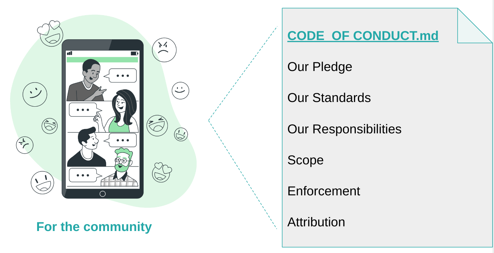

## Title

Code of Conduct

## Patlet

A healthy and inclusive InnerSource community requires strong levels of communications and interactions.
Establishing a Code of Conduct provides guidelines for establishing rules and expectations regarding behavior and interactions within the community.

## Problem

InnerSource initiatives often involve collaboration among individuals and teams from diverse backgrounds and perspectives.
The absence of clear rules of communication and interaction leaves room for ambiguity and potential conflicts within the InnerSource community.
Without established guidelines, members may engage in behavior that is harmful, discriminatory, or counterproductive, leading to a breakdown in collaboration and trust.

## Context

Different individuals and teams within the organization collaborate in a healthy and inclusive community without conflicts.
This welcoming, respectful and inclusive environment fosters more collaboration and creates trusted relationships across the organization where all community members feel safe and valued.

## Forces

A well-crafted Code of Conduct helps prevent and address issues such as harassment, discrimination, and other harmful behavior, ensuring that everyone feels safe and valued within the project.
By providing the framework for positive and inclusive participation, the Code of Conduct encourages diverse perspectives, enhances collaboration, and ultimately leads to the development of higher-quality open-source software.

## Solution

Develop a Code of Conduct that outlines expected behavior, including guidelines for communication, collaboration, and conflict resolution.
The Code of Conduct will articulate the shared values and principles of the InnerSource community, fostering a sense of belonging and common purpose, such as:

- **Diversity**: InnerSource communities may consist of individuals with varying cultural backgrounds, beliefs, and communication styles.
- **Trust**: Building trust among community members is essential for effective collaboration and knowledge sharing.
- **Inclusivity**: A Code of Conduct and Social Contract can promote inclusivity by setting expectations for respectful behavior and interactions.
- **Accountability**: Clear guidelines help hold community members accountable for their actions and contributions.

## Implementation

The adoption of well-known covenants, such as the [Contributor Covenant](https://www.contributor-covenant.org/), or the adaptation of some internal covenant for members of the organization are good starting points for implementation of this pattern.
However, adopting the following life cycle can improve the implementation and adoption of the Code of Conduct in an InnerSource community:

1. Collaboratively draft the Code of Conduct, involving input from community members representing diverse perspectives.
2. Seek feedback and consensus from the community to ensure buy-in and ownership of the guidelines.
3. Publish the finalized documents in a prominent location accessible to all community members, such as the InnerSource platform or collaboration tools.
4. Regularly review and update the Code of Conduct as needed to reflect evolving community norms and values.

A good practice for the third point is to share the Code of Conduct in each InnerSource community repository as a file named `CODE_OF_CONDUCT.md`.
This file can be part of the [Standard Base Documentation](../2-structured/base-documentation.md) of any InnerSource project repository.

## Resulting Context

With a well-defined Code of Conduct in place, the InnerSource community can cultivate a culture of respect, trust, and collaboration.
Community members feel empowered to contribute openly and engage in meaningful dialogue, leading to enhanced innovation and problem-solving.

## Known Instances

- Red Hat - Many of the internal communities
- National Australia Bank

## Authors

- Roman Martin Gil

## Acknowledgments

- Matt Cobby - Adding the National Australia Bank reference

## Related Patterns

- [InnerSource Commons Pattern - Standard Base Documentation](../2-structured/base-documentation.md)
- [Open Practice Library - Social Contract](https://openpracticelibrary.com/practice/social-contract/)
- [Contributor Covenant](https://www.contributor-covenant.org/)

## Status

- Initial
