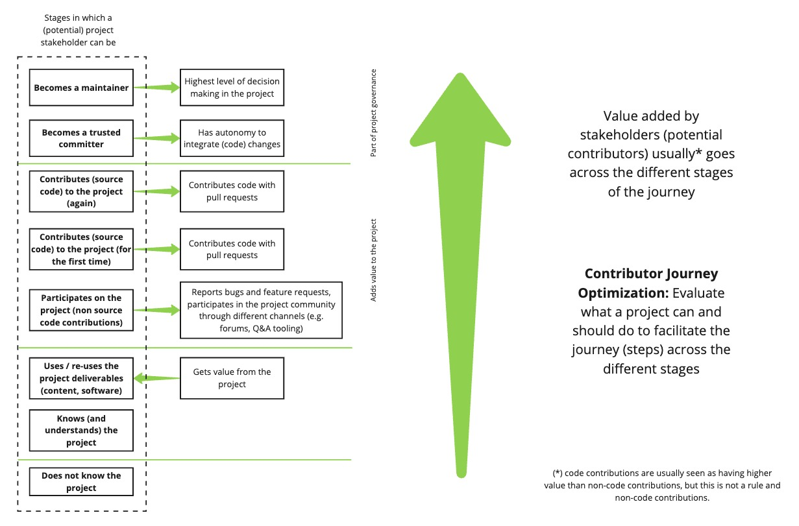

## Title

Contributor Journey Optimization

## Patlet

New contributors often struggle to progress smoothly through the various stages of engagement in an InnerSource project, leading to high drop-off rates and underutilized potential.
By systematically evaluating and optimizing the Contributor Journey, projects can identify and remove friction points, enabling a more inclusive and efficient path to higher-value contributions.

## Problem

Many InnerSource projects fail to retain and grow their contributor base because potential contributors encounter barriers at different stages of engagement.
These barriers may include lack of awareness, unclear onboarding processes, missing documentation, or inadequate mentorship.
Without deliberate intervention, these challenges reduce the number of contributors reaching the trusted committer stage, limiting the project's sustainability and impact.

## Context

This pattern applies to InnerSource projects that:

- Seek to attract and grow an engaged community of contributors.
- Experience a high drop-off rate of potential contributors at various stages.
- Have contributors who struggle to transition from users to active participants.
- Recognize that reducing friction in contributor onboarding and progression can lead to a healthier, more sustainable project.

## Forces

- **Awareness Barrier** – Many potential contributors are unaware of the project or do not understand how it aligns with their needs or interests.
- **Onboarding Complexity** – The process of contributing is not well-documented or too complex, discouraging new contributors.
- **Skill Gap** – Some contributors may lack the necessary technical or collaboration skills, requiring additional support.
- **Lack of Mentorship** – Without guidance from experienced contributors, new contributors struggle to navigate the project and make meaningful contributions.
- **Recognition and Retention** – Contributors may feel unrecognized or unsupported, leading them to disengage before reaching the trusted committer stage.

## Sketch (optional)

A visual representation of the Contributor Journey stages and common obstacles at each transition could be useful.

## Solution

1. **Map the Contributor Journey** – Identify key stages in the contributor journey: awareness, usage, non-code contributions, code contributions, and trusted committer status.
2. **Identify Friction Points** – Conduct workshops or self-assessments to document impediments preventing contributors from progressing.
3. **Prioritize and Address Issues** – Create a backlog of improvement tasks, prioritizing high-impact changes such as better documentation, streamlined onboarding, mentorship programs, or automated contribution workflows.
4. **Implement and Iterate** – Apply solutions in an incremental fashion, continuously gathering feedback and refining the process.
5. **Measure Success** – Track engagement metrics, contributor retention rates, and qualitative feedback to assess improvements and adjust strategies as needed.

## Resulting Context

After implementing this pattern, projects experience:

- Increased contributor engagement and retention.
- A clearer, more inclusive onboarding process.
- Faster transition from new contributor to active participant.
- Higher rates of trusted committers, strengthening the project’s long-term sustainability.

## Rationale

By proactively identifying and addressing barriers at each stage of the Contributor Journey, projects can maximize both the value they gain from contributors and the value contributors gain from participation.
An optimized journey fosters a thriving InnerSource community, leading to better collaboration and more sustainable projects.

## Known Instances

- Large software organizations with mature InnerSource programs have applied structured contributor journey workshops to boost engagement.
- Open source communities often adopt similar strategies to improve contributor experience and retention.

## Status

- Initial

## Author(s)

- Guilherme Dellagustin
- Sebastian Spier

## Acknowledgments

- TBD

## Alias

- Contributor Onboarding Optimization
- Contributor Engagement Framework
