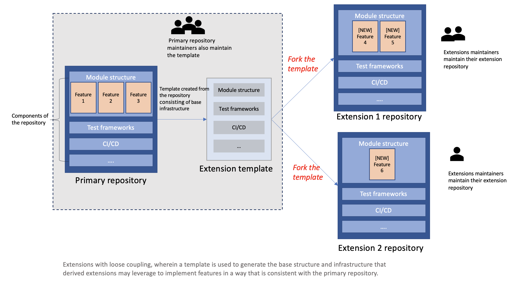

## Title

Extensions for Sustainable Growth

## Patlet

An InnerSource project is receiving too many contributions, making maintenance difficult. By offering an extension mechanism outside of the core project, the maintainers enable scaling of project capabilities with minimal cost and maintenance overhead.

## Problem

As the number of contributions to a mature InnerSource repository rapidly increases, it adds more burden on code reviews and maintenance. This results in a large code review backlog or premature rejection of new feature contributions.

How can the host team allow for faster release of new features, encouraging innovation and experimentation; while also keeping the repository well maintained?

## Story

There is a strategic project that aims to collect the best innovations within a domain space to one common stack, allowing reuse of a common infrastructure and providing a standard user experience. Through InnerSource, various teams in the organization that work within the domain space get an opportunity to collaborate and contribute their innovations to the common codebase.

However, a large number of contributions in parallel from several developers is making maintenance of the codebase difficult. This is adding a huge burden on the project maintainers who assume ownership over the code quality standards and enable the community through various forms of communication.

Project maintainers are at risk of burnout due to:

- Everlasting backlog of pull requests from contributors that need to be reviewed.
- Job dissatisfaction: Majority of maintainers' time spent in community support leaves no room for innovation.
- Perceived lack of accomplishment: Not all contributed features have adequate user demand and result in consequent adoption.
- Time consuming releases: More features in the codebase results in long running tests.
- Increase in maintenance activities: More bugs raised as new capabilities are added.

A lot of time is spent on maturing every new feature contribution, before potential users even get an opportunity to explore the feature for their use cases. If it turns out that new feature isn't fulfilling the use case, then all that time spent on achieving the desired code quality standards are waste.

## Context

- A strategic InnerSource codebase is scaling rapidly with new feature contributions from several employees.
- The ratio of reviewers to contributions results in a growing backlog of pull requests. This is slowing down release of new features to the community.
- Quality of the codebase is degrading and user experience is adversely impacted.
- Maintainers of the codebase are burdened and cannot keep up with the influx of contributions and increased community support.
- Some of the contributed features are not gaining adoption by users, and might even turn fully dormant. However even though they are unused, these features are still adding to the maintenance overhead.
- Organization is investing heavily in hardening of new feature contributions to retain quality standards before the ideas are explored by the community.
- The pattern applies in either scenario:
   - Maintainers find themselves rejecting new feature ideas to narrow down the scope of the project. This is hampering innovation in the community and restricting further expansion.
   - To reduce backlog, new features are getting released without thorough documentation, hardening, or testing, creating a poor user experience. This is also bloating the size of the codebase, adding a huge dependency graph and making it difficult to maintain.

## Forces

- Maintainers and product owners want to allow for expansion, encourage innovation and experimentation without being overly restrictive on contributions, while also keeping good code and quality standards for user experience.
- A large amount of time goes into hardening and thorough testing of features to meet product standards, but product owners may want to allow for faster release of new innovations for adopting products to explore before investing time in maturing the capabilities.
- Maintainers want to encourage the community to share innovations that combine product capabilities with other use-cases without adding more dependencies to the primary repository.

## Solutions

Allowing [extensions/plugins](https://en.wikipedia.org/wiki/Extensibility) to high-scale InnerSource codebases can relieve the maintenance burden on repository maintainers and allow faster release of new features for adopting products to explore. This shifts maintenance of capabilities to extension owners and allows the primary repository to support capabilities that have been adopted more widely and are more strategic.  

Extensions provide a filter for new capabilities that may eventually move into the core of the project. Extensions also act as an incubation and community hardening environment, allowing for much of that hardening to happen organically rather than in a costly review process.

In order for the extensions model to be successful, there are few architectural considerations to keep in mind:

1. **Easy to create:** To obtain community participation, extensions need to be easy to create.
   - Create a repository template that extensions should use as a starting point. This allows the extensions to add their new features in new repositories, separate from the core project. The template should provide the same modular structure as the primary repository, and include the framework to package and release extensions.
      - Ensure that as the primary repository changes, the template(s) are well-maintained. The primary repository maintainers are responsible for updating the template(s) to ensure it is compatible with the main project. Following good versioning conventions, e.g., [semver](https://semver.org/), makes this easier to follow.
      - It is further recommended that the primary repository maintainers provide guidance on how to update extensions based on older versions of the template as newer versions are released.
   - Add example extension(s) developed from the template, which project developers can reference to understand how to write a well-patterned extension.
   - Loosen the requirements for contributors to create extensions by bypassing reviews to allow for faster release or experimentation.
2. **Loose coupling:** Having modular components that contain functionality can allow loose coupling, where changes to extensions do not impact the quality of the main codebase or other extensions.
3. **Dependency management:**  Each extension should be careful to pin the version range of the primary repository that it is built against (the same way it would any other dependency) and should be careful in its use of other dependencies that shadow dependencies of the primary repository such that the versions it chooses for those dependencies are compatible with the primary repository versions selected. Any conflicts with primary repository will be caught in the test framework for the extension.
4. **Testing strategy:** How to test extensions both individually and in combination?
   - **Testing extension individually:** Extensions template will provide a test framework to be used by the extension developers to test the capability added. This can include a framework for unit tests, runtime performance and quality tests.
   - **Testing extension in combination with primary repository:** Extension developers have a well-patterned method for testing their extension against specific versions of the primary repository without involvement from the primary repository's maintainers.
   - **Testing extension in combination with other extensions:** Providing a test framework for this scenario could result in being excessive especially if there are a large number of extensions that are still being explored by users and unlikely to be all used in combination. If a user runs into conflicts while using extensions in combination (which should be unlikely with sufficient loose coupling), the user can raise an issue to the respective extension owners who will sort it out. As an extension reaches later phases of the lifecycle and gets merged into the primary repository, it would be tested in combination with rest of library and any dependency conflicts will have to be resolved at the time.
5. **Discoverability and Usability:**
   - Make extensions easily discoverable with a publishing page showing the extensions that users have created and want to share for product usage.
   - Allow registration of extensions with the primary project for users to leverage extensions alongside the original project, thus keeping the same user experience.
6. **Lifecycle of extensions and maintainability:** Establish the lifecycle for extensions from creation to porting into the primary codebase, along with clear ownership guidelines.
   - Extension creators continue maintaining the extension, providing any support and fixing defects. Any extension left unmaintained will be unlisted from the publishing page.
   - Create criteria for when an extension can be ported to the primary repository, such as adoption of the extension by internal products and demand for the feature.
   - Porting process of the extension to the primary repository will follow more stringent code review guidelines as set by library maintainers.

Following these principles ensures that:

- Developers can add new features to a project's ecosystem without requiring them to write large amounts of [boilerplate](https://en.wikipedia.org/wiki/Boilerplate_code) code.
- Extensions are discoverable in a repeatable manner by all users of the primary project; just because code doesn't live in the main repository yet does not mean it is not valuable.
- The maintainer burden is reduced until an extension has demonstrated that it fills an important gap in the primary project.
- The core project's common code (e.g. base classes and utility functions) can be a starting point for new development that extends project's domain. This avoids the need to port innovative work after-the-fact, thus reducing the overall burden of developing novel features for the project.
- Developers are more likely to contribute and stay involved in maintenance and building communities for their codebase, which is also good for the health of the overall project ecosystem.

## Resulting Context

- The project is able to scale with the addition of new features, without adding maintenance overhead on the primary project repository.
- Faster release of new features for the community to explore, encouraging innovation and experimentation.
- Reduced the costly code review and feature hardening process until the feature is able to prove its utility. This has cost savings benefits for the organization.
- A post problem that can be introduced - what happens if an extension can not complete the full lifecycle?
   - If an extension is not adopted over a period of time and could not build a community around it to support maintenance, it would be up to the extension owner to continue maintaining it for however long they want to. If an extension is left unmaintained, it would be unpublished.
   - If an extension developer is unable to further maintain their project, and other developers in the community want to continue supporting it, they may maintain the extension going forward.

## Known Instances

* **IBM Corporation** has adopted this solution to scale [InnerSource AI libraries](https://youtu.be/Lz-tIc2cyRM). Using extensions, developers are able to extend AI libraries with more algorithms and share their innovations with the company-internal community. The core libraries only contain strategic algorithms that have been adopted and validated, keeping them easier to maintain as we scale contributions.

## Alias

Extensions to Manage Contributions at Scale

## Status

Initial

## Author(s)

- Sukriti Sharma, IBM
- Alexander Brooks, IBM
- Gabe Goodhart, IBM
