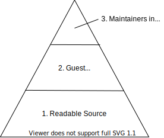

## Title

Transparent Governance Levels

## Patlet

Several teams are using different InnerSource patterns and all calling it "InnerSource", so the term is not precise enough to usefully describe a set of working practices without confusion.

Estabilishing a more accurate common language that is understood across all teams allows anyone to communicate intent or set expectations efficiently without ambiguity.

## Problem

Several teams are using InnerSource practices. However the degree to which they welcome contributions and give equal collaboration rights to contributors differ. Despite these differences, all teams refer to their way of working as "InnerSource" without any additional qualifiers.

The result is confusion and frustration when teams collaborate as the expectation of what InnerSource means in practice is different in each team. This confusion also affects strategy planning and decisions on future InnerSource intent as the term is too vague which leads to long discussions and time lost on clarifications.

## Stories

### Example of Confusion

For two projects InnerSource best practices have been adopted. Project A has a shared ownership model with [Trusted Committers](../2-structured/trusted-committer.md) from multiple teams. Project B is fully owned by one team with contributions from other teams. New users of either project are regularly confused about the level of influence they can gain in the respective project. This leads to long discussions, escalations and time lost on clarifications.

### Example of Delayed Decision

Project C is currently closed source and used only by team 1. Team 2 want to use project C and the leadership of the two teams negotiates options which include InnerSource practices. Agreement takes longer than expected because the "InnerSource" term did not describe a target state that could be agreed without ambiguity, and the teams had to document bespoke options for their leadership to consider before a decision could be made.

### Examples from Open Source

Like "InnerSource", Open Source is also a broad term.

There are projects on GitHub, published purely for the pleasure of the author with no intention of long term maintenance, not intention to fix bugs submitted by users. This would be the equivalent of "Bug Reports and Issues Welcome" - you can report the bug, but its on the owner to find the time to fix it.

There are projects where the roadmap is created in-house, hidden from public view. Where commit rights come and go with the contract of the employees of one company (e.g. MongoDB, Elastic, Tensorflow). Users are welcome to submit patches, they will even be mentored through. All development happens in the open, but control and strategy is never shared. This would be the equivalent of stage "Contributions Welcome".

There are projects that share write access, but do not share the power to decide who gets write access next. This applies to everyone who is only a committer at an Apache project. There are projects that are fully shared across multiple independent organisations (e.g. k8s, any Apache project) - those would be "Shared Ownership".

The same levels make sense inside of organisations.

## Context

- InnerSource concepts are established within an organisation with multiple projects and teams adopting InnerSource.
- Internal InnerSource practices are not prescribed in detail.
- Teams/projects have the autonomy to optimise for their local circumstances.

## Forces

- Projects adopt different InnerSource patterns and practices to optimise for their context.
- Users want clarity on the level of influence they can gain in an InnerSource project when deciding whether or how to use it.
- Leaders want clarity on InnerSource project intentions to understand the expected cost and benefits.
- Writing a detailed description of a set of InnerSource practices requires significant effort.

## Solution

The solution is to create a universally understood language to describe the InnerSource operating models that are used in your organisation.

We define **InnerSource operating model** as a description of how much influence the core development team of a project ist willing to share with contributing teams. Or in other terms, the level of influence a contributing team can gain in the respective project.

The shared language for these InnerSource operating models can be established with these steps:

1. Identify the common recurring InnerSource operating models that exist in your teams and projects.
2. Document each model in detail, and give each a distinctive name.
3. Promote the use of these names to describe projects until the name's meaning is understood across the whole organisation.

Examples of common InnerSource operating models (1) are:

- **Bug Reports and Issues Welcome**: People outside the core development team may use the code. They can submit feature requests and bug reports for things they would like to see changed.
- **Contributions Welcome**: People outside the core development team may use the code. They can also make modifications and submit them to core team for inclusion.
- **Shared Ownership**: Members of different teams collaborate on the project as equal peers. Everyone has the ability to merge code. Everyone has an equal say on the project direction. Everyone has an equal say in who else to add to this group.

Examples of promoting the model names (3) are:

- Using the names within project documentation and contributing guides (see also [Standard Base Documentation](../2-structured/project-setup/base-documentation.md)).
- Labelling projects with the names in an [InnerSource Portal](../2-structured/innersource-portal.md).
- Presenting the names as a menu of adoption options for new InnerSource projects.
- Including the names and models in any internal InnerSource training or promotion.

## Resulting Context

- Cross team communication occurs efficiently without confusion using terms that are universally understood and centrally documented.
- Organisation leaders understand the nuances within practising InnerSource and make better informed and more precise decisions that are easier to communicate.
- Increased standardisation of InnerSource practices within the organisation as the named and documented building blocks are used by teams as a menu for adoption.
- Teams can adopt InnerSource best practices in a step-by-step way which makes adoption easier and less intimidating.

## Known Instances

Flutter Entertainment define an [InnerSource Pyramid](https://innersource.flutter.com/how/) to describe 3 different InnerSource operating models: Readable Source, Guest Contributions and Maintainers in Multiple Teams. Each name is centrally documented. The use of these names is encouraged via repeated usage, direct training and categorisation of each InnerSource project.

## Status

Structured

## Authors

- Isabel Drost-Fromm
- Rob Tuley
