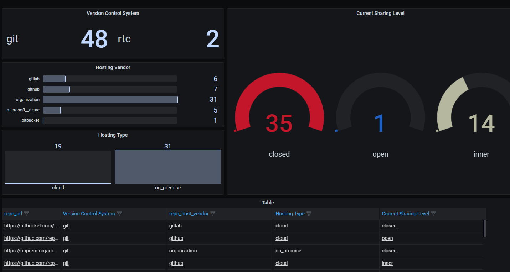

## Title

Unified Source Code Inventory

## Patlet

Large organizations with many legal entities often don't have visibility into all of their software assets (repositories), limiting their ability to increase businesses value and control liability costs holistically.
A unified source code inventory at organization-level addresses these issues, while exploiting opportunities to identify and support valuable InnerSource assets.

## Problem

Given situations when InnerSource stakeholders do not value source code at the same level as other Organization's assets; when source code strategies are ad-hoc and different among legal entities with little consolidation at Organization-level; then it becomes harder both to select and support the right InnerSource project candidates as well as maximize business value of such a key asset.

Can you get consistent answers within the Organization to questions like:

* How would you find all source code touched by anyone in your legal entity?
* How would you find out who else can also access each of the above?
* For new source code, what is your default level of access?
* How would you know nothing is missing from your inventory?
* What valuable insights or actions have you gained from your inventory?

## Context

* You work on Legal Entity within a complex Organization under continuous change (e.g. new acquisitions or changing business priorities).
* You cannot find all source code touched, shared and consumed within the Organization.
* You do not have a clear policy on default sharing level when creating a new project (e.g. Open Source, InnerSource or Closed Source).
* You cannot scan significant parts of the Organization's source code looking for duplication, similarity or code smells.
* You do not know the existing ratios of Open Source, innerSource and Closed Source and their trend.
* You cannot measure the diversity of contributions and resulting value for a given project.
* You cannot identify and optimize tech stack diversity.
* You cannot identify technical debt and determine the priorities for retirement (e.g. dead APIs/source).

## Forces

* Fragmentation of source code hosting systems in the Organization.
* Ad-hoc source code strategies scattered across the different Legal Entities in the Organization.
* Continuously changing map of the relationships between: projects, repositories, products, tech stacks, domains, solutions, platforms, services, components, sub-systems, people, authors, teams, external repositories.
* Diverse software culture of teams across the Organization (e.g. more open to collaboration or more siloed).

## Solutions

### Set up an Organization-level source code inventory live dashboard

* Combination of manual and automated input data sources to a single source of truth
* API available to add new data sources and extend coverage of the source code repository
* Key meta-data about each repository:
  * Legal Entity
  * URL
  * Version control system (e.g. GIT or SVN)
  * Hosting vendor (e.g. GitHub, Gitlab or BitBucket)
  * Hosting type (e.g. on-prem, private cloud or public cloud)
  * Sharing level (e.g. Open Source, InnerSource, Closed Source)
* Visualization in place to list all assets with options to filter based on meta-data
* Enable access to automated source code static analysis tools (e.g. identify duplicated or similar code, flag code smells, benchmark test coverage).

Mockup dashboard             |  Mockup questionnaire
:-------------------------:|:-------------------------:
  |  

### Define a Source Code Strategy Assessment Framework

* Help to define a source code strategy including an explicit definition of policies at Organization and Legal Entity levels for:
  * Inventory
  * Sharing
  * Consumption
  * Contribution
  * Ecosystem
* Example of such a framework: [github.com/trieshard/source-strategy-assessment/blob/master/framework.md](https://github.com/trieshard/source-strategy-assessment/blob/master/framework.md)

## Resulting Context

### For the Organization, Legal Entity and Project maintainers

* We have explicit policies at Organization and Legal Entity level on source code strategy (e.g. where to create new repository or how to select the right sharing level).
* We can find all source code touched, shared and consumed within the Organization or Legal Entity and take actions as needed.
* We can measure the diversity of contributions and resulting business value for our project.
* We can identify technical debt and determine the priorities for retirement (e.g. dead APIs/source).

### For InnerSource governance

* We can scan significant parts of our Organization's source code looking for opportunities of reuse, duplication, similarity or code smells.
* We know the ratios of Open Source, InnerSource and Closed Source within the Organization so we can steer as needed.
* We can identify and optimize tech stack diversity.
* We can create awareness and culture shift on certain Legal Entities as needed (e.g. ratio of Open Source and InnerSource below average).

## Rationale

It creates a dynamic and extendable single source of truth for repositories to capture, visualize and act on source code repositories across the Organization. That helps to create awareness and focus efforts on the right direction.

The Source Code Strategy Assessment Framework helps teams to understand the value of intentional explicit policies on how to manage source code. It helps to create both continuous improvement cycles and references within the Organization of what others are doing.

## Known Instances

* Philips (under test at scale)

## References

* Organization and Legal Entity terms as defined in the [InnerSource License Pattern - Glossary](../2-structured/innersource-license.md#glossary).
* Explore using this pattern in combination with the [InnerSource Portal](../2-structured/innersource-portal.md) pattern.

## Status

* Initial

## Author(s)

* [David Terol](https://github.com/dterol23)
* [Simao Williams](mailto:me@simaos.net)

## Acknowledgements

* [Sebastian Spier](https://github.com/spier)
