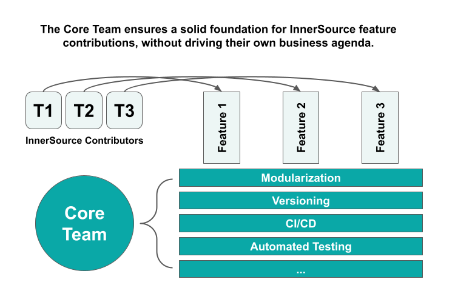

## Title

Core Team

## Patlet

Even when an InnerSource project is widely needed, contributions and usage may be hindered because the project is difficult to work with.
Establish a core team that is dedicated to take care of the project's fundamental items.
Their work enables contributors to add and use the features that provide value to their scenarios.

## Problem

* It is difficult to contribute to the project.
This could be due to things like:
  * Can't run the project locally.
  * Poor documentation.
  * Convoluted code.
  * Inadequate testing.
* It is difficult to use the project.
Some possible causes:
  * Poor documentation (again).
  * Frequent bugs.
  * Unintuitive setup.

## Story

There's a central project that everyone depends on.
What a great candidate for InnerSource!
Unfortunately, the project has grown organically, with various contributions and additions slapped on haphazardly.
Now it's an icky, thick morass of code that no one understands and everyone is afraid to touch.
It's clearly due for an overhaul (e.g. refactoring, testing, documentation, etc.), but even though everyone needs and wants that work to happen, no one takes the time to do it.

## Context

* Many teams need the project.
* The project has significant tech debt.
* Slow adoption and iteration on the project.
* There is not a owner or maintainer who takes reponsibility for the project and contribution ecosystem as a whole.

## Forces

* Every contributing team is busy, and therefore prioritizes work that results in an immediate payoff for themselves.
* As the project grows the natural trend is for it to become more difficult to use and to modify.

## Solution

Form a core team whose job it is to maintain this project in a state so that others can easily onboard and contribute to it.
This core team does the work that is necessary for a healthy usage and contribution ecosystem.
This critical work tends to not be prioritized as a contribution.
Categories of this type of work include communication, local environment, and DevOps infrastructure.

Here are some specific examples:

* Production bugs
* Documentation
* Onboarding tutorials and examples
* Automated testing
* CI/CD
* Local environment
* Modularization
* Versioning
* Monitoring
* Trailblazing new classes/categories of features

Each of these items is very important to a healthy product ecosystem, yet is unlikely to be prioritized as a contribution.

The core team may be composed of a small number of people on a full-time or a part-time basis.
The choice depends on the amount of work needed, the availability of resources, and the culture of the organization.
The most important consideration is to form the team in a way that allows the organization to empower and hold them accountable in the same way as any other team.

Due to their central role, core team members should nearly always fill the role of **Trusted Committers** as well (for more on that concept see [Learning Path][tc-learning-path] and [Pattern][tc-pattern]).
While the Trusted Committer role focuses mostly on facilitating others' contribution and use of the project, a core team member regularly contributes to the project as well.
The core team doesn't have its own business agenda that determines its contributions.
They decide what to work on based on what will help others most to use and contribute to the project.

A good way to continually remind the core team of this goal is to have them report regularly on:

* number of active teams using the project
* number of off-team contributions to the project.

Continual focus on these metrics will naturally drive the core team to prioritize generally the right work to create a thriving InnerSource ecosystem around the project.

## Resulting Context

* It is easy to use and contribute to the project.
* Many teams use and contribute to the project.
* Core team has their success defined in terms of others' interaction with and response to their project.

## Rationale

Separating out a core team and tasking them in this way helps to fill the gaps that a successful project needs yet are left behind by contributors that are pursuing their own agenda only.
The core team fills those gaps and greases the wheels so that the contribution ecosystem remains healthy.

## Known Instances

* **Nike** implemented this pattern to manage the InnerSource effort around its reusable CI/CD pipelines.
* **WellSky** established a Core Team for a key project. This allowed them to scale their InnerSource contributions to that project significantly - see [Wide-Scaled InnerSource with a Core Team](https://www.youtube.com/watch?v=kgxexjYdhIc).
* **BBVA AI Factory** implemented this pattern as part of an InnerSource strategy to foster contribution to and reuse of data science code - see [Mercury: Scaling Data Science reusability at BBVA](https://www.bbvaaifactory.com/mercury-acelerando-la-reutilizacion-en-ciencia-de-datos-dentro-de-bbva/).

## Status

Structured

## Author

[Russell R. Rutledge](https://github.com/rrrutledge)

[tc-learning-path]: https://innersourcecommons.org/learn/learning-path/trusted-committer/
[tc-pattern]: ../2-structured/trusted-committer.md
