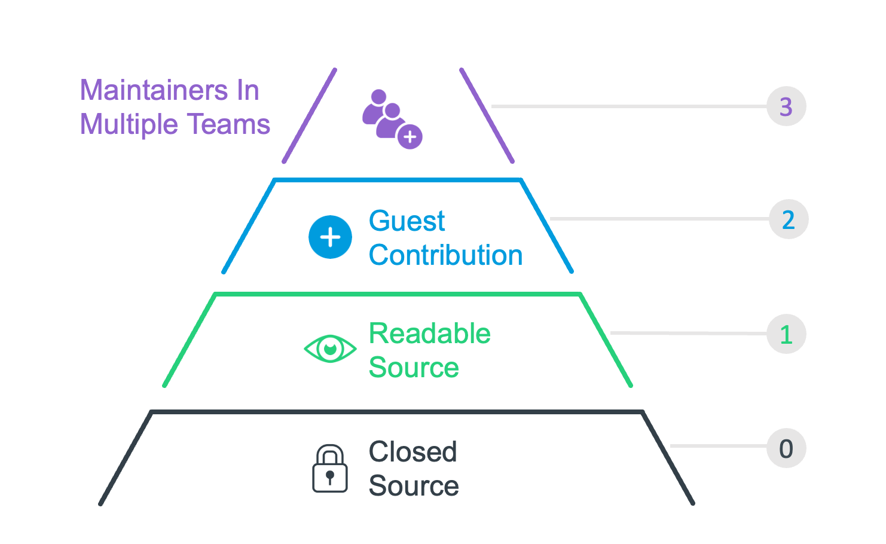

## Title

Project Governance Levels

## Patlet

Several teams are using different InnerSource patterns and all calling it "InnerSource", so the term is not precise enough to usefully describe a set of working practices without confusion.
Establishing a more accurate common language that is understood across all teams allows anyone to communicate intent or set expectations efficiently without ambiguity.

## Problem

Several teams are using InnerSource practices.
However the degree to which they welcome contributions and give equal collaboration rights to contributors differ.
Despite these differences, all teams refer to their way of working as "InnerSource" without any additional qualifiers.

The result is confusion and frustration when teams collaborate as the expectation of what InnerSource means in practice is different in each team.
This confusion also affects strategy planning and decisions on future InnerSource intent as the term is too vague which leads to long discussions and time lost on clarifications.

## Story

### Example of Confusion

For two projects, different InnerSource practices have been adopted.
Project A has a shared ownership model with [Trusted Committers](../2-structured/trusted-committer.md) from multiple teams.
Project B is fully owned by one team with contributions from other teams.

New users of either project are regularly confused about the level of influence they can gain in the respective project.
This leads to long discussions, escalations and time lost on clarifications.

### Example of Delayed Decision

Project C is currently closed source and used only by team 1.
Team 2 want to use project C and the leadership of the two teams negotiates options which include InnerSource practices.
Agreement takes longer than expected because the "InnerSource" term did not describe a target state that could be agreed without ambiguity, and the teams had to document bespoke options for their leadership to consider before a decision could be made.

### Examples from Open Source

Like "InnerSource", Open Source is also a broad term.

There are projects on GitHub, published purely for the pleasure of the author with no intention of long term maintenance, not intention to fix bugs submitted by users. This would be the equivalent of "Bug Reports and Issues Welcome" - you can report the bug, but its on the owner to find the time to fix it. We call this **shared source**, which would not qualify as open source software (OSS) yet.

There are projects where the roadmap is created in-house, hidden from public view. Where commit rights come and go with the contract of the employees of one company (e.g. MongoDB, Elastic, Tensorflow). Users are welcome to submit patches, they will even be mentored through. All development happens in the open, but control and strategy is never shared. This would be the equivalent of stage "Contributions Welcome". We call this **single vendor OSS**.

There are projects that share write access, but do not share the power to decide who gets write access next. This applies to everyone who is only a committer at an Apache project.

There are projects that are fully shared across multiple independent organizations (e.g. k8s, any Apache project) - those would be "Shared Ownership". We call this **vendor neutral OS**.

The same levels make sense inside of organizations.

## Context

- InnerSource concepts are established within an organization with multiple projects and teams adopting InnerSource.
- Internal InnerSource practices are not prescribed in detail.
- Teams/projects have the autonomy to optimize for their local circumstances.

## Forces

- Projects adopt different InnerSource patterns and practices to optimize for their context.
- Users want clarity on the level of influence they can gain in an InnerSource project when deciding whether or how to use it.
- Leaders want clarity on InnerSource project intentions to understand the expected cost and benefits.
- Writing a detailed description of a set of InnerSource practices requires significant effort.

## Solution

Create a universally understood language to describe the project governance levels that are used in your organization.
Note: These governance levels may also be referred to as "operating models", or "ownership models". We stick to the term "governance levels" throughout this pattern but feel free to use whatever terms fits your organization best.

We define **governance levels** as a description of how much influence the core development team of a project is willing to share with contributing teams.
Or in other terms, the level of influence a contributing team can gain in the respective project.

Examples of governance levels (more details below):

- Bug Reports and Issues Welcome
- Contributions Welcome
- Shared Ownership

To evangelize these governance levels in your organization, follow these steps:

1. Define your governance levels
   - Document the governance levels that are commonly used in your organization.
   - Document additional governance levels that you don't have yet, but that would benefit the cross-team collaboration in your organization.
   - Give each of them a distinctive and descriptive name.
   - Use specific projects as examples where helpful.
   - **Goal**: Have a clear written description of the governance levels, that you can refer to as a reference.
2. Promote your governance levels
   - Present your governance levels in existing knowledge sharing forums in your organization.
   - Stick to the names of these governance levels that you chose above.
   - **Goal**: The governance levels are known and understood throughout your organization.

### Example: Commonly used Governance Levels

Examples of common project governance levels are:

- **Bug Reports and Issues Welcome**:
    - People outside the core development team may use the code.
    - They can submit feature requests and bug reports for things they would like to see changed.
    - aka **Readable Source**, **Shared Source**
- **Contributions Welcome**:
    - People outside the core development team may use the code.
    - They can also make modifications and submit them to the core team for inclusion.
    - aka **Guest Contributions**
- **Shared Ownership**:
    - Members of different teams collaborate on the project as equal peers.
    - Everyone has the ability to merge code.
    - Everyone has an equal say on the project direction.
    - Everyone has an equal say in who else to add to this group.
    - aka **Distributed Ownership**, **Maintainers in Multiple Team**

### Example: Different Ways of Promoting the Governance Levels

- Use the chosen names of your governance levels within project documentation and contributing guides (see also [Standard Base Documentation](../2-structured/base-documentation.md)).
- Label projects with the governance levels in an [InnerSource Portal](../2-structured/innersource-portal.md), so that contributors can see at a glance what type of InnerSource collaboration the core team currently supports.
- Create training material contain examples of projects in your organization, that make it easier for people in your organization what these governance levels mean and how they work.
- Presenting the governance levels as a menu of adoption options when launching new InnerSource projects.

## Resulting Context

- Cross team communication occurs efficiently without confusion using terms that are universally understood and centrally documented.
- Organization leaders understand the nuances within practising InnerSource and make better informed and more precise decisions that are easier to communicate.
- Increased standardization of InnerSource practices within the organization as the named and documented building blocks are used by teams as a menu for adoption.
- Teams can adopt InnerSource best practices in a step-by-step way which makes adoption easier and less intimidating.

## Known Instances

* BBC - referenced in this talk: [Ownership in a DevOps and InnerSource environment - Tom Sadler (BBC)](https://www.youtube.com/watch?v=O8TK7QG3FjM)
* Flutter Entertainment
* Europace AG

### Flutter Entertainment

Flutter Entertainment define an [InnerSource Pyramid](https://innersource.flutter.com/how/pyramid/) to describe three different operating models: Readable Source, Guest Contributions and Maintainers in Multiple Teams. Each name is centrally documented. The use of these names is encouraged via repeated usage, direct training and categorization of each InnerSource project.

## Status

Structured

## Authors

- Isabel Drost-Fromm
- Rob Tuley
- Tom Sadler

## Alias

- Transparent Governance Levels
