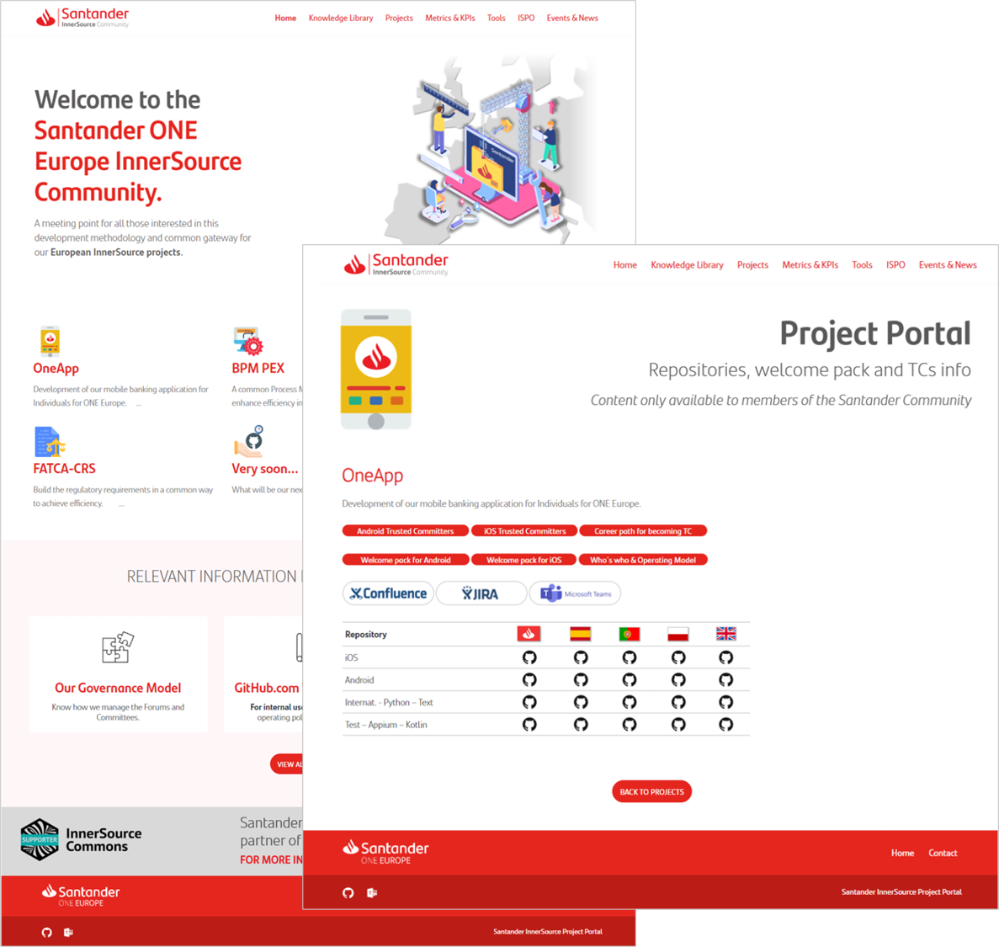

## Title

InnerSource Portal

## Patlet

Potential contributors cannot easily discover InnerSource projects that they are interested in. By creating an intranet website that indexes all available InnerSource project information you enable contributors to learn about projects that might interest them and InnerSource project owners to attract an outside audience.

## Problem

InnerSource project teams are finding it difficult to attract outside contributions.

InnerSource projects at your organization are increasing but potential contributors have no easy way of discovering them.

## Story

You are attempting to establish an InnerSource practice within your organization.  You are aware of some projects being run using an InnerSource model but their existence is only being communicated via word of mouth, email or sidebar conversations with other employees.  As a result InnerSource project owners are finding it difficult to attract contributors.  

There is no single, shared resource for employees across the organization to access which will allow them to easily discover all ongoing InnerSource projects.  This is severely limiting the growth potential of every InnerSource project.  

What can be done to help all InnerSource projects raise their visibility to as large an audience as possible and attract contributors organization-wide?

## Context

* Your organization is interested in adopting an InnerSource work style.
* InnerSource project owners are seeking a way to attract audiences to their projects. However, they are limited by the communication channels available to them through which they could advertise to potential contributors.
* InnerSource projects at your organization are increasing.
* Compounding this problem is the fact that the shared source control management application in use has such limited search capabilities that even developers in search of InnerSource projects find it frustrating to locate them.

### Prerequisites

* Managers have given tacit acceptance that their employees should take part in InnerSource projects
* A shared source control management system is in use which provides programmatic access to the contents of the repositories it hosts
* There is a department within your organization with the responsibility of promoting InnerSource collaboration

## Forces

* The full potential for separate engineering teams to partner on shared challenges is not being realized
* It is difficult for individuals to discover what InnerSource projects exist
* It is difficult for InnerSource project owners to attract an audience of external contributors

## Solutions

Create an InnerSource Portal intranet website where InnerSource project owners can easily advertise the availability of their projects.

Key properties of the portal are:

* Visitors to the InnerSource Portal should be able to see all available projects as well as search for specific projects based on various criteria such as project name, technologies in use, contributor names, sponsoring business unit etc.  
* The information displayed via the InnerSource Portal should be under the full control of the InnerSource project owners at all times.  Preferably, by sourcing this information directly from a specific data file or meta-data stored in the project repository itself.  
* Project owners should include all relevant information concerning their projects within those data files including the project name, trusted contributors' names, a brief description and links to the code repository or any supporting documentation.  
* (optional) While most organizations will choose to make their portal only available on their intranet, some organizations have opted to make their portal available on the public internet. The latter can be interesting for organizations that want to show additional information about their InnerSource approach in their portal e.g. for branding and recruitment purposes.

When launching the portal, a communications campaign promoting the addition of InnerSource data files or meta-data to code repositories should be considered, to bolster the number of projects displayed within the portal.

A [reference implementation](https://github.com/SAP/project-portal-for-innersource) of an InnerSource portal is available on GitHub and open for contributions. It lists all InnerSource projects of an organization in an interactive and easy to use way. Projects can self-register using a dedicated GitHub topic and provide additional metadata.

## Resulting Context

* The InnerSource Portal has enabled InnerSource project owners to advertise their projects to an organization-wide audience.  Due to this increased visibility they are attracting much larger communities of contributors than ever before.
* For those looking to get involved in InnerSource projects, the InnerSource Portal has allowed them to discover exactly the kind of opportunities they are interested in by searching across all available InnerSource projects simultaneously based on their specific criteria.
* Satisfying the needs of both of these audiences has helped establish InnerSource as a viable and attractive option for all areas of the organization to leverage to accomplish things together they could not have separately.

## Known Instances

* **A large financial services organization** has used the creation of an InnerSource Portal to provide a mechanism of advertising and discovering InnerSource projects in existence across different business units
* **SAP** promotes InnerSource projects in the InnerSource Portal - projects can self-register using GitHub topics. The [Repository Activity Score](repository-activity-score.md) defines the default order of the InnerSource projects in the portal. Also see [Michael Graf & Harish B (SAP) at ISC.S11 - The Unexpected Path of Applying InnerSource Patterns](https://www.youtube.com/watch?v=6r9QOw9dcQo&list=PLCH-i0B0otNQZQt_QzGR9Il_kE4C6cQRy&index=6). Its codebase is published as a [reference implementation](https://github.com/SAP/project-portal-for-innersource) and open for contributions.
* **Elbit Systems** has used this pattern and added gamification on top.
  * [Gamification As Means of Cultural Change and InnerSource Engagement Booster](https://www.oreilly.com/library/view/oscon-2018-/9781492026075/video321579.html) | Shelly Nizri | OSCON 2018 - Portland, Oregon
  * Of Islands, Monsters & InnerSource [(slides)](https://docs.google.com/presentation/d/1P1OCEK9B6eSrVRUclVWY6meSI-qHOBjM_UAPNvCZamU/edit#slide=id.p15), [(video)](https://drive.google.com/file/d/1pM89uHMn0vhE3ayFJDGYcCO8R0tAXXZD/view?usp=drivesdk) | InnerSource Spring Summit 2019 (Galway, Ireland)
  * The [code](https://gitlab.com/gilda2) realizing this platform has been open sourced.
* **American Airlines** promotes InnerSource projects via an [internal InnerSource Marketplace](https://tech.aa.com/2020-10-30-innersource/). Similarly to SAP, projects self-register by adding `innersource` as a GitHub topic. Projects are searchable and filterable by language, topics, number of open issues, etc.
* **Banco Santander** has created a public portal called "Santander ONE Europe InnerSource Community" to support and increase InnerSource adoption. In addition to the catalog of projects the portal includes relevant content such as documentation, way of working, news, and events.

* **Airbus** used the [SAP Portal](https://github.com/SAP/project-portal-for-innersource) as a Proof of Concept. It is now using the [Bazaar plugin](https://github.com/backstage/backstage/blob/master/plugins/bazaar/README.md) of [Backstage](https://backstage.io) as the latter became the official developer experience tool internally. It provides a convenient self-registering capability for all the divisions.
* **Mercado Libre** use an instance of the [SAP portal](https://github.com/SAP/project-portal-for-innersource) to discover existing InnerSource projects within the organization.
* **Mercedes-Benz** is [using](https://opensource.mercedes-benz.com/news/sponsor_innersource_commonsoss) the SAP reference implementation mentioned above for their InnerSource Portal.

## References

* The InnerSource Portal pattern has been proven to work extremely well with the associated InnerSource [Gig Marketplace](./gig-marketplace.md) pattern in this context

## Status

* Structured

## Author(s)

* Stephen McCall

## Acknowledgments

* Shelly Nizri
* Melinda Malmgren
* Michael Graf
* Jesús Alonso Gutierrez
