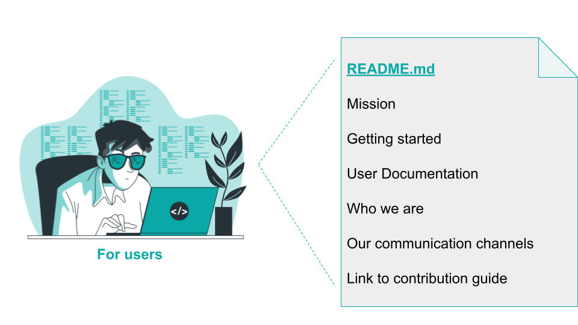

## Title

Standard Base Documentation

## Patlet

New contributors to an InnerSource project have a hard time figuring out who
maintains the project, what to work on, and how to contribute. Providing
documentation in standard files like `README.md`/`CONTRIBUTING.md` enables a
self service process for new contributors, so that they can find the answers to
the most common questions on their own.

## Problem

A team wants to share either a freshly started or a pre-existing project with
the wider organization and receive contributions to it. Potential contributors
often are lost: They are failing to identify the team's preferred communication
channels. They have trouble quickly making a judgment about whether a new
feature makes sense to be added or not. They have a hard time understanding
exactly which colleagues are currently actively maintaining the project.

## Context

A project is to be shared with others as an InnerSource project. In order for
others to be able to understand what the project is about as well as how to
contribute, the project needs to provide some base level documentation. So far
the project is lacking either all documentation or some aspects needed for users
to try it out in a self-service manner as well as for contributors to get up to
speed quickly.

## Forces

- The project was converted into an InnerSource project only recently. Before, users were either only internal or on-boarded in personal face-to-face sessions. Equally, people working on the project went through personal on-boarding sessions which do not scale with growing numbers of contributors or remote contributors. As a result, self service documentation is lacking.
- The project was newly created as an InnerSource project. However the host team lacks experience with InnerSource. As a result they need guidance on which information to include in their documentation, where to put that documentation so others can find it and which types of readers to address in their documentation.
- The project was converted into an InnerSource project only recently, the host team has limited experience with InnerSource. As a result, existing documentation addresses a lot of technical aspects. It does not cover communication, coordination, information needed to facilitate transparent planning.
- The project was converted into an InnerSource project only recently. As a result, a lot of implicit knowledge that exists within the team is neither written down nor obvious to contributors.
- A lack of documentation leads to potential contributors taking a long time to get setup and get started. Producing documentation (and keeping it up to date) requires a time investment. Even if the host team relies on contributors to help with lacking documentation, those contributions still need time to review.
- Project members are spending a lot of time answering getting started questions. Maintaining a comprehensive database of what could be considered support questions requires a lot of time and effort though.
- Different teams within the organization have diverging standards for how to format source code and which software patterns to use. As a result contributions often end up getting re-written to a large part or even entirely. Standardizing all of that and enforcing the standard often would require a lot of time and work.
- The added work for repeated explanations and re-writes diminishes the usefulness of the InnerSource approach.
- Frequent escalations due to extra work and delays due to re-writes lead to a big cheese situation.

## Solution

Address the need for clearer documentation for new contributors. The goal when
creating this documentation should be to make getting started as much a self
service process as possible with frequently asked questions answered in standard
documentation format.

### README.md

If it does not yet exist, create a `README.md` for your project. It should
contain:

* The [mission of the project](https://producingoss.com/en/producingoss.html#mission-statement) in as a concise format as possible. It should answer what the project's purpose is and enable contributors to make a good first guess whether a suggested feature will likely be in scope for the project, or not.
* A "Getting Started" section for downstream users of the project. It should explain how to setup/ integrate the project artifacts as well as an explanation of some of the first typical steps for first time users.
* Deeper documentation for project users - or a link to that.
* Documentation needed for making modifications to the project - or a link to that.
* Documentation on how to contribute to the project - or a link to that.
* A "Getting involved" section that explains which public, archived, linkable communication channels the project uses. This should include a link to the project issue tracker, but also to any further discussion media used.
* A "Who we are" section explaining who the [Trusted Committers](../trusted-committer.md) behind the project are - with an explanation that instead of contacting these people privately the public communication channels above should be used for communication.
* An explanation of what the criteria are for the project to turn contributors into Trusted Committers - if that path exists.

### CONTRIBUTING.md

If the explanation of the steps to make a contribution are too involved, create
a separate `CONTRIBUTING.md` document. This document should answer frequently
asked questions that contributors have asked in the past. There is no need to
provide a comprehensive book up front. Rather, share information that has proven
needed by contributors. Likely it will touch upon one or more of the following
topics:

* How to checkout the project source code from version control.
* How to make modifications to the project (potentially including information on coding guidelines).
* How to build the project.
* How to run tests to make sure the above modifications aren't introducing new bugs.
* How to submit your modifications back to the project.
* Some information on which turnaround time to expect for modifications made.

There are many of good examples for how to write a `README.md` and what kind
of information to include in a `CONTRIBUTING.md` file in various open source projects.
Pages like [how to write a readme that rocks](https://m.dotdev.co/how-to-write-a-readme-that-rocks-bc29f279611a),
[Open Source Guide from GitHub](https://opensource.guide/) as well as
the book [Producing Open Source](https://producingoss.com/en/producingoss.html)
all have valuable information on what kind of information to provide. While
Producing Open Source does not have a chapter on writing a good README per se,
the [Getting Started
chapter](https://producingoss.com/en/producingoss.html#starting-from-what-you-have)
does provide a fairly extensive list of things that fellow host team members,
users and contributors will need. InnerSource projects likely will not cover all
of those aspects right from the start, the list itself is helpful for
inspiration for what one could cover.

In addition to that, this pattern comes with two very basic templates to get you
started right away: [README-template.md](templates/README-template.md) and
[CONTRIBUTING-template.md](templates/CONTRIBUTING-template.md)

## Resulting Context

* The time for contributors to get up to speed is significantly reduced.
* Time spent on answering initial questions for [Trusted Committers](../trusted-committer.md) is significantly reduced, leaving them more time to work on other tasks.
* Escalations due to misunderstandings and misalignment are significantly reduced.

## Known Instances

* Europace AG - See blog post [InnerSource: Adding base documentation](https://tech.europace.de/post/innersource-base-documentation/)
* Paypal Inc.
* Mercado Libre - create a documentation site that contains how to get started with InnerSource and also define the basic artifacts that a repository must have to be InnerSource (README, CONTRIBNUTING, CODING_GUIDELINES, etc).

## Authors

* Isabel Drost-Fromm

## Alias

Provide standard base documentation through a README

## Status

* Structured
* Drafted in December 2019.

## References

* [README-template.md](templates/README-template.md) and
* [CONTRIBUTING-template.md](templates/CONTRIBUTING-template.md)

## Credits

[Web](https://storyset.com/web) and [People](https://storyset.com/people) illustrations by Storyset
