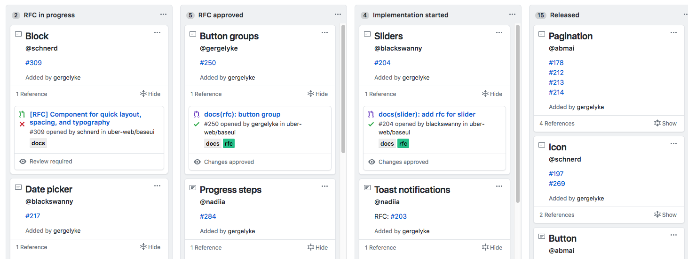

## Title

Transparent Cross-Team Decision Making using RFCs

## Patlet

InnerSource projects that want to achieve high participation rates and make the best possible decisions for everybody involved need to find ways to create participatory systems throughout the full software lifecycle. Publishing internal Requests for Comments (RFCs) documents allows for discussions early on in the design process, and increases the chances to build solutions with a high degree of commitment from all involved parties.

## Problem

For an InnerSource project to be healthy, it needs a substantial amount of contributors. These contributors (or teams) maybe have different requirements for the given project. e.g. they may want to add features to the project that are not compatible with one another or lead to an unhealthy bloat in the architecture.

Discovering such disagreements or misunderstanding late in the process, e.g. once the software has already been built, is very costly. These disagreements may lead to frustrations by all parties involved, and can even be disruptive to the health of the collaboration culture in the project. A common situation where such a disagreement surfaces is a change request (pull request) which is open for a very long time because the author of the change request and the maintainers of the project essentially don’t agree that the proposed change should be made at all.

For an InnerSource project this situation happens more frequently when the project is maintained by multiple teams in the company i.e. shared ownership.

## Story

A project, or application made up of multiple projects, is maintained by a number of different teams, with each team owning different areas of the project or application. These teams do make InnerSource contributions to each other's areas, but larger, cross-cutting changes are only ever driven by the teams' technical leads working together, or don't happen at all. This results in most engineers unable to effect large scale, cross-cutting change, reducing innovation and opportunities for collaboration.

By implementing a process and template for RFCs, teams and individuals are empowered to propose large, cross-cutting changes via a transparent decision making process, with consultation across teams done asynchronously. This results in greater innovation, closer collaboration, and more knowledge spread. This is dependent on buy-in from all disciplines at all levels, and an environment of psychological safety so that people can openly propose and debate ideas.

Like with any process, this must be continually improved upon. There may need to be changes to the RFC template or process to ensure it is inclusive, collaborative, and effective.

## Context

- shared ownership by many teams of an InnerSource project
- overarching design decisions cannot be made from a central body all the time (e.g. a group of architects) as they have neither enough time, nor sufficient domain-specific knowledge to make good decisions in all the cases
- various types of users have input on the direction that a certain project is taking. Such user may be: Developers, Product Owners, Product Managers, etc
- decisions need to be made in a asynchronous fashion, at least partly, as it isn’t feasible to call frequent synchronous meetings with all participants
- there is a desire to document the decisions made, i.e. making sure that they are made in writing, rather than just verbally

## Forces

- most of the times, the involved parties want to make a decision fairly quickly (e.g. the up-front design time is fairly limited)
- writing things down (without already implementing things) is often a new skill for many of the people involved

## Sketch

## Solutions

We chose an RFC-like process for increasing the transparency of our cross-team decision making process (also see [Requests for Comments][requests-for-comments]).

Important elements of the solution are:

- a description of when to publish an RFC (and when not to)
- a template for RFC documents
    - should provoke RFC author to consider their proposal from multiple angles
    - should prompt both high level accessible overview, and detailed in-depth explanation
- a well known, lightweight process surrounding RFCs e.g.
    - how to publish RFC and share it with all stakeholders (e.g. Slack, mailing list)
    - how to collect feedback for the RFC
    - how to work in the feedback
    - how to move the RFC towards a conclusion or decision (e.g. relevant nominated maintainers to sign off)
    - appropriate tooling chosen (e.g. non-engineers may not have access to source control tools)
- a commitment to iterate on the RFC template and process

### Examples/Templates

- [Rust][rust] is a good Open Source example of RFC template and process, and has been the basis for many other RFC processes.
- [Generalized BBC iPlayer & Sounds RFC template](templates/rfc.md), originally based on the [Rust][rust] template

## Resulting Context

Implementing an RFC-like process has proven to be valuable, as it makes the cross-team decision making process more transparent for everybody, allowing for all voices to be heard.

Observable positive effects:

- **democratization of the decision making process** for decisions that impact many teams (also offloading team leads from that burden)
- **a open asynchronous communication method** that works well across multiple teams and geographies
- **empowers individuals and teams** to effect large scale change
- **record of decisions made** for people to refer back to for context
- **scales impact of experienced engineers** as they can contribute to solutions asynchronously and remotely, rather than needing to be present in a meeting
- **terminology alignment** e.g. by spelling out our testing terminology such as “what is a system test?”
- **process alignment** e.g. by spelling out the out-of-hours support process
- **greater clarity of thought**, as writing an RFC makes the author challenge herself more than they would normally

The RFC approach also has risk that we want to call out:

- It doesn’t always work! e.g. some people might still argue against a decision that was already made via an RFC. However having the decision making process in writing is still beneficial in these scenarios, as you can point people to when and why a certain decision was made.
- Writing up design proposals (architecture, protocols, etc) upfront has an element of waterfall-like design that does not fit the iterative development approach that many development teams favor. Remember: “Working software over comprehensive documentation” ([Agile Manifesto](https://agilemanifesto.org/)). The RFC process should be as lightweight as possible.
- An RFC may become big and too unwieldy. This often shows in long comment threads and discussions surrounding it. In those situations we may decide to complement the RFC with synchronous communication such as a working group and in-person meetings. But time is still saved, as people can read the RFC before the meeting rather than having all the information shared during the meeting.

## Rationale

RFCs haven proven themselves in the Open Source world for many years. This is true both for the Internet as a whole where RFCs have been instrumental in developing standards (e.g. see [30 Years of RFCs][30-years-of-rfcs]), as well for other Open Source projects that have adapted this method to promote transparent decision making in their community (e.g. [RUST][rust], [ZeroMQ][zeromq]).

In the context of InnerSource, other companies have shared their experiences with RFC-like approaches too, such as [Uber][uber] and [Europace][europace].

Also for decision making outside of pure software design decisions, transparent decision making models can be effective e.g. when working towards an Open Organization. For an example see Red Hat’s [Open Decision Framework][open-decision-framework] (released publicly on June 7, 2016).

## Known Instances

- **BBC iPlayer & Sounds** - As presented at the ISC Fall Summit 2020 [Using Internal RFCs to Enhance Collaboration][bbc].
- **Europace** - As described in Open Organization: [Setting cross-team standards and best practices in the open][europace].
- **Uber** - According to this blog post by Gergely Orosz: [Scaling Engineering Teams via RFCs: Writing Things Down][uber].
- **Google Design Docs** - As described in this blog post by Malte Ubl [Design Docs at Google][google]
- **DAZN** (10/2021) - One way that DAZN makes technical decisions is via RFCs. RFCs are used for decisions that apply to engineering-wide processes only! The RFCs live in a GitHub repository, and technical standards are then gradually adopted within their tools and by their engineers. An RFC can be raised by any engineer, and voted on by all engineers. If upvotes exceed downvotes, the RFC is adopted. It’s worth noting, that the RFC voting process hasn’t yet been “stress-tested” by any contentious decisions. - As described in this blog post by Lou Bichard: [Building A DX Team: Lessons Learned][dazn]

## Status

Structured

## Author(s)

- Tom Sadler
- Sebastian Spier

## Aliases

- [Design Docs][google]
- Architecture Decision Record (ADRs) - Not necessarily a direct alias, as they can sometimes be used very differently e.g. RFCs for seeking input and building consensus, ADRs for recording decisions and implementation detail

[requests-for-comments]: https://en.wikipedia.org/wiki/Request_for_Comments
[30-years-of-rfcs]: https://www.rfc-editor.org/rfc/rfc2555.txt
[rust]: https://github.com/rust-lang/rfcs
[zeromq]: https://rfc.zeromq.org
[uber]: https://blog.pragmaticengineer.com/scaling-engineering-teams-via-writing-things-down-rfcs/
[europace]: https://github.com/open-organization/open-org-distributed-work-guide/blob/master/drostfromm-remote-first-through-openess.md#setting-cross-team-standards-and-best-practices-in-the-open
[open-decision-framework]: https://www.redhat.com/en/about/press-releases/red-hat-releases-open-decision-framework-spur-transparent-and-inclusive-leadership
[bbc]: https://www.youtube.com/watch?v=U6zlghE0HcE
[google]: https://www.industrialempathy.com/posts/design-docs-at-google/
[dazn]: https://medium.com/dazn-tech/building-a-dx-team-lessons-learned-4a66446088bc
