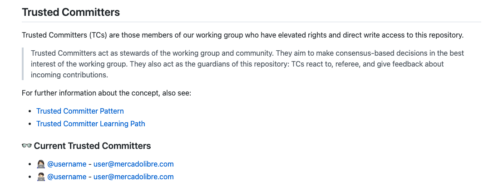

## Title

Trusted Committer

## Patlet

Many InnerSource projects will find themselves in a situation where
they consistently receive feedback, features, and bug-fixes from contributors.
In these situations, project maintainers seek ways to recognize and reward the
work of the contributor above and beyond single contributions.

## Problem

- Project maintainers want to find ways to scale their ability to support a project
- Project maintainers want to find ways to lengthen the value delivered by a project
- Project maintainers want to visibly reward frequent contributors and empower them to amplify their value contribution.
- Lack of mechanism and language for recognizing contributions across teams within an organization

## Context

- You are the maintainer of a cross-team library, service, or shared resource
- You receive regular contributions
- You receive regular feature requests
- You receive regular bug-fix requests
- There are motivated contributors looking to build expertise through InnerSource projects

## Forces

- Over the lifecycle of a project, the focus of the maintainers may shift away to accommodate changing business priorities
- Contributors seek visible recognition of their contributions, demonstrating value
- Maintaining a project of reasonable complexity is taxing for a small team
- Developing project features at scale is taxing for a small team

## Solution

### Defining the Trusted Committer Role for a Project

What a Trusted Committer handles is up to each project and its maintainers. Ensure you document within the project the scope of your Trusted Committer role. Clear documentation sets expectations for new community members and establishes the role for future candidates.

The following are a few guidelines for identifying a potential Trusted Committer:

* An active participant in community channels (Slack, JIRA issue triaging, etc.) becomes a Trusted Committer, thereby formalizing their role in community support.
* Someone who frequently submits code, documentation, or other repository changes.  Start by including this person on pull requests. If they are actively engaging in pull requests, consider approaching them about opportunities for further collaboration on the project.

### Formalizing Trusted Committers

The first step is to approach candidates about becoming a Trusted Committer.
Maintainers should educate candidates on the role of a Trusted Committer. There is no expectation that candidates will accept the role of Trusted Committer. Each candidate
should assess if they have the available bandwidth to take on the responsibilities.

When a candidate accepts the role, it is up to the project maintainers to
publicly recognize the transition from user to Trusted Committer. It is also a
good idea to add their name to a Trusted Committers section in your project's
README.  As an example:

```markdown
# project-name

... your project's readme ...

## Project Leaders

### Maintainers

  - Your team

### [Trusted Committers]

  - The name of the new trusted committer

[Trusted Committers]: https://example.com/link/to/your/trusted/committer/documentation.md
```

### Maintaining Trusted Committer Relationships

Once you formalize a new Trusted Committer, it is a good idea to keep them in the
loop as you continue to iterate on your project. Keeping them in the loop can be as
simple as inviting them to your project channel or as involved as including them in your
planning sessions. More opportunities for involvement gives Trusted Committers
a path to Maintainer if they so desire.

Besides keeping Trusted Committers informed, it is good to check in on a
regular basis. A suggested cadence is to start with every week before gradually
progressing to every few weeks. The purpose of these check-ins is to make sure the
Trusted Committer feels supported in their new role. Analogous to a 1:1 with your
manager, if there are any issues, listen and empathize to try and understand
what is preventing the Trusted Committer from being successful. Always
[thank the Trusted Committer for their continued effort][praise] in making the project successful and set a new date to check-in.

### Sunsetting a Trusted Committer

There are times which necessitate removing a Trusted Committer, such as if the Trusted
Committer is:

* No longer willing to take part
* No longer able to perform their duties
* No longer employed by the company

A plan for removing access to project resources should be agreed upon by both parties,
including transitioning their entry in a project's **Trusted Committer** section to a
list of past contributors.

Upon removing access, [thank the Trusted Committer for
their participation publicly][praise]. Public acknowledgment ensures clear
communication of transition and continuity within the community.

## Resulting Context

### For Contributors

Achieving Trusted Committer status for a project demonstrates initiative in
contributing to the community project. Recognition for these
efforts can be used during annual reviews with managers.

### For Maintainers

As a project matures, maintainers can become less familiar with key aspects
of a project. Trusted Committers fill in these gaps, ensuring that all
aspects of the project are better served over time.

A healthy set of Trusted Committers ensures that if project maintainers move on
there is a plan for responsible stewardship.

## Known Instances

This has been tried and proven successful at:

- Nike
- PayPal
- Mercado Libre - adds a section in the `CONTRIBUTING.md` file to inform who the Trusted Committers are.



## Status

- Structured
- Published internally at Nike; drafted via pull-request in June of 2018.

## Authors

- [Fernando Freire]

## Acknowledgements

- [Russell Rutledge]
- [Loren Sanz]
- [Noah Cawley]
- [Jeremy Hicks]
- [Doron Katz]

[Doron Katz]: https://github.com/doronkatz
[Russell Rutledge]: https://github.com/rrrutledge
[Loren Sanz]: https://github.com/mrsanz
[Jeremy Hicks]: https://github.com/greatestusername
[Noah Cawley]: https://github.com/utanapishtim
[praise]: ./praise-participants.md
[Fernando Freire]: https://github.com/dogonthehorizon
