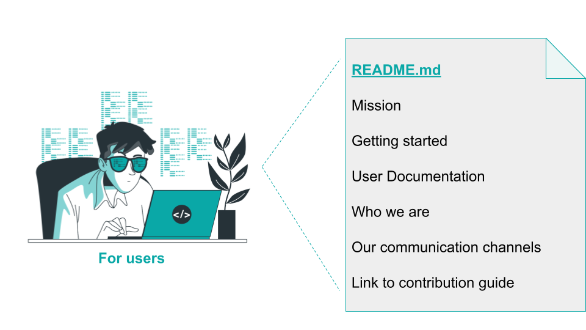
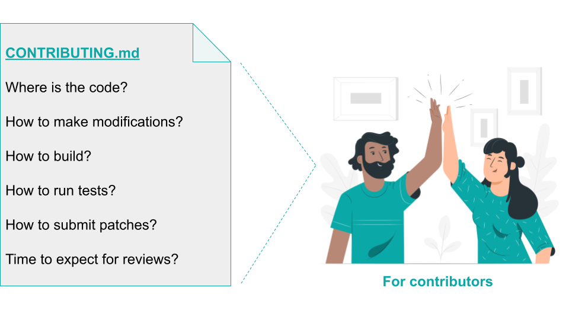

## Title

Documentación Base Estándar

## Patlet

Los nuevos contribuidores a un proyecto InnerSource tienen dificultades para identificar quién mantiene el proyecto, en qué trabajar y cómo contribuir. Proporcionar documentación en archivos estándar como `README.md`/`CONTRIBUTING.md`/`COMMUNICATION.md` permite un proceso de autoservicio para nuevos contribuidores, permitiéndoles encontrar respuestas a las preguntas más comunes por sí mismos.

## Problema

Un equipo desea compartir un proyecto, ya sea nuevo o existente, con la organización y recibir contribuciones. Los potenciales contribuidores frecuentemente se sienten perdidos: No logran identificar los canales de comunicación preferidos del equipo. Tienen dificultades para determinar rápidamente si una nueva funcionalidad tiene sentido o no. Les cuesta entender exactamente quiénes son los colegas que actualmente mantienen el proyecto.

## Contexto

Un proyecto se compartirá con otros como proyecto InnerSource. Para que otros puedan entender de qué trata el proyecto y cómo contribuir, el proyecto necesita proporcionar documentación básica. Hasta ahora, el proyecto carece de toda la documentación o algunos aspectos necesarios para que los usuarios lo prueben de manera autónoma y para que los contribuidores puedan ponerse al día rápidamente.

## Resistencias

- El proyecto se convirtió en un proyecto InnerSource recientemente. Antes, los usuarios eran internos o recibían capacitación presencial. De igual manera, las personas que trabajaban en el proyecto pasaban por sesiones de incorporación presencial que no son escalables con el crecimiento de contribuidores o contribuidores remotos. Como resultado, falta documentación de autoservicio.
- El proyecto fue creado como un proyecto InnerSource, pero el equipo anfitrión carece de experiencia con InnerSource. Como resultado, necesitan orientación sobre qué información incluir en su documentación, dónde ubicarla para que otros la encuentren y qué tipos de lectores considerar.
- El proyecto se convirtió en un proyecto InnerSource recientemente, y el equipo anfitrión tiene experiencia limitada con InnerSource. Como resultado, la documentación existente aborda aspectos técnicos pero no cubre comunicación, coordinación e información necesaria para facilitar la planificación transparente.
- El proyecto se convirtió en un proyecto InnerSource recientemente. Como resultado, mucho conocimiento implícito del equipo no está documentado ni es obvio para los contribuidores.
- La falta de documentación hace que los potenciales contribuidores tarden mucho en configurar y comenzar. Producir documentación (y mantenerla actualizada) requiere inversión de tiempo. Incluso si el equipo anfitrión cuenta con contribuidores para ayudar con la documentación faltante, esas contribuciones necesitan tiempo de revisión.
- Los miembros del proyecto dedican mucho tiempo a responder preguntas iniciales. Mantener una base de datos completa de preguntas de soporte requiere mucho tiempo y esfuerzo.
- Diferentes equipos dentro de la organización tienen estándares divergentes sobre cómo formatear código y qué patrones de software usar. Como resultado, las contribuciones a menudo terminan siendo reescritas en gran parte o completamente. Estandarizar todo esto requeriría mucho tiempo y trabajo.
- El trabajo adicional por explicaciones repetidas y reescrituras disminuye la utilidad del enfoque InnerSource.
- Las escalaciones frecuentes debido al trabajo extra y los retrasos por reescrituras llevan a una situación de cuello de botella.

## Solución

Abordar la necesidad de una documentación más clara para nuevos contribuidores. El objetivo al crear esta documentación debe ser hacer que el proceso de inicio sea lo más autoservicio posible, con preguntas frecuentes respondidas en un formato de documentación estándar.

### README.md

Si tu proyecto aún no tiene un README.md, créalo e incluye lo siguiente:

* La [misión del proyecto](https://producingoss.com/en/producingoss.html#mission-statement) en un formato lo más conciso posible. Debe responder cuál es el propósito del proyecto y permitir a los contribuidores hacer una buena suposición inicial sobre si una funcionalidad sugerida probablemente estará dentro del alcance del proyecto o no.
* Una sección de "Primeros pasos" para los usuarios del proyecto. Debe explicar cómo configurar/integrar los artefactos del proyecto, así como una explicación de algunos de los primeros pasos típicos para los usuarios primerizos.
* Documentación más profunda para los usuarios del proyecto, o un enlace a ella.
* Documentación necesaria para hacer modificaciones al proyecto, o un enlace a ella.
* Documentación sobre cómo contribuir al proyecto, o un enlace a ella.
* Una sección de "Participar" que explique qué canales de comunicación públicos, archivados y enlazables utiliza el proyecto. Esto debe incluir un enlace al rastreador de problemas del proyecto, pero también a cualquier otro medio de discusión utilizado.
* Una sección de "Quiénes somos" que explique quiénes son los [Trusted Committers](trusted-committer.md) detrás del proyecto, con una explicación de que en lugar de contactar a estas personas en privado, se deben utilizar los canales de comunicación públicos mencionados anteriormente.
* Una explicación de cuáles son los criterios para que el proyecto convierta a los contribuidores en Trusted Committers, si ese camino existe.

### CONTRIBUTING.md

Si la explicación de los pasos para hacer una contribución es demasiado detallada, crea un documento `CONTRIBUTING.md` separado. Este documento debe responder preguntas frecuentes que los contribuidores hayan hecho en el pasado. No es necesario proporcionar un libro completo desde el principio. Más bien, comparte información que haya demostrado ser necesaria para los contribuidores. Probablemente tocará uno o más de los siguientes temas:

* Cómo obtener el código fuente del proyecto desde el control de versiones.
* Cómo hacer modificaciones al proyecto (potencialmente incluyendo información sobre las pautas de codificación).
* Cómo construir el proyecto.
* Cómo ejecutar pruebas para asegurarse de que las modificaciones anteriores no introduzcan nuevos errores.
* Cómo enviar tus modificaciones de vuelta al proyecto.
* Alguna información sobre el tiempo de respuesta esperado para las modificaciones realizadas.

### COMMUNICATION.md

Crea un documento `COMMUNICATION.md` separado. Enlaza este documento a tu `README.md` para que se pueda proporcionar información de contacto completa sin ocupar espacio adicional en tu README.
Este documento debe responder preguntas frecuentes sobre cómo comunicarse con tu equipo que los contribuidores necesitan saber. El objetivo es agilizar las comunicaciones para que los usuarios y contribuidores se comuniquen con la persona correcta a través de un solo canal.
Esto reduce distracciones innecesarias para los miembros del equipo y organiza las comunicaciones para que no se pierdan.

Las secciones en el `COMMUNICATION.md` incluyen puntos de contacto para comunicaciones entrantes e información sobre comunicaciones salientes del equipo de propiedad del proyecto. A continuación, algunos ejemplos.

Puntos de contacto para la comunicación entrante y cómo contactar a esos usuarios:

* Reportar un error
* Dar seguimiento a un PR
* Solicitudes de funcionalidades
* Preguntas sobre documentación
* Escalaciones

Cómo y cuándo el equipo se comunica con los usuarios y cómo ser agregado a esas comunicaciones:

* Interrupciones planificadas y no planificadas
* Lanzamientos de funcionalidades
* Congelaciones de código
* Cambios importantes

Hay muchos buenos ejemplos de cómo escribir un `README.md` y qué tipo de información incluir en un archivo `CONTRIBUTING.md` en varios proyectos de código abierto.
Páginas como [cómo escribir un readme que destaque](https://m.dotdev.co/how-to-write-a-readme-that-rocks-bc29f279611a), [Guía de Código Abierto de GitHub](https://opensource.guide/) así como el libro [Producing Open Source](https://producingoss.com/en/producingoss.html) tienen información valiosa sobre qué tipo de información proporcionar.
Aunque Producing Open Source no tiene un capítulo sobre cómo escribir un buen README per se, el [capítulo de Primeros Pasos](https://producingoss.com/en/producingoss.html#starting-from-what-you-have) proporciona una lista bastante extensa de cosas que los miembros del equipo anfitrión, usuarios y contribuidores necesitarán.
Los proyectos InnerSource probablemente no cubrirán todos esos aspectos desde el principio, pero la lista en sí es útil para inspiración sobre qué se podría cubrir.

Además de eso, este patrón viene con tres plantillas muy básicas para que puedas comenzar de inmediato: [README-template.md](../templates/README-template.md),
[CONTRIBUTING-template.md](../templates/CONTRIBUTING-template.md) y [COMMUNICATION-template.md](../templates/COMMUNICATION-template.md).

## Contexto Resultante

* El tiempo para que los contribuidores se pongan al día se reduce significativamente.
* El tiempo dedicado a responder preguntas iniciales para los [Trusted Committers](trusted-committer.md) se reduce significativamente, dejándoles más tiempo para trabajar en otras tareas.
* Las escalaciones debido a malentendidos y desalineaciones se reducen significativamente.

## Instancias Conocidas

* Europace AG - Ver publicación en el blog [InnerSource: Adding base documentation](https://tech.europace.de/post/innersource-base-documentation/)
* Paypal Inc.
* Mercado Libre - crear un sitio de documentación que contenga cómo comenzar con InnerSource y también definir los artefactos básicos que un repositorio debe tener para ser InnerSource (README, CONTRIBUTING, CODING_GUIDELINES, etc).
* Analog Devices Inc.
* Airbus

## Autores

* Isabel Drost-Fromm
* Katie Schueths - agregó el concepto de `COMMUNICATION.md`

## Alias

Proporcionar documentación base estándar a través de un README

## Estado

* Estructurado
* Borrador en diciembre de 2019.

## Referencias

* [README-template.md](../templates/README-template.md)
* [CONTRIBUTING-template.md](../templates/CONTRIBUTING-template.md)
* [COMMUNICATION-template.md](../templates/COMMUNICATION-template.md)

## Créditos

Ilustraciones de [Web](https://storyset.com/web) y [People](https://storyset.com/people) por Storyset

## Histórico de Traducciones

- **2025-04-03** - Traducción [Oscar Lobaton S.](https://github.com/ovas04)
