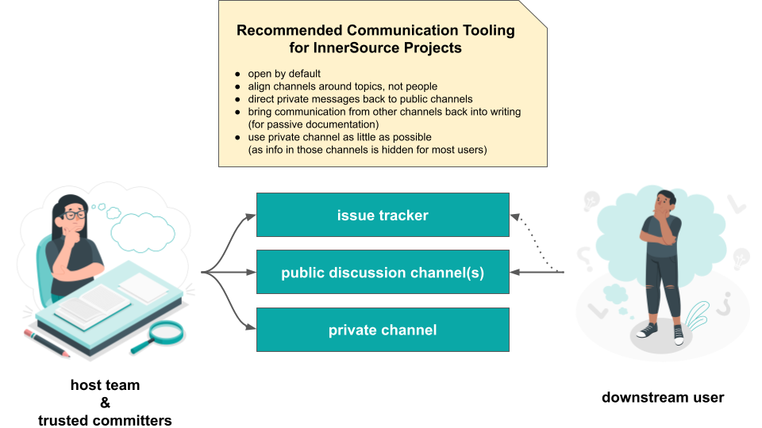

## Title

Herramientas de Comunicación

## Patlet

Los usuarios de un proyecto InnerSource tienen dificultades para obtener ayuda y contactar con el equipo anfitrión. Mediante el uso consistente de herramientas de comunicación asincrónica, el proyecto hace que las discusiones sean visibles, archivadas y buscables, lo que conduce a un mejor nivel de soporte para los usuarios.

## Problema

Un equipo está abierto a recibir contribuciones de los usuarios posteriores de su componente. Sin embargo, la coordinación y comunicación ocurre de manera improvisada, lo que lleva a compartir información incoherente, retrasos en las respuestas recibidas, y contribuyentes contactando a múltiples miembros del equipo anfitrión antes de recibir una respuesta definitiva.

## Contexto

- Un equipo depende del componente de otro equipo.
- Le gustaría hacer contribuciones a ese componente.
- Incluso cuando ocurre por escrito, la comunicación sucede de manera individual.

## Resistencias

- El equipo anfitrión está interesado en recibir contribuciones y dispuesto a guiar a los contribuyentes.
- Los equipos tienen una fuerte cultura de comunicación verbal y poca experiencia en establecer canales de comunicación asincrónica específicos para proyectos.
- Los canales de comunicación pueden estar alineados con grupos específicos que deben ser alcanzados pero no por propósito de comunicación.

## Solución

El equipo anfitrión debe proporcionar canales de comunicación públicos dentro de la empresa, archivados, buscables y enlazables a los que cualquier persona en la empresa pueda suscribirse, ya que hay beneficios medibles al mantener canales de comunicación escritos y abiertos.

El objetivo al optimizar los canales de comunicación para proyectos InnerSource debe ser alinear la comunicación en torno a temas, no en torno a ciertos grupos de personas.

Un proyecto debe establecer las siguientes herramientas de comunicación:

1. **Gestor de tareas dedicado** donde la comunicación estructurada, la toma de decisiones y el seguimiento del progreso pueden ocurrir de manera transparente para todos los miembros del equipo anfitrión y también para los usuarios y contribuyentes posteriores. Para más aplicaciones del gestor de problemas, ver [Casos de Uso del Gestor de Problemas](./issue-tracker.md).
2. **Canales de discusión públicos** que tienen una estructura menos rígida. Típicamente, serán listas de correo, foros en línea, sistemas de preguntas y respuestas o incluso canales de chat archivados. Usualmente es suficiente comenzar con solo un canal para el proyecto. Si el tráfico aumenta demasiado, es útil separar las discusiones sobre el uso del proyecto de las discusiones sobre el desarrollo del proyecto.
3. **Un canal privado** donde la comunicación sobre temas sensibles puede ocurrir entre [Trusted Committers](./trusted-committer.md) - por ejemplo, agregar más Trusted Committers al equipo anfitrión. Este canal debe usarse con mucho cuidado para que la comunicación por defecto sea abierta y se mantenga privada solo en circunstancias muy raras.

Aunque la comunicación puede ocurrir fuera de estos canales escritos, se debe traer la mayor cantidad de información posible a los canales asincrónicos.

Todos los canales de comunicación deben estar documentados en el archivo `README.md` del proyecto. Para más detalles sobre el uso de este archivo, ver [Documentación Base Estándar](./base-documentation.md).

Los miembros del equipo anfitrión deben esforzarse por dirigir las preguntas que reciben personalmente (por ejemplo, por correo electrónico o mensajes privados) hacia los canales de comunicación oficiales.

## Contexto Resultante

Establecer y usar consistentemente canales de comunicación asincrónica oficiales ayuda a crear un nivel base de [documentación pasiva](https://www.oreilly.com/library/view/understanding-the-innersource/9781491986899/ch04.html) que puede ser referenciada nuevamente cuando surgen preguntas similares.

Con la comunicación ocurriendo abiertamente, otros pueden seguir fácilmente el progreso del proyecto y participar activamente contribuyendo. Otros observando y leyendo reduce la barrera para involucrarse, aumentando la probabilidad de recibir contribuciones.

Con las preguntas siendo respondidas en público, más personas pueden agregar su perspectiva llevando a una imagen completa - esto incluye no solo a los miembros del equipo anfitrión, sino también a los usuarios del proyecto.

Mantener la comunicación en canales asincrónicos permite que los participantes con diferentes horarios - ya sea debido a diferentes zonas horarias o debido a diferentes rutinas, horarios de reuniones, rutinas de equipo - contribuyan significativamente al proyecto.

Responder preguntas en estos canales significa que no solo otros miembros del equipo pueden escuchar y proporcionar información adicional, sino que también que otros usuarios con la misma pregunta ven (o encuentran más tarde) la respuesta anterior, lo que lleva a una menor necesidad de repetir explicaciones.

## Instancias Conocidas

* Europace AG
* Paypal Inc.
* Mercado Libre

## Autores

Isabel Drost-Fromm

## Agradecimientos

Sebastian Spier (por el visual)

## Estado

* Estructurado
* Redactado en Diciembre 2019

## Créditos

Ilustraciones de [People](https://storyset.com/people) por Storyset

## Histórico de Traducciones

- **2025-04-03** - Traducción [Oscar Lobaton S.](https://github.com/ovas04)
