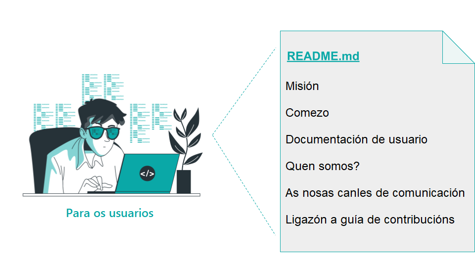
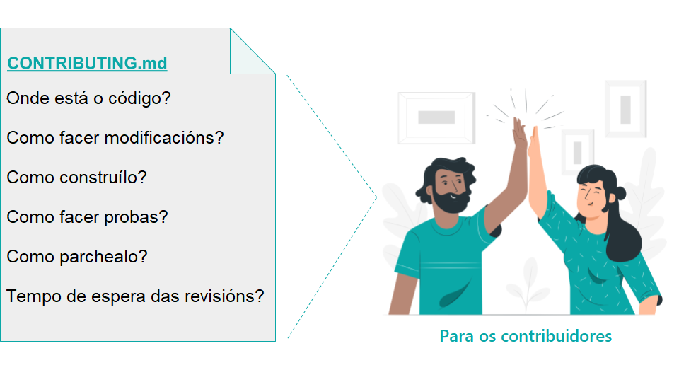

### Title

Documentación base estándar

## Patlet

ós/ás novos/as contribuidores/as dun proxecto InnerSource teñen dificultades para determinar quen mantén o proxecto, en que traballar e como contribuír. Ao proporcionar documentación en arquivos estándar como README.md/CONTRIBUTING.md permítese un proceso de autoservizo para os/as novos/as contribuidores/as, de xeito que poidan atopar por si mesmos/as as respostas ás preguntas máis comúns.

## Problema

O equipo quere compartir un proxecto iniciado recentemente ou preexistente co resto da empresa e que ese proxecto reciba contribucións. A miúdo, os/as posibles contribuidores/as pérdense. Deste xeito, non conseguen identificar cales son as canles de comunicación predilectas do equipo. Tamén teñen problemas para xulgar con rapidez se ten sentido poñer en marcha unha nova funcionalidade ou non. Por outra banda, resúltalles difícil comprender que compañeiros/as en particular están a manter de xeito activo o proxecto nese momento.

## Contexto

O proxecto debe compartirse con outros/as contribuidores/as como proxecto InnerSource. Para que outros/as poidan comprender de que trata o proxecto e como contribuír a el, este debe proporcionar certa documentación básica. Polo de agora, o proxecto carece da documentación ou dalgúns aspectos necesarios para que os/as usuarios/as poidan probalo en modo autoservicio, así como para que os/as contribuidores/as se actualicen rapidamente.

## Aspectos que mellorar

- O proxecto converteuse nun proxecto InnerSource fai pouco. Antes, os/as usuarios/as eran só internos/as ou incorporábanse en sesións presenciais cara a cara. Do mesmo xeito, as persoas que traballaban no proxecto asistían a sesións presenciais de incorporación que non se adaptaban ao crecente número de contribuidores/as ou ás situacións daqueles/as que colaboraban en remoto. Como resultado, existe unha falta de documentación de autoservicio.
- O proxecto creouse como unha iniciativa InnerSource fai pouco. Con todo, o equipo anfitrión carece da experiencia con InnerSource. Como consecuencia, este necesita orientación para saber que información incluír na súa documentación, onde colocar esa documentación do código para que outros/as poidan atopala, ademais de entender como dirixirse ás persoas que despois van a ler esa documentación de código.
- O proxecto converteuse nun proxecto InnerSource recentemente, o equipo anfitrión ten experiencia limitada con InnerSource. Como resultado, a documentación de código existente aborda moitos aspectos técnicos. Así a todo, non se aborda a comunicación, a coordinación ou a información necesaria para facilitar unha planificación transparente.
- O proxecto converteuse nun proxecto InnerSource recentemente. Como resultado, a meirande parte do coñecemento implícito que existe dentro do equipo non está escrito, polo que non é visible para os/as contribuidores/as.
- A falta de documentación de código fai que os/as posibles contribuíntes tarden moito tempo en distribuírse e comezar. Elaborar documentación de código (e mantela actualizada) require un investimento de tempo. Incluso se o equipo anfitrión confía nos/nas contribuidores/as para que o axuden coa documentación de código que falta, esta aínda precisa dun tempo para revisarse.
- Os membros do proxecto pasan moito tempo respondendo a preguntas con respecto á posta en marcha do devandito proxecto. Porén, manter unha base de datos exhaustiva cunha especie de preguntas de asistencia, require moito tempo e esforzo.
- Os distintos equipos da empresa teñen estándares diverxentes respecto a como formatar o código fonte e que modelos de software empregar. Por conseguinte, a miúdo a maior parte de contribucións teñen que reescribirse ata incluso na súa totalidade. Estandarizar estes aspectos e facer que se cumpra a norma adoita requirir de moito tempo e traballo.
- O traballo adicional resultado das explicacións repetidas e as reescrituras diminúe a utilidade do enfoque InnerSource.
- As escaladas frecuentes por mor do traballo adicional e dos atrasos son o resultado das reescrituras de código e, estas, conducen a unha situación que require a intervención dun/dunha especialista.

## Solución

Abordar a necesidade de establecer unha documentación de código máis clara para os/as novos/as contribuidores/as. O obxectivo á hora de crear esta documentación de código debería ser que a posta en marcha sexa un proceso de autoservizo na medida do posible, que dea resposta ás preguntas máis frecuentes nun formato de documentación estándar.

### README.md

Se aínda non o fixo, cree un arquivo `README.md` para o seu proxecto que conteña:

- [A misión do proxecto](https://producingoss.com/en/producingoss.html#mission-statement) no formato máis conciso posible. Debe dar resposta ao propósito do proxecto e permitir que os/as contribuidores/as se fagan unha idea inicial de se é probable que a posta en marcha da funcionalidade suxerida estea dentro do alcance do proxecto ou non.
- Unha sección de «Comezo» para os/as usuarios/as intermedios/as do proxecto. Esta sección debe explicar como configurar/integrar os dispositivos do proxecto, así como tamén ha de incluír unha explicación dalgúns dos primeiros pasos habituais para os/as usuarios/as recentemente incorporados/as.
- Documentación máis detallada para os/as usuarios/as do proxecto ou unha ligazón a ela.
- Documentación necesaria para realizar modificacións no proxecto ou unha ligazón a ela.
- Documentación sobre como contribuír ao proxecto ou unha ligazón á mesma.
- Unha sección de «Comezo» que explique que canles de comunicación públicas, arquivadas e asociadas se empregan no proxecto. Isto debe incluír unha ligazón ao sistema de seguimento de incidencias do proxecto, pero tamén a calquera outro medio de discusión utilizado.
- Unha sección de «Quen somos?» na que se explica quen son os/as [*trusted committers*](./trusted-committer.md) que están detrás do proxecto, cunha explicación na que se especifica que, na contra de contactar estas persoas en privado, se deben empregar as canles de comunicación públicas mencionadas anteriormente.
- Unha explicación que expoña os criterios do proxecto polos que os/as contribuidores/as pasan a ser *trusted committers*, no caso de que exista esa posibilidade.

### CONTRIBUTING.md

Se a guía dos pasos para facer unha contribución é demasiado complicada, cree un documento CONTRIBUTING.md por separado. Este documento debe responder ás preguntas máis frecuentes que outros/as contribuidores/as fixeron no pasado. Non hai necesidade de proporcionarlles un libro detallado con antelación. Máis ben, comparta a información que sexa indispensable para os/as contribuidores/as. É probable que esta información aborde un ou máis dos seguintes temas:

- Como verificar o código fonte do proxecto desde o control de versións.
- Como facer as modificacións no proxecto (que posiblemente inclúa información sobre as pautas de codificación).
- Como construír o proxecto.
- Como executar probas para asegurarse de que as modificacións anteriores non engaden novos *bugs*.
- Como enviar as súas modificacións ao proxecto.
- Información sobre o tempo total necesario para que se fagan as modificacións.

Existen moitos e moi bos exemplos de como escribir a un `README.md`, así como do tipo de información que incluír nun arquivo `CONTRIBUTING.md` en varios proxectos de software libre. Páxinas como [*How to write a readme that rocks*](https://m.dotdev.co/how-to-write-a-readme-that-rocks-bc29f279611a) [Como escribir un README que sexa un éxito], [*Open Source Guide from GitHub*](https://opensource.guide/) [Guía de software libre en Github], así como o libro [*Producing Open Source*](https://producingoss.com/en/producingoss.html) [A creación do software libre] conteñen información valiosa sobre o tipo de información que precisa proporcionar aos/ás contribuidores/as. Posto que *Producing Open Source* non contén un capítulo sobre como escribir un bo README *per se*, o capítulo «[Getting Started](https://producingoss.com/en/producingoss.html#starting-from-what-you-have)» [Comezo] proporciona unha listaxe bastante extensa de cousas que necesitarán os membros do *host team*, os/as usuarios/as e os/as contribuidores/as. É probable que os proxectos InnerSource non cubran todos eses aspectos desde o comezo, pero a listaxe en si é útil a modo de inspiración que serve para determinar aquelas áreas que se poderían incluír.

Ademais, este modelo contén dous exemplos moi básicos para que poida iniciarse de inmediato: [README-template.md](../templates/README-template.md) e [CONTRIBUTING-template.md](../templates/CONTRIBUTING-template.md)

## Contexto resultante

- O tempo que tardan os/as contribuidores/as en poñerse ao día redúcese de xeito significativo.
- Redúcese de xeito considerable o tempo dedicado a responder ás preguntas iniciais dos/das [*trusted committers*](./trusted-committer.md), o que lles permite ter máis tempo para traballar noutras tarefas.
- As escaladas por mor de malentendidos e discordancias redúcense de xeito significativo.

## Exemplos coñecidos

- Europace AG - Ver entrada do blog [*InnerSource: Adding base documentation*](https://tech.europace.de/post/innersource-base-documentation/) [InnerSource: Como engadir documentación base].
- Paypal inc.
- Mercado Libre: cree un sitio de documentación que conteña instrucións para iniciarse en InnerSource e tamén defina os elementos básicos que debe ter un repositorio para poder ser considerado InnerSource (README, CONTRIBUTING, CODING_GUIDELINES etc.).

## Autoría

* Isabel Drost-Fromm

## Título alternativo

Proporcionar documentación base estándar a través dun README

## Estado

* Estruturado
* Redactado en decembro de 2019

## Referencias

* [README-template.md](../templates/README-template.md)
* [CONTRIBUTING-template.md](../templates/CONTRIBUTING-template.md)

## Créditos

Ilustracións de [xente](https://storyset.com/people) e [web](https://storyset.com/web) de Storyset

## Tradución

- Leticia Gómez Cadahía
- María Lucía González Castro
