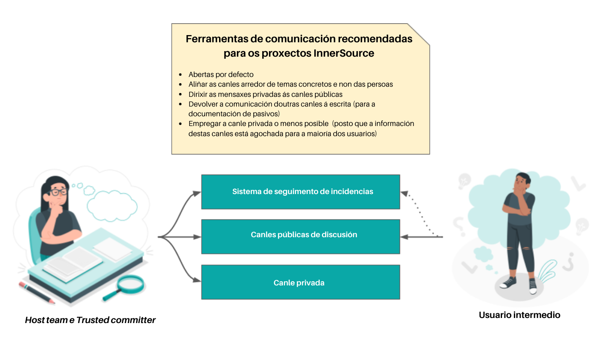

## Title

Ferramentas de comunicación

## Patlet

Os/As usuarios/as dun proxecto InnerSource teñen problemas para obter axuda e poñerse en contacto co *host team*. Mediante o uso sistemático de ferramentas de comunicación asíncrona, os debates serán visibles e permanecerán arquivados e accesibles; o que se traduce nunha mellora do nivel de asistencia aos/ás usuarios/as.

## Problema

Un equipo está aberto a recibir contribucións de usuarios/as intermedios/as do seu compoñente. A coordinación e a comunicación prodúcense de maneira *ad hoc*, o que causa que se comparta información incoherente, que se reciban respostas con atraso ou que os/as contribuidores/as fagan *ping* a varios membros do *host team* antes de recibir unha resposta definitiva.

## Contexto

- Hai un equipo dependente do compoñente do outro equipo.
- Hai un equipo ao que lle gustaría facer contribucións a ese compoñente.
- Incluso cando isto ocorre por escrito, a comunicación ten lugar de maneira individual.

## Aspectos que mellorar

- O equipo anfitrión está interesado en recibir contribucións e disposto a asesorar aos/ás contribuidores/as.
- Os equipos teñen unha cultura sólida baseada na comunicación verbal e non teñen experiencia na configuración de canles de comunicación asíncrona específicas do proxecto.
- As canles de comunicación poden estar aliñadas cos grupos específicos aos que se debe chegar, pero non por un propósito comunicativo.

## Solución

O *host team* debe proporcionar canles de comunicación públicas, arquivadas, con capacidade de busca e vinculables ás que poida subscribirse calquera persoa da empresa; posto que o apoio ás canles abertas de comunicación escrita aporta beneficios medibles.

O obxectivo ao optimizar as canles de comunicación para os proxectos InnerSource debe ser aliñar a comunicación arredor de temas, non arredor de certos grupos de persoas.

Un proxecto debe establecer as seguintes ferramentas de comunicación:

1. **Un sistema especializado de seguimento de incidencias** co que avaliar o progreso que estruture a comunicación e a toma de decisións de xeito transparente para tódolos membros do equipo anfitrión, pero tamén para os/as futuros/as usuarios/as intermedios/as e contribuidores/as. Para coñecer máis aplicacións deste sistema, consulte [Casos de uso cun sistema de seguimento de incidencias](./issue-tracker.md).
2. **Canles conversacionais públicas** cunha estrutura menos ríxida. Polo xeral, trátase de listaxes de correo, foros en liña, sistemas *Q&A* ou, incluso, canles de chat arquivadas. Normalmente, abonda con comezar cunha soa canle para o proxecto. Se o tráfico aumenta demasiado, é útil separar as conversacións sobre o uso do proxecto das outras acerca do desenvolvemento do proxecto.
3. **Unha canle privada na que poida ter lugar** a comunicación entre os/as [*trusted committers*](./trusted-committer.md) sobre os temas máis sensibles; como, por exemplo, incorporar a máis *trusted comitters* ao *host team*. Esta canle debe empregarse con sumo coidado, de xeito que a comunicación sexa aberta por defecto e só se manteña privada en circunstancias moi excepcionais.

Mentres que a comunicación pode ter lugar fóra desas canles escritas, debería ser devolta ás canles asíncronas tanta información como sexa posible.

Tódalas canles de comunicación deberían estar documentadas no proxecto README.md. Para obter máis información acerca do emprego deste arquivo vexa [Documentación base estándar](./base-documentation.md).

Os membros do *host team* necesitan facer o esforzo de dirixir as preguntas que reciban persoalmente (por exemplo, por medio do correo electrónico ou chats de mensaxería) de volta á comunicación nas canles oficiais.

## Contexto resultante

Establecer e empregar sistematicamente canles oficiais de comunicación asíncrona axuda a crear o nivel base da [documentación de pasivos](https://www.oreilly.com/library/view/understanding-the-innersource/9781491986899/ch04.html) que pode volver a consultarse cando xurdan preguntas similares.

Cando a comunicación é aberta, os/as demais poden seguir facilmente o progreso do proxecto e obter contribucións activas. O feito de que outros/as estean espreitando e poidan lelas reduce a barreira de participación e aumenta a probabilidade de recibir contribucións.

Se as preguntas se contestan en público, máis persoas poden aportar a súa opinión, o que conduce a ter unha visión xeral: Isto inclúe non só aos membros do *host team*, senón tamén aos/ás usuarios/as do proxecto.

Manter a comunicación en canles asíncronas permite que os/as participantes con horarios diferentes —xa sexa por mor das diferenzas horarias, por ter rutinas de traballo diferentes, diferentes calendarios de reunións ou rutinas de traballo en equipo— contribúan de xeito significativo ao proxecto.

Responder ás preguntas nesas canles significa que non só outros membros do equipo poden escoitar e proporcionar información adicional, senón que tamén outros/as usuarios/as que teñan a mesma pregunta poden consultar (e máis tarde atopar) a resposta; o que reduce a necesidade de repetir as explicacións.

## Exemplos coñecidos

* Europace AG
* Paypal Inc.
* Mercado Libre

## Autoría

* Isabel Drost-Fromm

## Recoñecementos

* Sebastian Spier (nos visuais)

## Status

* Estruturado
* Redactado en decembro de 2019

## Créditos

Ilustracións de [xente](https://storyset.com/people) de StorySet.

## Tradución

- Leticia Gómez Cadahía
- María Lucía González Castro
