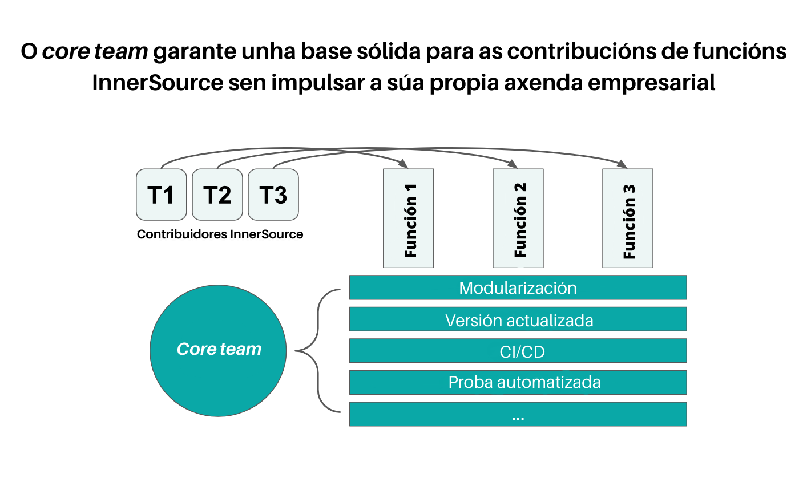

## Title

*Core team*

## Patlet

Incluso cando se necesita moito un proxecto InnerSource, as colaboracións e o seu uso poden verse obstaculizados porque é difícil traballar co proxecto. Estableza un *core team* que se dedique a coidar dos elementos fundamentais do proxecto. O traballo do *core team* permite aos/ás contribuidores/as engadir e empregar as funcionalidades que aportan valor aos seus escenarios. 

## Problema

- É difícil contribuír ao proxecto. Isto podería deberse a aspectos como: 
  - Non se pode executar o proxecto de maneira local.
  - Documentación deficiente.
  - Código intrincado.
  - Probas inadecuadas.
- É difícil usar o proxecto. Algunhas causas posibles son: 
  - Documentación deficiente (unha vez máis).
  - Erros frecuentes.
  - Configuración pouco intuitiva.

## Historia

Hai un proxecto central do que todos/as dependen. Gran candidato para InnerSource! Desafortunadamente, o proxecto creceu de maneira orgánica e con varias contribucións e adicións fortuítas. Agora trátase dunha maraña de código desordenado e denso que ninguén entende e no que todo o mundo ten medo a somerxerse. Está claro que necesita unha revisión (por exemplo, refactorización, probas, documentación etc.), pero aínda que todos/as necesitan e queren que se leve a cabo a tarefa, ninguén emprega tempo en facelo. 

## Contexto

- Moitos equipos necesitan o proxecto.
- O proxecto ten unha débeda tecnolóxica significativa. 
- A adopción e iteración do proxecto é lenta.
- Non hai un/unha propietario/a ou encargado/a do mantemento que asuma a responsabilidade do proxecto e o ecosistema de contribución no seu conxunto.

## Aspectos que mellorar

- Tódolos equipos contribuidores están ocupados e, por tanto, priorizan o traballo que supón unha recompensa inmediata para eles mesmos. 
- A medida que o proxecto crece, a tendencia natural é que se volva máis difícil de empregar e modificar. 

## Solución

Forme un *core team* cuxo traballo sexa manter este proxecto nun estado no que outros/as poidan incorporarse e contribuír facilmente. Este equipo leva a cabo o traballo necesario para crear un ecosistema saudable de uso e de contribución. Este traballo crítico a miúdo non se prioriza tanto como a contribución. As categorías deste tipo de traballo inclúen a comunicación, un entorno local e unha infraestrutura DevOps. 

Velaquí algúns exemplos específicos: 

- Erros de produción.
- Documentación.
- Titorial de incorporación e exemplos.
- CI/CD.
- Medio local.
- Modularización.
- Versión actualizada.
- Monitorización.
- Clases/categorías de funcionalidades pioneiras.

Cada un destes elementos é moi importante para un ecosistema de produtos saudable, pero é pouco probable que se lle dea tanta prioridade como á contribución. 

O *core team* pode estar composto por un pequeno número de persoas a tempo completo ou parcial. A elección depende da cantidade de traballo necesario, a dispoñibilidade de recursos e a cultura da organización. A consideración máis importante é formar ao equipo de maneira que permita á organización capacitalos e responsabilizalos da mesma maneira que a outro equipo calquera. 

Por mor do seu rol central, os membros do *core team* case sempre deben desempeñar tamén o rol de ***trusted committers*** (para obter máis información acerca deste concepto, consulte [Learning Path](https://innersourcecommons.org/learn/learning-path/trusted-committer/) ou *Ruta de aprendizaxe* e o [modelo](./trusted-committer.md)). Se ben o rol de *trusted committer* se centra principalmente en facilitar a contribución e o uso do proxecto por parte doutros/as, un membro do *core team* tamén contribúe regularmente ao proxecto. O *core team* non ten unha axenda propia que determine as súas contribucións. Estes deciden en que traballar en función daquilo que máis axudará aos/ás demais a empregar e contribuír ao proxecto. 

Unha boa maneira de recordarlles constantemente ao equipo central este obxectivo é facer que estes proporcionen información regularmente sobre: 

- O número de equipos activos que emprega o proxecto.
- O número de contribucións externas ao equipo.

Centrarse de xeito continuo nestas métricas, naturalmente, impulsará ao *core team* a priorizar, en xeral, o traballo axeitado co fin de crear un ecosistema InnerSource próspero arredor do proxecto. 

 

## Contexto resultante

- É doado de empregar e contribuír ao proxecto. 
- Moitos equipos empregan e contribúen ao proxecto. 
- O éxito do *core team* defínese nos termos da interacción dos/as demais e a resposta ao seu proxecto. 

## Fundamento

Separar a un *core team* e asignarlle tarefas axuda a encher os baleiros que necesita un proxecto frutífero e que, porén, exclúe aos/ás contribuíntes que só se preocupan dos seus propios obxectivos. O *core team* enche eses baleiros e engraxa as rodas para que o ecosistema de contribución se manteña saudable. 

## Exemplos coñecidos

- **Nike** aplicou este modelo para xestionar o esforzo InnerSource arredor das súas planificacións non reutilizables de CI/CD. 
- **WellSky** estableceu un *core team* para un proxecto chave. Isto permitiulles escalar as súas contribucións InnerSource a ese proxecto de xeito significativo; vexa [*Wide-Scaled InnerSource with a Core Team*](https://www.youtube.com/watch?v=kgxexjYdhIc) [InnerSource de grande escala cun *core team]*.
- **BBVA AI Factory** aplicou este modelo como parte dunha estratexia InnerSource para fomentar a contribución e a reutilización do código de ciencia de datos; vexa [*Mercury: Scaling Data Science reusability at BBVA*](https://www.bbvaaifactory.com/mercury-acelerando-la-reutilizacion-en-ciencia-de-datos-dentro-de-bbva/) [Mercury: Acelerando a reutilización da ciencia de datos en BBVA].

## Estado

- Estruturado

## Autoría

* [Russell R. Rutledge](https://github.com/rrrutledge)

## Tradución

- Leticia Gómez Cadahía
- María Lucía González Castro
