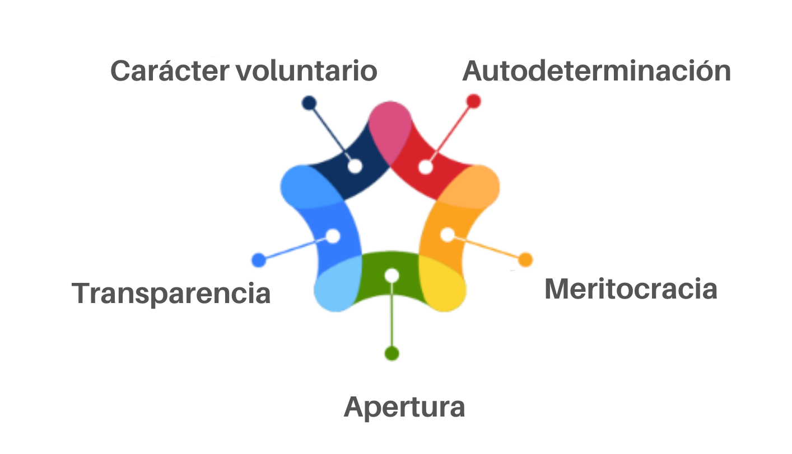

## Title

Documente os seus principios reitores

## Patlet

a explicación habitual de InnerSource baseada en «aplicar as mellores prácticas de software libre dentro dunha organización» non funciona correctamente coas persoas que carecen de experiencia con software libre. Como solución, os principios InnerSource máis importantes documéntanse e publícanse de maneira aberta.

## Problema

A organización está intentando despregar InnerSource a grande escala. A iniciativa comezou cos/coas entusiastas do software libre e,agora, o obxectivo agora é conseguir a adhesión de persoas que carecen de experiencia no software libre. Para ese público, o típico slogan de «aplicar as mellores prácticas de software libre» non basta para transmitir a mensaxe do que supón InnerSource, os problemas que se poden resolver ou as ferramentas que se poden empregar para resolvelos. Como resultado, a adopción de InnerSource na organización relentízase. Os equipos desenvolven ideas diverxentes sobre os obxectivos de InnerSource e a mellor forma de aplicalo, o que xera confusión cando os/as contribuidores/as comezan a cruzar os límites dos equipos.

## Historia

Os primeiros experimentos levados a cabo nunha organización demostraron que as mellores prácticas de colaboración en software libre poden ser beneficiosas. O seguinte paso agora é trasladar a iniciativa aos equipos e persoal que carecen de formación en software libre. O obxectivo agora é comunicar claramente os obxectivos da iniciativa InnerSource, así como o camiño claro cara a consecución destes obxectivos.

## Contexto

- O termo InnerSource estase a dar a coñecer entre os/as traballadores/as.
- A iniciativa xurdiu entre os/as entusiastas do software libre.

## Aspectos que mellorar

- Os equipos teñen dificultades á hora de comunicar de xeito exacto cales son os aspectos fundamentais de InnerSource.
- Quen carece de experiencia en software libre non entende o que significa implantar as mellores prácticas do software libre na empresa.
- No día a día, os equipos que intentan seguir as mellores prácticas InnerSource teñen dificultades para decidir se o que están facendo se atopa aliñado cos valores xerais de InnerSource.

## Solución

Quen impulsa a iniciativa InnerSource na organización debe axudar aos equipos e individuos que carecen dunha forte formación en software libre e, polo tanto, teñen unha comprensión menos intuitiva de InnerSource.

Débese proporcionar claridade aos equipos e individuos documentando estas dúas áreas:

1. **Propósito**: Por que quere adoptar InnerSource a organización?
2. **Principios:** Que principios InnerSource axudarán a abordar estes retos?

As seguintes seccións proporcionan máis detalles acerca destas áreas pensadas como posibles puntos de partida para documentalos para a súa organización.

### Cal é o motivo polo que as organizacións queren adoptar InnerSource?

No pasado, InnerSource amosou a súa eficacia na resolución de problemas habituais das organizacións.

Con todo, que retos organizativos espera mellorar a súa organización cando emprega InnerSource?

Na contra de facer xeneralizacións, intente identificar exactamente as solucións que se axustan aos retos da súa organización, preferiblemente coas persoas afectadas polo cambio que desexa aplicar.

Algúns retos que outras empresas abordaron seguindo as mellores prácticas InnerSource son:

- Reducir o desenvolvemento de silos causados pola cultura da propiedade excesiva.
- Aumentar a velocidade da innovación reducindo o tempo dedicado a resolver problemas similares mediante o fomento da reutilización saudable do código.
- Aumentar a velocidade de desenvolvemento mediante unha mellor colaboración entre equipos
- Resolver as dependencias de proxecto/equipo máis aló da espera e das solucións provisionais, reducindo así os puntos de conxestión na enxeñaría.
- Aumentar a calidade.
- Aumentar a felicidade dos/as traballadores/as.
- Aumentar o éxito das novas contratacións.
- Crear documentación viable.

### Que principios InnerSource axudarían a abordar estes retos?

Unha vez que os equipos entendan que problemas lles axudarían a resolver InnerSource, o seguinte paso é explicar que principios axudan a afrontar estes retos.

Baseándonos nos principios básicos do desenvolvemento de software libre, as seguintes directrices amosaron a súa eficacia:

(1) O código debe aloxarse de maneira transparente na organización.

O código fonte, a documentación e os datos relevantes para o desenvolvemento do proxecto deben estar dispoñibles e ser fáciles de atopar para calquera persoa da organización.

(2) As contribucións priman sobre as *feature requests*.

Tódalas partes interesadas no proxecto actúan como posibles contribuidores/as e son tratados/as e apoiados/as como tal. As contribucións seguen sendo suxestións na contra de requisitos. A coordinación previa axuda a evitar esforzos inútiles. Os proxectos proporcionan directrices para evitar friccións.

(3) Os erros son oportunidades para aprender.

Cando o traballo é visible para toda a organización, calquera erro será tamén visible para todos/as. Deste xeito, debe establecerse unha cultura na que os erros sexan oportunidades de aprendizaxe na contra de fracasos que deben ser evitados a toda costa.

(4) A comunicación escrita prima respecto da comunicación oral.

Para os proxectos que abarcan varios equipos, con posibles calendarios de reunións diverxentes, ten que ser posible colaborar de maneira asíncrona. O obxectivo dos proxectos InnerSource é recrutar a novos/as contribuidores/as. Para iso, os/as posibles futuros/as contribuidores/as deben poder seguir o progreso do proxecto de maneira autónoma con poucas barreiras de acceso. Se a comunicación relevante do proxecto se produce a través da comunicación asíncrona, os razoamentos que se debatan deben facerse transparentes na canle escrita; as decisións unicamente poden finalizar nesa canle. Como efecto secundario, isto conduce a unha documentación de pasivos base moi valiosa para calquera novo/a colaborador/a do proxecto.

(5) Permita que o asesoramento escrito se acumule nun arquivo accesible no que se poidan realizar buscas.

Toda a comunicación do proxecto, en particular as decisión tomadas e os debates que conduciron a esas decisións, deben ser arquivados. Debe ser posible facer referencia á comunicación a través de URL estables. As conversacións previas deben poder almacenarse de maneira que se poidan atopar facilmente.

Mais é necesario facer dúas advertencias:

1. Isto non substitúe a unha documentación estruturada. Con todo, pode servir como punto de partida para recompilar a documentación estruturada.
2. Existen excepcións á regra de que todo debe estar por escrito e ser accesible para toda a organización: as conversacións relacionadas cos/coas traballadores/as, así como coa seguridade, son confidenciais e non deben facerse públicas.

(6) Recompensa aos/ás *trusted committers*.

Tódalas contribucións (por exemplo, de código fonte, de documentación, de informes de erros, de aportacións aos debates, de apoio aos/ás usuarios/as, de marketing) son benvidas e deben ser recompensadas. Aqueles/as que amosen o seu apoio ao proxecto serán invitados/as como [*trusted committers*](./trusted-committer.md), e tódolos/as *trusted committers* dun proxecto se publican.

## Contexto resultante

- Os membros da organización comprenden que retos poden abordar aplicando as mellores prácticas InnerSource.
- Os membros da organización que carecen de experiencia previa no software libre comprenden os valores e os principios básicos dos proxectos InnerSource.
- Os membros da organización que carecen de experiencia previa en software libre son capaces de contrastar a súa actividade diaria cun conxunto de valores comúns establecidos.

## Exemplos coñecidos

- Europace AG
- Github
- Robert Bosch GmbH

### Europace AG

Os principios de InnerSource enumerados na sección de **Solución** baséanse, na súa meirande parte, na experiencia de Europace. Ver [máis](https://tech.europace.de/post/europace-inner-source-prinzipien/) (en alemán).

### GitHub

#### Finalidade

A miúdo en GitHub traballamos cun modelo no que os equipos aportan funcionalidades a áreas que están fóra do seu ámbito de competencia. Algúns exemplos comúns inclúen a enxeñaría de ventas que aporta funcionalidades para desbloquear unha venta, os proxectos especiais que contribúen cando é estritamente necesario, as funcionalidades de grande impacto en todo o produto e un equipo de traballo en múltiples áreas para entregar unha funcionalidade.

#### Principios

Polo xeral, os principios descritos neste documento son evitar o aumento da débeda tecnolóxica e a carga para o equipo propietario. A miúdo, préstase axuda a un equipo que quedou atrás por mor dos costes de soporte e mantemento na súa área de competencia e non ten ancho de banda para contribuír á funcionalidade. Calquera nova funcionalidade realizada por outro equipo que aumente a carga de soporte ou a débeda técnica supón aínda menos tempo para que o equipo propietario traballe nas novas funcionalidades, polo que queremos asegurarnos de que se fai ben.

Do mesmo xeito, esforzámonos por ser unha empresa na que os/as enxeñeiros/as traballen libremente máis aló das fronteiras e as prioridades empresariais que, a miúdo, esixen que contribuamos en áreas alleas ás nosas principais áreas de especialidade.

Un bo resumo dos principios é deixar a área en tan bo estado ou nun estado aínda mellor do que a atopou.

Tendo isto en conta, velaquí os principios nos que estamos de acordo:

- Evite os produtos menos viables (MVP, polas súas siglas en inglés, Produto-Viable-Mínimo) que acumulan débeda de funcionalidades. Está ben lanzar un MVP para obter *retroalimentación* dos/as clientes/as, pero o equipo que contribúe debe comprometerse a rematar o conxunto de funcionalidades. Algúns exemplos son:
  - Compromiso de ir máis aló do MVP para chegar a unha solución que satisfaga á maioría dos/as clientes/as.
  - Soporte completo para a administración das novas funcionalidades (por exemplo, soporte na interface de usuario/a (IU)).
  - Presentar as funcionalidades tanto na IU como na API (polas súas siglas en inglés, Interface de Programación de Aplicacións).
  - Garantir que as funcionalidades responden en ambientes de servidores locais e na nube.
- Apoie o traballo das funcionalidades ata o seu despregamento para a produción e tras esta.
  - Xestionar o despregamento progresivo.
  - Xestionar os tíckets de asistencia.
  - Planificar o tempo para responder aos comentarios dos/as clientes/as (funcionalidades e erros).
- Crear funcionalidades do xeito correcto (sen acumular débeda tecnolóxica).
  - Acordar os requisitos e a solución cos equipos de produto e de enxeñaría.
  - Arquitectura e deseño axeitados.
  - Asegúrese de que os datos se almacenan correctamente para evitar posteriores migracións de datos.
  - Implantar telemetría apropiada.
  - Soporte en ambientes de produción locais e na nube (incluídos a instalación, configuración e copia de seguridade/restauración, migracións etc.).
  - Erros reparados.
  - Documentación actualizada.

#### Compromiso

Empregamos un modelo de compromiso porque nos gusta establecer que pasos concretos pode dar un equipo cando contribúe con funcionalidades a áreas fóra do seu ámbito de responsabilidade.

Un modelo de compromiso típico de GitHub é o seguinte:

- Obter a aprobación do conxunto de características e do plan de despregamento do/a *product owner*.
- Obter a aprobación do deseño da enxeñaría, incluído o cumprimento dos requisitos non funcionais (telemetría, cobertura de probas, ensaios e asistencia multiambientais) do/a propietario/a de enxeñaría (normalmente o/a enxeñeiro/a xefe/a e o/a director/a).
- Facer revisións do código ao longo do proceso, así como revisión de requisitos novos ou modificados.

### Robert Bosch GmbH

#### Finalidade

O principal obxectivo da iniciativa InnerSource de Bosch (BIOS) é fomentar a colaboración, a aprendizaxe e a innovación.

#### Principios

Para isto, Bosch aplica os seguintes principios:

- **Apertura:** Reducimos ao máximo as barreiras de entrada ás comunidades BIOS.
- **Transparencia:** Somos radicalmente transparentes, compartimos o traballo realizado e comunicámonos na toma de decisións tendo en conta a tódolos/as socios/as da empresa.
- **Carácter voluntario:** A decisión de unirse e contribuír a unha comunidade BIOS corresponde a cada socio/a. Os/As socios/as deben traballar na BIOS por mor da súa motivación intrínseca, non porque o persoal directivo llo pedise.
- **Autodeterminación:** As comunidades BIOS son libres de elixir en que traballar, cando traballar e que ferramentas e procesos empregar.
- **Meritocracia:** O poder conferido aos membros do proxecto BIOS vén dado en función dos seus méritos, é dicir, en función da calidade e da cantidade de contribucións.

Os principios de *apertura*, *transparencia* e *carácter voluntario* axudaron a crear comunidades diversas de traballadores/as cunha motivación intrínseca. A *meritocracia* amosou ser unha motivación eficaz para realizar grandes contribucións. E a *autodeterminación* permitiu ás comunidades empregar o seu tempo limitado para facer contribucións dunha maneira máis eficaz e eficiente.

## Estado

- Estruturado

## Autoría

- Isabel Drost-Fromm
- Georg Grütter

## Recoñecementos

- Zack Koppert, por compartir o enfoque de GitHub nos exemplos coñecidos.

## Título alternativo

Principios explícitos InnerSource

## Tradución

- Leticia Gómez Cadahía
- María Lucía González Castro
