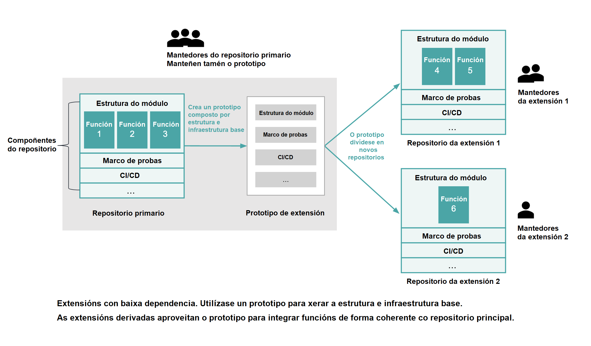

## Title

Extensións para o crecemento sostible

## Patlet

Un proxecto InnerSource está a recibir demasiadas contribucións, o que dificulta o seu mantemento. Os/As responsables ofrecen un mecanismo de extensión fóra do proxecto principal, que permite escalar as capacidades do proxecto cun custo e gastos xerais de mantemento mínimos.

## Problema

A medida que o número de contribucións a un repositorio InnerSource maduro aumenta rapidamente, engádese máis carga de traballo nas revisións e mantemento do código. Isto provoca unha grande acumulación de código pendente de revisión ou un rexeitamento prematuro das contribucións de novas funcionalidades.

Como pode o *host team* lanzar novas funcionalidades de contado e fomentar a innovación e a experimentación, ao tempo que se encarga do mantemento do repositorio?

## Historia

Trátase dun proxecto estratéxico co obxectivo de recompilar nunha pila compartida as mellores innovacións dentro dun espazo de dominio, o que permite a reutilización dunha infraestrutura común e proporciona unha experiencia de usuario/a estándar. A través de InnerSource, distintos equipos da organización que traballen neste espazo de dominio, poderán ter a oportunidade de colaborar e contribuír coas súas innovacións á base de código común.

Non obstante, ter un gran número de contribucións paralelas de varios/as desenvolvedores/as dificulta o mantemento da base de código. Isto está a engadir unha enorme carga para os/as mantedores/as do proxecto, que asumen a responsabilidade dos estándares de calidade do código e habilitan á comunidade a través de diversas formas de comunicación.

Os/As encargados/as do mantemento do proxecto poderían estar en risco de esgotamento por:

- A acumulación continua de *pull requests* de contribuidores/as que precisan ser revisadas.
- A insatisfacción laboral: Os/As mantedores/as empregan a meirande parte do seu tempo no servizo de asistencia á comunidade, o que non deixa espazo para a innovación.
- A percepción de falta de consecución de logros: Se non contan con suficiente demanda dos/as usuarios/as, non tódalas funcionalidades engadidas tornarán na súa conseguinte adopción.
- Os lanzamentos que levan moito tempo: Máis funcionalidades na base de código requiren probas de longa duración.
- O aumento das actividades de mantemento: Xorden máis erros (*bugs*) a medida que se engaden novas capacidades.

Dedícase moito tempo a madurar cada nova funcionalidade engadida, antes de que os/as potenciais usuarios/as teñan a oportunidade de explorala para os seus casos de uso. Se a nova funcionalidade non resultase satisfactoria para o caso de uso, todo o tempo empregado en acadar os estándares de calidade de código desexados suporía un desproveito.

## Contexto

- Unha base de código estratéxica de InnerSource escálase rapidamente coas contribucións de novas funcionalidades de distintos/as empregados/as.
- A proporción número de revisores/as por contribucións ten como resultado unha crecente acumulación de *pull requests*. Isto desacelera o lanzamento de novas funcionalidades á comunidade.
- A calidade da base de código estase a degradar e a experiencia do/a usuario/a vese afectada negativamente.
- Os/As mantedores/as da base de código están sobrecargados/as e non poden seguir o ritmo da afluencia de contribucións e o incremento do servizo de asistencia á comunidade.
- Algunhas das características engadidas non están a ser adoptadas polos/as usuarios/as, e mesmo poderían quedar completamente inactivas. Sen embargo, aínda se non se empregan, estas características contribúen á suma dos gastos xerais de mantemento.
- A organización inverte considerablemente no fortalecemento das contribucións de novas funcionalidades para manter os estándares de calidade, mesmo antes de que esas ideas sexan exploradas pola comunidade.
- O modelo aplícase en calquera escenario:
  - Os/As mantedores/as teñen que rexeitar ideas de novas funcionalidades para limitar o alcance do proxecto. Isto está a dificultar a innovación na comunidade e a restrinxir unha expansión maior.
  - Para reducir as acumulacións, lánzanse novas funcionalidades sen documentación, fortalecemento ou probas exhaustivas; o que xera unha experiencia de usuario/a deficiente. Ademais, isto está a aumentar o tamaño da base de código, un grande engadido no gráfico de dependencia que dificulta o seu mantemento.

## Aspectos que mellorar

- Os/As mantedores/as e *product owners* queren permitir a expansión, fomentar a innovación e a experimentación sen ser excesivamente restritivos/as nas contribucións; cun bo código e estándares de calidade para a experiencia do/a usuario/a.
- Para cumprir eses estándares do produto, dedícase unha gran cantidade de tempo ao fortalecemento e probas exhaustivas das funcionalidades. Por outra banda, os/as *product owners* tamén poderían permitir un lanzamento máis rápido de innovacións, para adoptar produtos que explorar antes de investir tempo en madurar as súas capacidades.
- Os/As mantedores/as queren alentar á comunidade a compartir innovacións que combinen as capacidades do produto con outros casos de uso, sen engadir máis dependencias ao repositorio primario.

## Solucións

Permitir [extensións/plugins](https://en.wikipedia.org/wiki/Extensibility) para bases de código InnerSource a grande escala pode aliviar a carga de traballo dos/as mantedores/as do repositorio e permitir un lanzamento máis rápido de novas funcionalidades para adoptar produtos que explorar. Isto traslada o mantemento das capacidades aos/ás *extension owners*, ao tempo que permite que o repositorio primario atenda ás capacidades adoptadas dun xeito máis extenso e estratéxico.

As extensións proporcionan un filtro para novas capacidades que, eventualmente, poden pasar ao núcleo do proxecto. Estas extensións tamén actúan como un entorno de incubación e fortalecemento da comunidade, o que permite que gran parte dese fortalecemento ocorra de xeito orgánico, en lugar de nun custoso proceso de revisión.

Para que o modelo de extensións teña éxito, haberá que ter en conta algunhas consideracións arquitectónicas coas que cumprir:

1. **Fáciles de crear:** Para obter a participación da comunidade, as extensións deben ser doadas de crear.
   - As extensións deberían ter como punto de partida un repositorio prototipo. A creación destes prototipos permite que as novas funcionalidades das extensións se engadan a novos repositorios separados do proxecto principal. O prototipo debe aportar a mesma estrutura modular que o repositorio primario e incluír o marco de traballo para empaquetar e lanzar extensións.
      - É necesario asegurarse de que, a medida que cambia o repositorio primario, os prototipos continúan ben mantidos. Os/As propios/as mantedores/as do devandito repositorio serán tamén os/as responsables de actualizar os prototipos para garantir a súa compatibilidade co proxecto principal. Seguir bos mecanismos de versionado, por exemplo, [SemVer](https://semver.org/), facilita ese proceso.
      - Recoméndase, ademais, que os/as mantedores/as do repositorio primario proporcionen orientación sobre como actualizar as extensións baseadas en versións antigas dos prototipos, a medida que se publiquen versións máis novas.
   - É preciso engadir exemplos de extensións desenvolvidas a partir do prototipo, que os/as desenvolvedores/as do proxecto poidan consultar para comprender como escribir unha extensión ben modelada.
   - E haberá que afrouxar os requisitos para que os/as contribuidores/as creen extensións que eviten as revisións e permitir así un lanzamento ou experimentación máis rápidos.
2. **Baixa dependencia:** Ter compoñentes modulares que conteñan funcionalidades pode favorecer a baixa dependencia, na que os cambios nas extensións non afectan á calidade da base de código principal ou doutras extensións.
3. **Xestión de dependencia**: Cada extensión debe coidar de fixar o rango de versións do repositorio primario sobre o que se constrúe (do mesmo xeito que faría con calquera outra dependencia). Tamén se debe ter coidado no uso doutras dependencias que ocultan as do repositorio primario, e que as versións elixidas para esas dependencias sexan compatibles coas versións seleccionadas. Calquera conflito co repositorio primario recollerase no marco de proba da extensión.
4. **Estratexia de proba:** Como probar as extensións tanto individualmente como de xeito combinado?
   - **Probar a extensión individualmente:** O prototipo de extensión proporcionará un marco de proba, que será empregado polos/as desenvolvedores/as de extensións para probar a capacidade engadida. Isto pode incluír un marco para probas unitarias, o rendemento en tempo de execución e probas de calidade.
   - **Probar a extensión en combinación co repositorio primario:** Os/As desenvolvedores/as de extensións teñen un método ben establecido para probar a súa extensión fronte a versións específicas do repositorio primario sen a implicación dos/as mantedores/as do devandito repositorio.
   - **Probar a extensión en combinación con outras extensións:** Proporcionar un marco de proba para este escenario podería resultar excesivo, especialmente se hai un gran número de extensións que aínda están explorando os/as usuarios/as e é improbable que se empreguen todas de xeito combinado. Se un/unha usuario/a se atopa con conflitos ao usar extensións combinadas (o que debería ser improbable cunha baixa dependencia), pode informar dunha incidencia aos/ás respectivos/as *extension owners* para que o resolvan. A medida que unha extensión acade as derradeiras fases do seu ciclo de vida e se integre co repositorio primario, pasará probas combinadas co resto da libraría e calquera incidencia posible resolveríase nese intre.
5. **Dispoñibilidade e utilización:**
   - É necesario que os/as usuarios/as que crearon as extensións as mostren nunha páxina de publicación, co fin de compartilas de maneira sinxela para o seu uso.
   - Será preciso permitir o rexistro de extensións co proxecto primario, para que os/as usuarios/as poidan valerse das extensións xunto co proxecto orixinal, mantendo así a mesma experiencia de usuario/a.
6. **Ciclo de vida das extensións e o seu mantemento:** Débese establecer o ciclo de vida das extensións desde a súa creación ata a súa portabilidade á base de código primario, xunto con directrices de propiedade claras.
   - Os/As creadores/as de extensións teñen que continuar o seu mantemento, proporcionar asistencia e corrixir as fallas. Calquera extensión sen mantemento será eliminada da páxina de publicación.
   - Teranse que crear criterios específicos para cando unha extensión pode ser portada ao repositorio primario, como a adopción da extensión por produtos internos e a demanda da funcionalidade.
   - O proceso de portar a extensión ao repositorio primario seguirá directrices de revisión de código máis estritas, establecidas polos/as mantedores/as da libraría.

Seguir estes principios garante que:

- Os/As desenvolvedores/as poidan engadir novas funcionalidades ao ecosistema do proxecto sen a esixencia de ter que escribir grandes cantidades de código [repetitivo](https://en.wikipedia.org/wiki/Boilerplate_code).
- As extensións pódense descubrir dun xeito replicable por tódolos/as usuarios/as do proxecto principal. Só porque o código non estea no repositorio primario non implica que non sexa valioso.
- A carga de traballo do/a mantedor/a redúcese ata que unha extensión permita cubrir un baleiro importante no proxecto primario.
- O código central común do proxecto (por exemplo, clases base e funcionalidades de utilidade) pode ser un punto de partida para novos desenvolvementos que estendan o dominio de proxecto. Isto evita a necesidade de portar traballos innovadores despois, reducindo así a carga xeral de desenvolver funcionalidades novidosas para o proxecto.
- É máis probable que os/as desenvolvedores/as contribúan e sigan involucrados/as no mantemento e na construción de comunidades para a súa base de código, o que tamén é bo para a saúde xeral do ecosistema do proxecto.

## Contexto resultante

- O proxecto é capaz de escalar coa adición de novas funcionalidades, sen engadir sobrecarga de mantemento no repositorio primario do proxecto.
- Un lanzamento máis rápido de novas funcionalidades para que a comunidade explore, fomenta a innovación e a experimentación.
- Cómpre reducir o custoso proceso de revisión de código e o fortalecemento das funcionalidades ata que se poida probar a utilidade da funcionalidade. Pois isto repercutirá nos beneficios de aforro de custos para a organización.
- Un problema que pode xurdir posteriormente é: que pasa se unha extensión non pode completar o ciclo de vida?
  - Se unha extensión non se adopta durante un período de tempo e non se puido construír unha comunidade ao seu redor para dar soporte ao seu mantemento, corresponderíalle ao/á *extension owner* continuar manténdoa durante tanto tempo como queira. Se unha extensión non ten mantemento, quedaría sen publicar.
  - Se un/unha desenvolvedor/a de extensións non pode seguir mantendo o seu proxecto e outros/as desenvolvedores/as da comunidade quixesen seguir prestándolle soporte, estes/as últimos/as poderían continuar co mantemento da extensión no futuro.

## Exemplos coñecidos

* **IBM Corporation** adoptou esta solución para escalar [librarías InnerSource de IA](https://youtu.be/Lz-tIc2cyRM). Ao usar extensións, os/as desenvolvedores/as poden ampliar as librarías IA con máis algoritmos e compartir as súas innovacións coa comunidade interna da compañía. As librarías principais conteñen só algoritmos estratéxicos que xa foron adoptados e validados, polo que serán máis doados de manter segundo escalamos as contribucións.

## Título alternativo

Extensións para xestionar contribucións a escala

## Estado

* Estruturado

## Autoría

- Sukriti Sharma, IBM
- Alexander Brooks, IBM
- Gabe Goodhart, IBM

## Tradución

- Leticia Gómez Cadahía
- María Lucía González Castro
