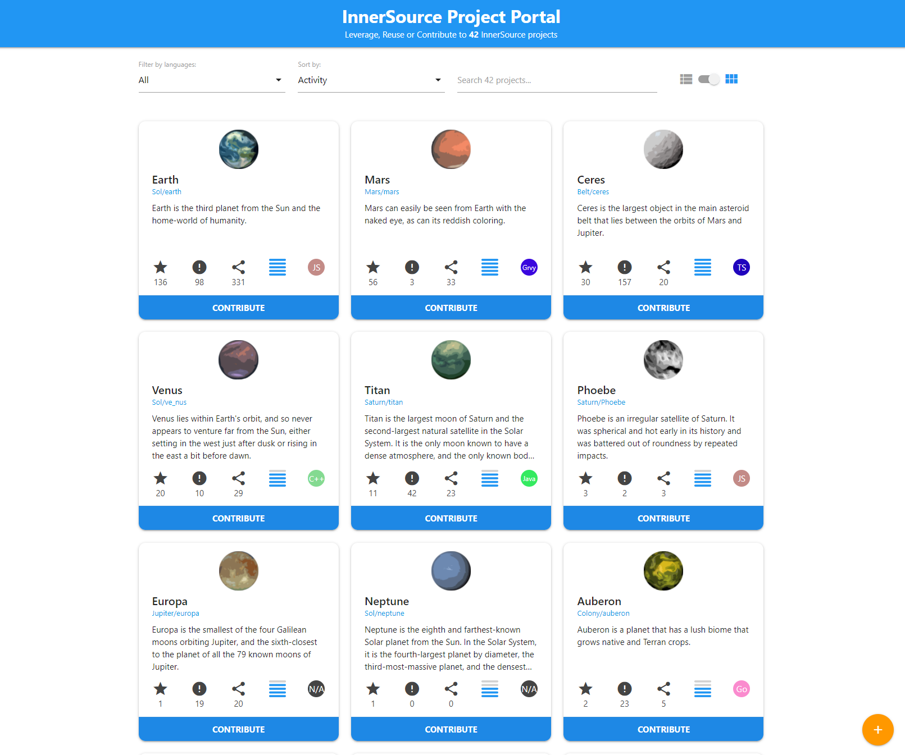

## Title

Portal InnerSource

## Patlet

os/as contribuidores/as potenciais non poden descubrir dun xeito sinxelo os proxectos InnerSource nos que están interesados/as. Ao crear unha intranet que indexe toda a información dispoñible do proxecto InnerSource, permítese que os/as contribuidores/as coñezan os proxectos que lles poderían interesar; do mesmo xeito que lles serve aos/ás project owners de InnerSource para atraer a un público externo.

## Problema

Os equipos do proxecto InnerSource teñen dificultades para atraer contribucións externas.

Os proxectos InnerSource da súa organización están en aumento, pero os/as posibles contribuidores/as non poden descubrilos dun xeito sinxelo.

## Historia

Está tentando establecer unha práctica InnerSource dentro da súa organización. Coñece algúns proxectos que se executan mediante un modelo InnerSource, pero a súa existencia só se comunica a través do boca en boca, o correo electrónico ou conversas privadas con outros/as empregados/as. Como resultado, os/as *project owners* de InnerSource teñen dificultades para atraer os/as contribuidores/as.

Non hai un recurso de acceso único e compartido para os/as empregados/as de toda a organización que lles permita descubrir facilmente todos os proxectos InnerSource en curso. Isto está a limitar dun xeito importante o potencial de crecemento de cada proxecto InnerSource.

Que se pode facer para axudar a que todos os proxectos de InnerSource eleven a súa visibilidade a un público tan grande como sexa posible e poidan atraer contribuidores/as de toda a organización?

## Contexto

* A súa organización está interesada en adoptar un estilo de traballo InnerSource.
* Os/As *project owners* de InnerSource buscan unha forma de atraer público aos seus proxectos. Non obstante, están limitados/as polas canles de comunicación dispoñibles a través das cales poderían facer publicidade ante posibles contribuidores/as.
* O número de proxectos InnerSource na súa organización está aumentando.
* O agravante deste problema é o feito de que a aplicación compartida en uso, de xestión de control de fontes, ten capacidades de busca tan limitadas que, ata para os/as desenvolvedores/as que buscan proxectos InnerSource, resulta frustrante localizalos.

### Requisitos previos

* Os/As directivos/as aceptan de maneira tácita que os/as seus/súas empregados/as participen nos proxectos InnerSource.
* Está en uso un sistema compartido de xestión de control de fontes que proporciona acceso programático aos contidos dos repositorios que aloxa.
* Existe un departamento dentro da súa organización coa responsabilidade de promover a colaboración InnerSource.

## Aspectos que mellorar

* Non se está a conseguir todo o potencial de equipos separados de enxeñaría para colaborar en desafíos compartidos.
* É difícil que os individuos descubran que proxectos InnerSource existen.
* É difícil para os/as *project owners* de InnerSource atraer un público de contribuidores/as externos/as.

## Solucións

É necesario crear unha web de intranet do portal InnerSource na que os/as *project owners* de InnerSource poidan anunciar facilmente a dispoñibilidade dos seus proxectos.

As propiedades chave do portal poden ser:

* As persoas visitantes do portal InnerSource deberían poder ver todos os proxectos dispoñibles e buscar proxectos específicos en función de varios criterios, como o nome do proxecto, as tecnoloxías en uso, os nomes dos contribuidores/as, a área empresarial patrocinadora etc.
* A información que se mostra a través do portal InnerSource debe estar baixo o control total dos *project owners* de InnerSource en todo momento. E, preferiblemente, esta información obterase directamente dun ficheiro de datos específico ou de metadatos almacenados no propio repositorio do proxecto.
* Os/As *project owners* deben incluír toda a información relevante sobre os seus proxectos nos ficheiros de datos; e engadir o nome do proxecto, os nomes dos *trusted contributors*, unha breve descrición e ligazóns ao repositorio de código ou calquera documentación do soporte.
* (Opcional) Aínda que a meirande parte das organizacións escollerá facer o seu portal dispoñible só na súa intranet, algunhas outras optaron por deixalo dispoñible na internet pública. Esta última opción pode ser interesante para as organizacións que queiran mostrar información adicional sobre o seu enfoque InnerSource no seu portal; por exemplo, con fins corporativos e de contratación.

No lanzamento do portal debe terse en consideración unha campaña de comunicación que promova a suma de ficheiros InnerSource de datos ou metadatos aos repositorios de código, para reforzar o número de proxectos que se mostran no portal.

Unha [implantación de referencia](https://github.com/SAP/project-portal-for-innersource) dun portal InnerSource está dispoñible en GitHub e aberta ás contribucións. Enumera todos os proxectos InnerSource dunha organización dun xeito interactivo e fácil de usar. Os proxectos poden autorrexistrarse a partir dun tema dedicado de GitHub e proporcionar metadatos adicionais.

## Contexto resultante

* O portal InnerSource permitiulles aos/ás *project owners* anunciar os seus proxectos a toda a organización. Debido a esta maior visibilidade, están a atraer comunidades de contribuidores/as moito máis grandes que nunca antes.
* Para aqueles/as que buscan involucrarse en proxectos InnerSource, o portal InnerSource permitiulles descubrir exactamente o tipo de oportunidades que lles interesan ou poder buscar de maneira simultánea entre todos os proxectos InnerSource dispoñibles, en función dos seus criterios específicos.
* Satisfacer as necesidades destes dous tipos de audiencia axudou a establecer InnerSource como unha opción viable e atractiva para que todas as áreas da organización poidan chegar a logros comúns que non poderían alcanzar por separado.

## Exemplos coñecidos

* **Unha grande organización de servizos financeiros** empregou a creación dun portal InnerSource para ofrecer un mecanismo de publicidade e descubrimento de proxectos InnerSource existentes en diferentes áreas empresariais.
* **SAP** promove proxectos InnerSource no portal InnerSource: Os proxectos poden autorrexistrarse usando temas de GitHub. A [cualificación da actividade do repositorio](./repository-activity-score.md) define a orde predeterminada dos proxectos InnerSource no portal. Podes ver tamén [Michael Graf & Harish B (SAP) at ISC.S11 - The Unexpected Path of Applying InnerSource Patterns](https://www.youtube.com/watch?v=6r9QOw9dcQo&list=PLCH-i0B0otNQZQt_QzGR9Il_kE4C6cQRy&index=6) [A senda inesperada na aplicación de modelos InnerSource]. A súa base de código publícase como [implantación de referencia](https://github.com/SAP/project-portal-for-innersource) e está aberta a contribucións.
* **Elbit Systems** usou este modelo e engadiulle gamificación.
  * [Gamificación como medio de cambio cultural e potenciador de compromiso InnerSource](https://www.oreilly.com/library/view/oscon-2018-/9781492026075/video321579.html) | Shelly Nizri | OSCON 2018: Portland, Oregon.
  * De islas, monstros e InnerSource [(presentación)](https://docs.google.com/presentation/d/1P1OCEK9B6eSrVRUclVWY6meSI-qHOBjM_UAPNvCZamU/edit#slide=id.p15), [(vídeo)](https://drive.google.com/file/d/1pM89uHMn0vhE3ayFJDGYcCO8R0tAXXZD/view?usp=drivesdk) | Cume InnerSource primavera de 2019 (Galway, Ireland).
  * O [código](https://gitlab.com/gilda2) desta plataforma era de software libre.
* **American Airlines** promove proxectos InnerSource a través dun [*Marketplace* InnerSource interno](https://tech.aa.com/2020-10-30-innersource/). Do mesmo xeito que SAP, os proxectos autorrexístranse engadindo InnerSource como tema de GitHub. Os proxectos pódense buscar e filtrar por idioma, temas, número de incidencias abertas etc.
* **Banco Santander** creou un portal público chamado «Santander ONE Europe InnerSource Community» para dar soporte e mellorar a adopción de InnerSource. Ademais do catálogo de proxectos, o portal inclúe contidos relevantes como documentación, forma de traballar, noticias e eventos.

* **Airbus** implantou o [portal SAP](https://github.com/SAP/project-portal-for-innersource) con pequenas modificacións para que coincida coa identidade gráfica de Airbus. Ademais, o/a [indexador/a de Python](https://github.com/zkoppert/innersource-crawler) foi parcheado para funcionar con exemplos de GitHub Enterprise.

* **Mercado Libre** emprega o [portal SAP](https://github.com/SAP/project-portal-for-innersource) para descubrir os proxectos InnerSource que existen na organización.

## Referencias

* Probouse que o modelo do portal InnerSource funciona moi ben co modelo InnerSource de [*Gig marketplace*](./gig-marketplace.md) neste contexto.

## Estado

* Estruturado

## Autoría

* Stephen McCall

## Recoñecementos

* Shelly Nizri
* Melinda Malmgren
* Michael Graf
* Jesús Alonso Gutierrez

## Tradución

- Leticia Gómez Cadahía
- María Lucía González Castro
