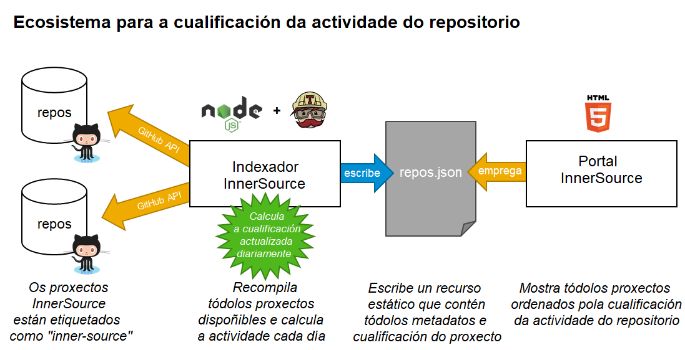

## Title

Cualificación da actividade do repositorio

## Patlet

os/as potenciais contribuidores/as queren atopar proxectos InnerSource activos que precisen da súa participación. Ao calcular a cualificación da actividade do repositorio para cada proxecto, pódese crear unha listaxe clasificada de proxectos (por exemplo, no portal InnerSource) para que os/as posibles contribuidores/as poidan determinar dun xeito máis doado en que proxecto desexan colaborar.

## Problema

En **que orde** se presentarán os proxectos InnerSource? Os KPI de clasificación típicos como as estrelas de GitHub, o número de *forks*, o número de *commits*, as liñas de código e a última actualización non son suficientes para indicar de forma concisa a actividade dun proxecto.

Os proxectos activos con moito soporte, pero tamén os proxectos bastante novos e entusiastas que necesitan novos/as colaboradores/as, deberían clasificarse nun rango superior ao dos proxectos madurados con pouca actividade ou en modo de mantemento.

Precísase unha nova métrica derivada de varios KPI para definir unha cualificación fiable e versátil para o nivel de actividade dun proxecto. Pódese utilizar para ordenar proxectos segundo o seu nivel de actividade.

## Historia

Cando InnerSource se practica durante moito tempo ou se escala máis aló dun determinado número de proxectos (digamos 50 para dar un limiar significativo), é difícil atopar os proxectos InnerSource máis populares e activos actualmente. Os proxectos que existen desde hai moito tempo son coñecidos, pero poden non estar xa moi activos. Por outra banda, proxectos bastante recentes aínda non teñen unha reputación nin unha comunidade activa.

Unha listaxe de proxectos InnerSource non debe considerarse un recurso estático, senón un lugar emocionante para descubrir e explorar proxectos novos e activos, do mesmo xeito que unha páxina de noticias que enumera primeiro os temas máis interesantes do día. Así, resulta beneficioso cando a orde dos proxectos se actualiza regularmente e cambia segundo a popularidade e a actividade do proxecto.

Estas consideracións levaron a un primeiro prototipo para calcular unha cualificación de actividade do repositorio, que funcionou sorprendentemente ben e determinou unha orde de proxectos en constante cambio segundo a súa actividade.

## Contexto

Descubrir proxectos InnerSource pódese facilitar co [portal InnerSource](./innersource-portal.md) e o modelo [*Gig marketplace*](./gig-marketplace.md), ou promovendo proxectos noutras canles e plataformas de comunicación. A cualificación da actividade define unha orde predeterminada na que se presentan os proxectos á comunidade.

## Aspectos que mellorar

Os KPI automatizados que se poden obter consultando a API de GitHub son só parte da verdade. Que pasa coa calidade do código, a dispoñibilidade dunha boa documentación ou dunha comunidade activa e disposta a axudar que faga do proxecto un lugar divertido para contribuír?

Tales KPI «brandos» terían que engadirse manual ou semiautomaticamente ao cálculo e á cualificación resultante. Se existen ferramentas que proporcionan máis contexto para o repositorio, como un informe de cobertura de código, pódense introducir facilmente.

## Exemplo ilustrativo



Un enfoque centralizado para calcular e aplicar a cualificación da actividade do repositorio. Consulte [Contexto resultante](#contexto-resultante) para máis información.

## Solucións

A cualificación da actividade do repositorio é un valor numérico que representa a actividade (GitHub) dun proxecto InnerSource. Derívase automaticamente de estatísticas do repositorio como as estrelas, as visitas e os *forks* de GitHub e pódense enriquecer con KPI doutras ferramentas ou avaliacións manuais.

Ademais, considera parámetros de actividade como a última actualización e a data de creación do repositorio para darlle un impulso aos proxectos novos con moita actividade. Os proxectos con pautas de contribución, estatísticas de participación activa e incidencias (de acumulación xeral) tamén reciben unha clasificación máis alta.

Todo isto pódese obter e calcular de xeito automático usando o conxunto de resultados da [API de busca de GitHub](https://docs.github.com/en/rest/search#search-repositories) e da [API de estadísticas de GitHub](https://docs.github.com/en/rest/metrics/statistics). Tamén se poden integrar outros sistemas de versión de código como BitBucket, Gitlab e Gerrit se hai unha API similar dispoñible.

O código seguinte asume que o `repositorio` contén unha entidade obtida da API de `busca` GitHub e que o obxecto de `participación` contén unha entidade da API de `estatísticas/participación` de GitHub.

Se é necesario, pódense facer axustes manuais segundo os KPI brandos (vexa [Aspectos que mellorar](#aspectos-que-mellorar)).

``` javascript
// calculate a virtual InnerSource score from stars, watches, commits, and issues
function calculateScore(repo) {
    // initial score is 50 to give active repos with low GitHub KPIs (forks, watchers, stars) a better starting point
    let iScore = 50;
    // weighting: forks and watches count most, then stars, add some little score for open issues, too
    iScore += repo.forks_count * 5;
    iScore += (repo.subscribers_count ? repo.subscribers_count : 0);
    iScore += repo.stargazers_count / 3;
    iScore += repo.open_issues_count / 5;

    // updated in last 3 months: adds a bonus multiplier between 0..1 to overall score (1 = updated today, 0 = updated more than 100 days ago)
    let iDaysSinceLastUpdate = (new Date().getTime() - new Date(repo.updated_at).getTime()) / 1000 / 86400;
    iScore = iScore * ((1 + (100 - Math.min(iDaysSinceLastUpdate, 100))) / 100);

    // evaluate participation stats for the previous  3 months
    repo._InnerSourceMetadata = repo._InnerSourceMetadata || {};
    if (repo._InnerSourceMetadata.participation) {
        // average commits: adds a bonus multiplier between 0..1 to overall score (1 = >10 commits per week, 0 = less than 3 commits per week)
        let iAverageCommitsPerWeek = repo._InnerSourceMetadata.participation.slice(-13).reduce((a, b) => a + b) / 13;
        iScore = iScore * ((1 + (Math.min(Math.max(iAverageCommitsPerWeek - 3, 0), 7))) / 7);
    }

    // boost calculation:
    // all repositories updated in the previous year will receive a boost of maximum 1000 declining by days since last update
    let iBoost = (1000 - Math.min(iDaysSinceLastUpdate, 365) * 2.74);
    // gradually scale down boost according to repository creation date to mix with "real" engagement stats
    let iDaysSinceCreation = (new Date().getTime() - new Date(repo.created_at).getTime()) / 1000 / 86400;
    iBoost *= (365 - Math.min(iDaysSinceCreation, 365)) / 365;
    // add boost to score
    iScore += iBoost;
    // give projects with a meaningful description a static boost of 50
    iScore += (repo.description?.length > 30 || repo._InnerSourceMetadata.motivation?.length > 30 ? 50 : 0);
    // give projects with contribution guidelines (CONTRIBUTING.md) file a static boost of 100
    iScore += (repo._InnerSourceMetadata.guidelines ? 100 : 0);
    // build in a logarithmic scale for very active projects (open ended but stabilizing around 5000)
    if (iScore > 3000) {
        iScore = 3000 + Math.log(iScore) * 100;
    }
    // final score is a rounded value starting from 0 (subtract the initial value)
    iScore = Math.round(iScore - 50);
    // add score to metadata on the fly
    repo._InnerSourceMetadata.score = iScore;

    return iScore;
}
```

## Contexto resultante

Os/As colaboradores/as son libres de dedicar unha parte do seu tempo ao proxecto InnerSource. De tódolos xeitos, poden optar por contribuír a un proxecto do que dependen para o traballo no seu equipo habitual. Non obstante, tamén poden escoller colaborar en algo completamente diferente, en función dos seus intereses e obxectivos de desenvolvemento persoal.

Os proxectos pódense clasificar e presentar segundo a cualificación da actividade do repositorio, para dar unha orde significativa nun portal que presente proxectos aos/ás posibles novos/as colaboradores/as. A cualificación pódese calcular sobre a marcha ou nun traballo de fondo que avalíe tódolos proxectos de forma regular e almacene unha listaxe de resultados.

Un/Unha indexador/a que busca regularmente tódolos repositorios InnerSource (por exemplo, etiquetado cun determinado [tema](https://github.com/topics) en GitHub) tamén pode ser un complemento útil. Ofrece unha listaxe clasificada de proxectos que se poden usar como entrada para ferramentas como o [portal InnerSource](./innersource-portal.md), un motor de busca ou un *bot* de *chat* interactivo.

## Fundamento

A cualificación da actividade do repositorio é un cálculo sinxelo baseado na API de GitHub. Pódese automatizar completamente e adaptar aos novos requisitos de forma sinxela.

## Exemplos coñecidos

* Empregado no portal de proxectos InnerSource de SAP para definir a orde predeterminada dos proxectos InnerSource. Creouse por primeira vez en xullo de 2020 e, desde entón, foi axustado e actualizado con frecuencia. Cando se propuxo a InnerSource Commons en xullo de 2020, xurdiu este modelo. Vexa tamén [Michael Graf & Harish B (SAP) at ISC.S11 - The Unexpected Path of Applying InnerSource Patterns](https://www.youtube.com/watch?v=6r9QOw9dcQo&list=PLCH-i0B0otNQZQt_QzGR9Il_kE4C6cQRy&index=6) [A senda inesperada na aplicación de modelos InnerSource].

## Estado

* Estruturado

## Autoría

* [Michael Graf (SAP)](mailto:mi.graf@sap.com)

## Recoñecementos

Grazas á comunidade InnerSource Commons polos consellos rápidos como un lóstrego e moitas aportacións útiles para alimentar este modelo. Especialmente:

* Johannes Tigges
* Sebastian Spier
* Maximilian Capraro
* Tim Yao

## Tradución

- Leticia Gómez Cadahía
- María Lucía González Castro
