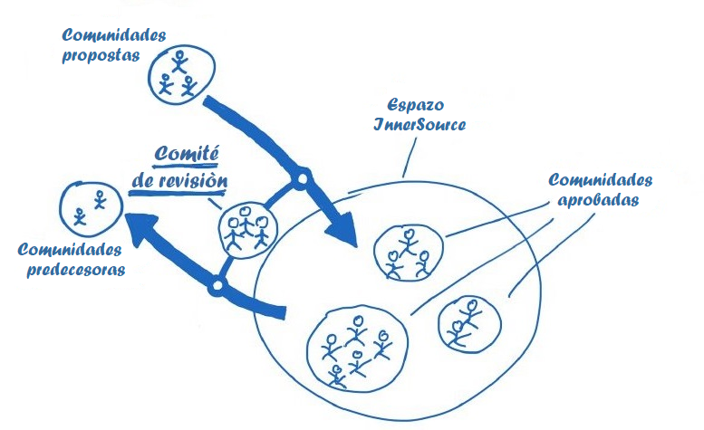

## Title

Comité de revisión

## Patlet

O modelo de traballo InnerSource é un afastamento radical dos enfoques máis tradicionais, tanto para os/as desenvolvedores/as como para os/as seus/súas superiores/as. Ao establecer un comité de revisión como interface entre a iniciativa InnerSource e tódolos altos cargos das áreas empresariais que participan nela, é máis probable que estes últimos se familiaricen coa iniciativa e a apoien; xa que lles brinda un certo nivel de supervisión e control, sen fomentar a microxestión.

## Problema

Os altos cargos percibirán o modelo de traballo de InnerSource como un afastamento radical dos modelos de traballo aos que están afeitos e cos que teñen experiencia. Como consecuencia, é probable que rexeiten ou microxestionen a iniciativa InnerSource para tratar de minimizar o risco percibido deste cambio. En ambos os dous casos, os beneficios de InnerSource non se poderían alcanzar. E, como resultado, InnerSource sería logo desacreditado.

## Contexto

A empresa A quere presentar a súa primeira iniciativa InnerSource. A meirande parte dos cargos superiores da empresa A non están familiarizados co modelo de traballo de software libre e, en cambio, están afeitos á xestión de estilos de control xerárquico e descendente.

## Aspectos que mellorar

- Canto máis control perciba un/unha directivo/a sobre o traballo na iniciativa InnerSource, máis probable é que apoie a iniciativa sen contar con experiencia previa.
- Canta menos experiencia teña un/unha xestor/a co modelo de traballo de software libre, máis probable é que queira controlar o risco da iniciativa.
- Canto máis draconiana e microxestionada sexa a dirección das iniciativas InnerSource, menos probable é que se adopte o modelo de traballo de software libre na medida necesaria. E, como resultado, os beneficios de InnerSource non se poderán acadar.

## Solución

- Establecer un comité de revisión composto por altos/as directivos/as de tódalas áreas empresariais que participan na iniciativa InnerSource.
- Os membros do Comité de revisión teñen a autoridade de decidir grupalmente, e en xeral, que proxectos InnerSource recibirán asistencia; así como cales en particular contarán con financiamento.
- Os/As candidatos/as poden ser elixidos/as con anterioridade polos membros do Comité de revisión para presentar a súa proposta de proxecto InnerSource, para a súa consideración durante as reunións do devandito Comité.
- Os/As líderes dos proxectos InnerSource, financiados actualmente polo Comité de revisión, están obrigados/as a informar sobre o estado do seu proxecto durante cada xuntanza do comité.
- Os membros do Comité de revisión están obrigados a proporcionar retroalimentación tanto ás novas persoas candidatas/solicitantes como aos/ás líderes actuais do proxecto durante as reunións do comité.
- Cada proxecto de InnerSource debe ter a oportunidade de reaccionar ás valoracións recibidas nunha sesión do Comité de revisión, no espazo de tempo que reste ata a sesión seguinte, para evitar o peche prematuro do proxecto.
- Un/Unha líder de proxecto InnerSource tamén pode presentar unha moción de cese por iniciativa propia no Comité de revisión. A continuación, o Comité de revisión ten que decidir se ás áreas empresariais que empregan o software se lles debe dar tempo ou non para poñer en marcha medidas para garantir que o desenvolvemento e/ou o mantemento da base de código continúe ata que se atope unha solución alternativa ao desenvolvemento por parte da comunidade InnerSource. (Se é relevante para o negocio ou é unha misión crítica).
- O Comité de revisión debería reunirse regularmente. Xa se probou que unha cadencia de dúas reunións ao ano resulta exitosa.

## Contexto resultante

- Os/As directivos/as empregan con InnerSource unha ferramenta coa que se senten cómodos/as, co fin de obter a cantidade necesaria de información e control sobre o funcionamento interno da iniciativa. Esta familiaridade fará que teñan máis probabilidades de asinar a iniciativa InnerSource e poder conceder o grao de liberdade necesario para os proxectos de InnerSource.
- Os/As desenvolvedores/as aínda poden autoorganizarse ata certo punto. Non hai lugar para a microxestión, xa que o Comité de revisión non se convoca con demasiada frecuencia.

## Exemplos coñecidos

- BIOS en Robert Bosch GmbH

## Estado

- Estruturado
- Finalizado e revisado na data: 31/8/17

## Autoría

- Georg Grütter, Robert Bosch GmbH
- Diogo Fregonese, Robert Bosch GmbH

## Título alternativo

*Cheese Interface*

## Tradución

- Leticia Gómez Cadahía
- María Lucía González Castro