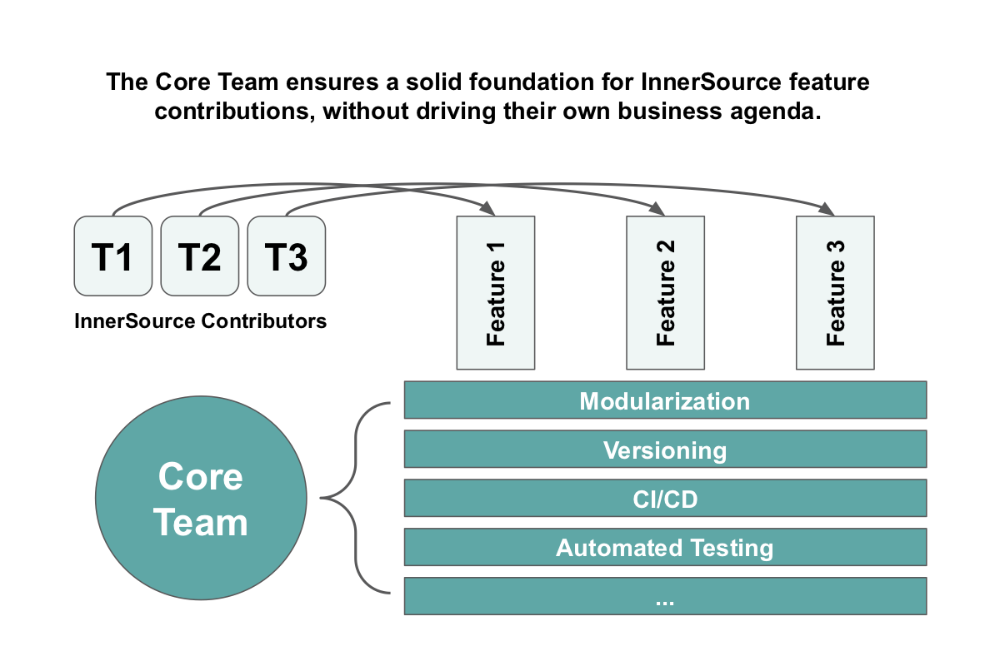

## Title

コアチーム

## Patlet

インナーソースのプロジェクトが広く必要とされていても、プロジェクトが難しいためにコントリビューションや活用に支障をきたす場合があります。プロジェクトの基本的な項目を専門に担当するコアチームを設立してください。コアチームの作業により、コントリビューターは自分のシナリオに価値をもたらす機能を追加し、使用することができます。

## 問題

* プロジェクトにコントリビュートすることが困難な場合、以下のようなことが原因として考えられます。
  * ローカルでプロジェクトを実行できない。
  * ドキュメントが貧弱
  * コードが複雑
  * テストが不適切である
* プロジェクトを使用するのが困難な場合、以下のようなことが原因として考えられます。
  * ドキュメントに不備がある
  * バグが頻繁に発生する
  * セットアップが直感的でない

## ケーススタディ

誰もが依存する中心的なプロジェクトがあります。「なんて素晴らしいインナーソースのための候補でしょうか！」
しかし残念ながらこれまでプロジェクトは有機的に成長し、様々なコントリビューションと追加が無計画に行われてきました。今では、誰も理解できず、誰もが触れることを恐れている、厄介で厚いコードの沼になっています。
明らかにオーバーホール（リファクタリング、テスト、ドキュメンテーションなど）を行うべきなのに、誰もがその作業を必要とし、望んでいるにもかかわらず、誰もそのための時間を取らないのです。

## 状況

* 多くのチームがそのプロジェクトを必要としています。
* プロジェクトに大きな技術的負債があります。
* プロジェクトの採用やイテレーションは遅いです。
* プロジェクトとコントリビューションのエコシステム全体に対して責任を持つオーナーやメンテナが存在しません。

## 組織に働く力学

* コントリビュートするチームは皆忙しいので、自分たちにすぐに利益が出る仕事を優先します。
* プロジェクトが成長するにつれ、使用や変更が難しくなるのは当然の傾向です。

## ソリューション

他の人が簡単に参加でき、コントリビュートできるようにこのプロジェクトを維持することを仕事とするコアチームを形成します。このコアチームは、健全な利用やコントリビューションのエコシステムに必要な作業を行います。この重要な仕事は、コントリビューションとして優先されない傾向があります。この種の作業のカテゴリには、コミュニケーション、ローカル環境、DevOpsインフラストラクチャが含まれます。
以下はその具体例です。

* 本番環境のバグ
* ドキュメンテーション
* オンボーディングチュートリアルとサンプル
* 自動化されたテスト
* CI/CD
* ローカル環境
* モジュール化
* バージョニング
* モニタリング
* 新しいクラス/機能のカテゴリを開拓する

これらの各項目は、健全な製品エコシステムにとって非常に重要であるにもかかわらず、貢献として優先されることはまずないでしょう。
コアチームは少人数の、フルタイムまたはパートタイムで構成することができます。その選択は、必要な作業量、リソースの利用可能性、組織の文化に依存します。最も重要な考慮点は、組織が他のチームと同じように権限を与え、責任を負わせることができるようにチームを編成することです。
その中心的な役割から、コアチームのメンバーはほぼ常に**トラステッドコミッター**の役割も果たすべきです (この概念については、[ラーニングパス][tc-learning-path]と [パターン][tc-pattern] を参照してください)。トラステッドコミッター の役割は、他のメンバーがプロジェクトに貢献したり利用したりするのを促進することに主眼が置かれていますが、コアチームのメンバーは定期的にプロジェクトにも貢献します。コアチームには、貢献を決定するような独自のビジネスアジェンダはありません。彼らは、他の人がプロジェクトを利用し貢献するために何が最も役に立つかを考えて、取り組むべきことを決定します。

この目標を継続的にリマインドさせるためには、コアチームに定期的に以下の項目を報告してもらうのがよいでしょう。

* そのプロジェクトを使用しているアクティブなチームの数
* プロジェクトに対するチーム外からの貢献の数

これらのメトリックに継続的に焦点を当てることで、コアチームは自然と、プロジェクトの周りに繁栄するインナーソースエコシステムを作成するための適切な作業に優先順位を付けるようになります。

## 結果の状況

* プロジェクトを利用しコントリビュートすることが容易になります
*  多くのチームがこのプロジェクトを利用し、貢献するようになります
* コアチームの成功は、他のプロジェクトとの相互作用とプロジェクトへの対応という観点から定義されています。

## 理論的解釈

コアチームを分離し、このようにタスクを与えることで、プロジェクトを成功させるために必要なギャップを埋めることができます。
コアチームはそのギャップを埋め、コントリビューションのエコシステムが健全であるよう、潤滑油の役割をします。

## 事例

Nike は、再利用可能なCI/CDパイプラインを中心としたインナーソースの取り組みを管理するためにこのパターンを導入しました。

## ステータス

Structured

## 著者

[Russell R. Rutledge](https://github.com/rrrutledge)

[tc-learning-path]: https://innersourcecommons.org/ja/learn/learning-path/trusted-committer/
[tc-pattern]: ./trusted-committer.md

## 翻訳の履歴

- **2022-06-01** - 翻訳 [Yuki Hattori](https://github.com/yuhattor)
- **2022-06-21** - レビュー [@hirotakatoya](https://github.com/hirotakatoya)
