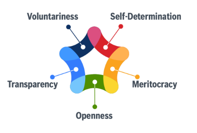

## Title

基本原則ガイダンスの文書化

## Patlet

「オープンソースのベストプラクティスを組織内に適用する」という通常のインナーソースの説明は、オープンソースのバックグラウンドがない人々にはうまく機能しません。
解決策として、インナーソースの最も重要な原則を文書化し広く公開しましょう。

## 問題

この組織は、インナーソースをより大規模に展開しようとしています。この取り組み自体はオープンソース愛好家のなかで始まりました。現段階の目標は、オープンソースの経験がない人たちからの賛同を得ることです。その人たちに伝えるためのツールとして「オープンソースのベストプラクティスを適用する」という典型的なスローガンは最適ではありません。この伝え方では、そもそもインナーソースがなんであるか、また問題の解決のためにどのようなツールを使うべきなのかは伝わりません。結果として、組織におけるインナーソースの適用が遅くなることにつながります。
チームはインナーソースのゴールが何であるか、そしてどうやったら最適の実装方法を見出せるのかを場当たり的なアイデアをもとに解決しようと試みます。しかしそれはコントリビューターがチームの境界を越え始めたときに混乱を引き起こす結果にも繋がってしまいます。

## ケーススタディ

ある組織での初期の実験では、オープンソースコラボレーションのベストプラクティスが有益であることが示されました。次のステップは、オープンソースの深いバックグラウンドがないチームや個人にそのイニシアチブを移すことです。
そして今の目標は、インナーソースイニシアチブの目標と、これらの目標達成に向けた明確な道筋を明確に伝えることです。

## 状況

* インナーソースという言葉が社員の間で広がり始めています。
* イニシアチブ自体はオープンソースの愛好家の間で始まった取り組みでした。

## 組織に働く力学

* チームは、インナーソースの重要な側面が何であるかを正確に伝えるのに苦労しています。
* オープンソースの経験が不足している人々は、オープンソースのベストプラクティスを組織にもたらすことの意味を理解することができません。
* 日常的にインナーソースのベストプラクティスに従おうとするチームは、自分たちがやっていることが一般的なインナーソースの典型例に沿っているのかを判断するのに苦労しています。

## ソリューション

組織内でインナーソースの取り組みを推進する人は、オープンソースの深いバックグランドを持たず、インナーソースを直感的に理解できていないチームや個人を支援する必要があります。

以下の2つの分野を文書化することで、チームや個人に対して明確な情報を提供する必要があります。

1. **目的** - なぜ組織はインナーソースを採用するのか？
2. **原則** - どのインナーソースの原則は、これらの課題に対処するのに役立つのか？

以下のセクションでは、この2つの詳細について説明します。あなたの組織が目的と原則を文書化するために、このセクションはよい出発点になるでしょう。

### なぜ組織はインナーソースを採用したいのか？

かつてよりインナーソースは、組織で発生する一般的な問題を解決するのに役立つことが証明されています。しかし幾多ある組織的な課題のうち、あなたの組織がインナーソースを用いて解決したい課題はなんでしょうか。その問題を特定するためには一般化するのではなく、組織の課題に一致するソリューションを正確に特定するようにしてください。できれば、目に見える変化を求めているチャレンジを特定するのが好ましいです。

他の個人や組織がインナーソースのベストプラクティスに従うことによって対処しているいくつかの課題があるので、見ていきましょう。

* 強力なオーナーシップを求める文化によって引き起こされる開発のサイロを減らすため
* 健全なコードの再利用を促進することにより、類似の問題の解決に費やす時間を短縮し、イノベーションの速度を向上させるため
* より良いクロスチームのコラボレーションによって開発速度を向上させるため
* 依存関係があるプロジェクトやチームの連携を、ワークアラウンドを開発したり、ただ単純に待つのではなくエンジニアリングにおけるボトルネックを減らすことによって解決するため
* 品質を向上させるため
* 従業員の幸福度を高めるため
* 新入社員の成功の数を増やす
* アクショナブルなドキュメントをつくる

### どのインナーソースの原則がこれらの課題を解決するのに役立つのか？

チームがインナーソースがどのような問題に対処するのに役立つかをひとたび理解したら、次のステップは、これらの課題に対処するのに役立つ原則を説明することです。
基本的なオープンソース開発の原則に基づき、以下のガイドラインが成功に役立つと証明されています。

(1) コードは、組織内で透明性を持ってホストされなければなりません。
ソースコード、ドキュメント、プロジェクト開発に関連するデータは、組織内の誰もが利用でき、簡単に見つけることができる必要があります。

(2)機能リクエストよりもコントリビューション

プロジェクトのすべての関係者は、潜在的なコントリビューターとして扱われ、サポートされます。コントリビューションはリクエストではなく、提案にとどめましょう。
コントリビューション前にきちんと連携をしておくことにより、無駄な労力を省くことができます。 プロジェクトは摩擦を避けるためにコントリビューションのガイドラインを提供します。

(3) 失敗することは学習をするチャンスであるということ

組織全体で仕事が見えるため、どんなミスもメンバーに見えてしまいます。「ミスは何としても避けなければならない失敗」ではなく「学習のための機会である」という文化が確立されなければなりません。

(4) 口頭より文字で伝える

複数のチームにまたがるプロジェクトでは、潜在的に会議のスケジュールが異なるため、非同期でのコラボレーションを可能にする必要があります。インナーソースのプロジェクトのゴールは、新しいコントリビューターを集めることです。そのため潜在的な将来のコントリビューターがプロジェクトに参加するハードルを下げることが必要であり、セルフサービスでプロジェクトの進捗状況を追跡することができるようにしておく必要があります。プロジェクトに関連するコミュニケーションが同期的なコミュニケーションを介して行われる場合、議論された内容は、ドキュメンテーションのチャネルで透明化しておく必要があります - 最終的な意思決定はそのコミュニケーションチャネルでのみ決定されるべきです。
このことは副次的な効果として、プロジェクトに新しく参加する人にとって非常に価値のある受動的なベースドキュメンテーションにつながります。

(5) 書面によるアドバイスを永続的で検索可能なアーカイブに蓄積できるようにする

プロジェクトのすべてのコミュニケーション、特に決定事項やその決定に至るまでの議論はアーカイブされる必要があります。また、コミュニケーションは安定したURLで参照できるようにする必要があり、過去のコミュニケーションも、簡単に検索できる形で保存される必要があります。

ただし、2つの注意点があります。

1. これは構造化された文書に取って代わるものではありません。しかし一方で、構造化されたドキュメントを収集するための出発点として機能もします。
1. すべてを文書化し、組織全体がアクセスできるようにするというルールには例外があります。人に関する議論やセキュリティに関する議論は機密事項であり、人前で行うべきではありません。

(6) **トラステッドコミッター** に対するリワード

すべての貢献(ソースコード、ドキュメント、バグレポート、議論への意見、ユーザーサポート、マーケティングなど) は歓迎され、リワードの対象になります。プロジェクトをサポートする人は、[トラステッドコミッター](./trusted-committer.md)としてプロジェクトに招待され、全てのトラステッドコミッターのリストは公開されます。

## 結果の状況

* 組織のメンバーは、インナーソースのベストプラクティスを適用することによって、どのような課題に対処することができるのかを理解しています。
* オープンソースの経験がないメンバーが、インナーソースプロジェクトの基本的な価値観や原則を理解することができます。
* オープンソースの経験がないメンバーが、自分たちが日々行っていることを、共通の価値観に照らして確認することができる。
* 組織の開発手法がオープンソースプロジェクトと類似しているため、組織のメンバーがオープンソースプロジェクトに参加しやすくなります。

## 事例

### Europace AG

上記のソリューションに記載されているインナーソースの原則は、ほとんどが Europace の経験に基づいています。
詳細は[Europace のインナーソース原則](https://tech.europace.de/post/europace-inner-source-prinzipien/)(ドイツ語)をご覧ください。

### GitHub

#### 目的

GitHub ではしばしば、チームが自分の担当外の領域に機能を提供するモデルで作業をします。よくある例としては、セールスエンジニアリングが営業におけるブロッカー要素を排除するために機能を提供したり、緊急なニーズに対する特別なプロジェクトがあり、インパクトの強い機能をプロダクト全体に提供したり、チームが複数のエリアにまたがって機能を提供したりすることです。

#### 原則

全体として、このドキュメントで説明されている原則は、オーナーとなるチームの技術的負債とサポートの負担を増加させないようにすることに焦点を当てています。

多くの場合、チームは責任範囲内のサポートとメンテナンスのコストのために遅れており、機能に貢献するための余裕がないため、チームにヘルプが求められています。しかし別のチームによって新機能にかかるサポートの負担や技術的負担が追加されることになると、所有するチームが新機能に取り組む時間がさらに短縮されることを意味するため、それらが正しく行われていることを確認する必要があります。 同時に、私たちはエンジニアが境界を越えて自由に仕事ができる会社を目指しており、ビジネスの優先事項では、コアオーナーシップ以外の分野にコントリビュートすることが求められることがよくあります。

これらの原則をまとめると、「見つけたときと同じか、それ以上の状態で残す」ということになります。

それを踏まえて、私たちが賛同する原則を以下に紹介します。

- 機能負債を抱えるようなMVP（Minimum Viable Product）は避ける。顧客からのフィードバックを得るためにMVPを出荷することは構いませんが、コントリビュートするチームはその機能セットを完成させることを約束しなければなりません。例えば、以下のようなことです。
  - MVP を越えて、ほとんどの顧客を満足させるソリューションにするためのコミットメント
  - 新機能の管理を完全にサポートすること (例: コマンドラインの操作のみを提供するのではなく、設定のための UI を提供する）
  - APIのみを提供するのではなく UI と API の両方のインタフェースを提供する（またはその逆）
  - クラウドとやサーバー環境での動作保証 (補足: GitHub Enterprise Server と GitHub Enterprise Cloud の両方で動く)
- 本番環境へのデプロイまで、またそれ以降も機能作業をサポートする
  - インクリメンタルなロールアウトの連携
  - サポートチケットをハンドルする
  - 顧客からの(機能やバグに関する)フィードバックに対応するための時間をプランニングする
- 正しい方法で機能を構築する(技術的負債を作らない)
  - プロダクトチームおよびエンジニアリングチームとの要件およびソリューションの合意
  - 適切なアーキテクチャと設計
  - 後のデータマイグレーションを避けるために、データが適切に保存されていることを確認する
  - 適切なテレメトリの計測が行われていること
  - 適切なテストカバレッジが確保されている
  - クラウドおよびローカルの本番環境でサポートされている（セットアップ、設定、バックアップ/リストア、マイグレーションなどを含む）
  - バグの修正
  - ドキュメントの更新

#### エンゲージメント

エンゲージメントモデルを使用するのは、チームが責任範囲外の領域に機能を提供するときに、チームが実行できる具体的な手順を示すためです。
GitHubの一般的なエンゲージメントモデルは以下です。

- プロダクトオーナーから、機能のセッティングとロールアウトプランの承認を得る
- エンジニアリングオーナー(通常、エンジニアリングマネージャーとディレクター)から、非機能要件(テレメトリ、テストカバレッジ、マルチ環境テストとサポート) への対応を含むエンジニアリング設計の承認を得る
- 新規または変更された要件のレビューとともに、コードレビューを実施する。

### Robert Bosch GmbH

#### 目的

Bosch のインナーソース・イニシアチブ (BIOS: Bosch Internal Open Source) は、コラボレーション、学習、イノベーションを促進することに主眼を置いています。

#### 原則

ボッシュは以下の原則を適用しました。

- **オープン性**: BIOS コミュニティへの参入障壁を可能な限り低くします。
- **透明性**: 徹底的に透明性を高め、仕事上の成果物、コミュニケーション、意思決定を社内の全社員と共有します。
- **自発性**: BIOSコミュニティに参加し、コントリビュートするかどうかの判断は、各人に任されています。社員は上司に言われたからではなく、自発的な動機で BIOS に参画すべきです。
- **自己決定**: BIOS コミュニティは、何に取り組むか、いつ取り組むか、どのようなツールやプロセスを使って取り組むかを自由に選択することができます
- **功績至上主義**: BIOSプロジェクトメンバーには、その功績に基づいて、つまりコントリビューションの質と量に基づいて権力が付与されます

オープン性、透明性、自発性の原則は、本質的な動機によって動く仲間の多様なコミュニティを成長させるのに役立ちました。功績至上主義は、多大な貢献をするための効果的な動機であることが証明されています。 自己決定により、コミュニティは限られた時間を最も効果的かつ効率的な方法でコントリビューションに使用することができました。

## ステータス

Structured

## 著者

* Isabel Drost-Fromm
* Georg Grütter

## 謝辞

* Zack Koppert - GitHub のアプローチを提供していただき感謝いたします。

## その他の呼び方

インナーソース減速の明示 - Explicit InnerSource Principles

## 翻訳の履歴

- **2022-06-02** - 翻訳 [Yuki Hattori](https://github.com/yuhattor)
- **2022-06-13** - レビュー [@kanazawazawa](https://github.com/kanazawazawa)
