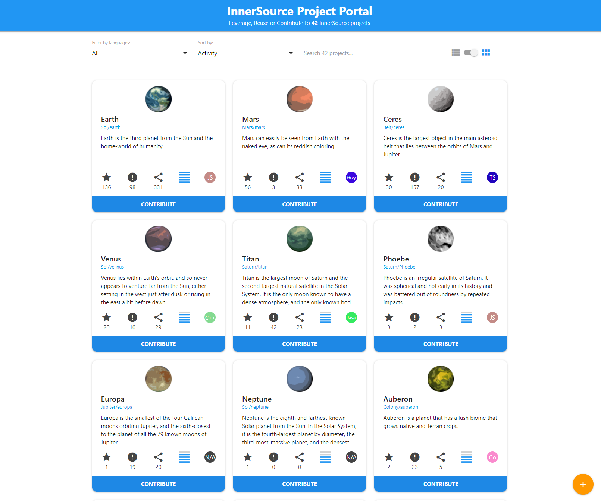
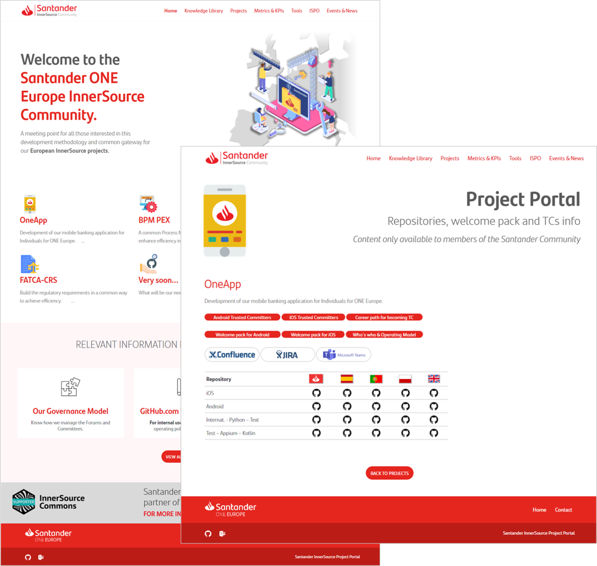

## Title

インナーソースポータル

## Patlet

潜在的なコントリビューターは、彼らが興味を持っているインナーソースプロジェクトを簡単に見つけることができません。すべての利用可能なインナーソースプロジェクトの情報をインデックス化するイントラネットのウェブサイトを作成することにより、あなたはコントリビューターが彼らに興味があるかもしれないプロジェクトについて知ることができ、インナーソースプロジェクトのオーナーは、外部のオーディエンスを引き付けることができます。

## 問題

インナーソースプロジェクトチームは、外部からのコントリビューションを集めることが難しいと感じています。

あなたの組織のインナーソースプロジェクトは増えているものの、潜在的なコントリビューターにとって、それらのプロジェクトを見つけるための簡単な方法がありません。

## ケーススタディ

あなたは、組織内のインナーソースプラクティスを確立しようとしています。 あなたは、いくつかのプロジェクトがインナーソースモデルを使用して運用されていることを知っていますが、それらの存在は、他の社員の口コミ、電子メールまたは立ち話を介してのみ伝達されています。 結果としてインナーソースプロジェクトのオーナーは、コントリビューターを引き付けることに困難を感じています。

現在、組織全体の従業員がアクセスできる単一の共有リソースはなく、進行中のすべてのインナーソースプロジェクトを簡単に見つけることはできません。このことは、すべてのインナーソースプロジェクトの成長の可能性を大幅に制限しています。

すべてのインナーソースプロジェクトが、できるだけ多くのオーディエンスにビジビリティを発揮し、組織全体のコントリビューターを引き付けるためには何ができるでしょうか？

## 状況

* あなたの組織は、インナーソースワークスタイルを採用することに興味を持っています。
* インナーソースプロジェクトのオーナーは、彼らのプロジェクトにオーディエンスを引き付けるための方法を探しています。しかし、潜在的なコントリビューターに宣伝するために利用できる通信チャネルはなく、活動が制限されてしまっています。
* あなたの組織でインナーソースプロジェクト自体は増加しています。
* この問題をさらに深刻にしているのは、使用されている共有ソース管理アプリケーションの検索機能が非常に限られているためです。インナーソースプロジェクトを探すのに慣れた開発者でさえ、その場所を特定するのに苦労しているという事実です。

## 前提条件

* マネージャーは、従業員がインナーソースプロジェクトに参加することを暗黙の了解としています。
* ホストするリポジトリのコンテンツは共有ソース管理システムによって提供されていますが、プログラムによるアクセス制限がついています。
* 組織内にインナーソースコラボレーションの促進を担当する部門があります。

## 組織に働く力学

* 別々のエンジニアリングチームが、共通の課題に対してパートナーとして取り組むことのポテンシャルが十分に発揮されていません。
* インナーソースプロジェクトが存在することを、個人が知ることは困難になっています。
* インナーソースプロジェクトのオーナーが外部のコントリビューターを引き付けることは困難です。

## ソリューション

インナーソースプロジェクトのオーナーがプロジェクトの利用可能性を簡単に宣伝できるインナーソースポータルイントラウェブサイトを作成します。

ポータルの主要な内容は次のとおりです。

* インナーソースポータルにアクセスした人は、すべての利用可能なプロジェクトを見るだけでなく、プロジェクト名、使用中の技術、コントリビューター名、スポンサー事業部などの様々な条件に基づいて、特定のプロジェクトを検索することができるようになっています。
* インナーソースポータルを通じて表示される情報は、常にインナーソースプロジェクトのオーナーの完全な制御下にある必要があります。プロジェクトリポジトリ自体に格納されている特定のデータファイルまたはメタデータから直接この情報をソーシングすることによって実現されるのが好ましいです。
* プロジェクトのオーナーは、プロジェクト名、トラステッドコミッターの名前、簡単な説明とコードリポジトリまたは任意のサポートドキュメントへのリンクを含むそれらのデータファイル内のプロジェクトに関するすべての関連情報を含める必要があります。
* (*オプション)ほとんどの組織は、ポータルをイントラネットでのみ利用できるようにすることを選択しますが、いくつかの組織は、ポータルを公共のインターネット上で利用できるようにすることを選択しました。後者は、例えばブランディングや採用の目的で、ポータルにインナーソースのアプローチに関する追加情報を表示したい組織にとって興味深いものになるでしょう。

ポータルを立ち上げる際には、ポータル内に表示されるプロジェクトの数を増やすために、インナーソースのデータファイルやコードリポジトリへのメタデータの追加を促進するコミュニケーションキャンペーンを検討する必要があります。

インナーソースポータルの[参考実装](https://github.com/SAP/project-portal-for-innersource)はGitHub上で公開されており、コントリビューションを受け付けています。これは、インタラクティブで使いやすい方法で、組織のすべてのインナーソースプロジェクトを一覧表示します。プロジェクトはGitHubの専用トピックを使って自己登録し、追加のメタデータを提供することができます。

## 結果の状況

* インナーソースポータルは、インナーソースプロジェクトのオーナーが組織全体のオーディエンスにプロジェクトを広告することが可能になりました。ビジビリティがあがったため、彼らはこれまで以上に大きなコントリビューターのコミュニティを惹きつけています。
* インナーソースプロジェクトに参加したい人のために、インナーソースポータルは、社員が特定の条件に基づいてすべての利用可能なインナーソースプロジェクトを横断検索することによって、興味を持っている種類を正確に発見することを可能にしました。
* インナーソースプロジェクトへの参加を検討している場合、インナーソースポータルでは、特定の基準に基づいて利用可能なすべてのインナーソースプロジェクトを一度で検索することにより、関心のある機会の対象を正確に見つけることができます。
* これらの両方のニーズを満たすことで、組織のすべての領域において個別に実現できないことを一緒に達成するために活用できる魅力的な手段として、インナーソースを確立するのに役立ちました。

## 事例

* **大手金融サービス組織**は、異なるビジネスユニット間で存在するインナーソースプロジェクトを宣伝し、発見する仕組みを提供するためにインナーソースポータルを使用しています。
* **SAP**はインナーソースポータルでインナーソースプロジェクトを推進しています。 プロジェクトはGitHubトピックを使用して自己登録することができます。[リポジトリアクティビティスコア](repository-activity-score.md) は、ポータル内のインナーソースプロジェクトのデフォルトの順序を定義しています。 また、SAP における事例はこちらもご参照ください[Michael Graf & Harish B (SAP) at ISC.S11 - The Unexpected Path of Applying InnerSource Patterns](https://www.youtube.com/watch?v=6r9QOw9dcQo&list=PLCH-i0B0otNQZQt_QzGR9Il_kE4C6cQRy&index=6)。 コードベースは[リファレンス実装](https://github.com/SAP/project-portal-for-innersource) として公開されており、コントリビューションのためにオープンになっています。
* **Elbit Systems**はこのパターンを使い、さらにゲーミフィケーションを上乗せしています。
  * [文化変革の手段としてのゲーミフィケーションとインナーソースのエンゲージメントブースター](https://www.oreilly.com/library/view/oscon-2018-/9781492026075/video321579.html) | Shelly Nizri | OSCON 2018 - Portland, Oregon
  * Of Islands, Monsters & InnerSource [(slides)](https://docs.google.com/presentation/d/1P1OCEK9B6eSrVRUclVWY6meSI-qHOBjM_UAPNvCZamU/edit#slide=id.p15), [(video)](https://drive.google.com/file/d/1pM89uHMn0vhE3ayFJDGYcCO8R0tAXXZD/view?usp=drivesdk) | InnerSource Spring Summit 2019 (Galway, Ireland)

  このプラットフォームを実現するコードはオープンソース化されており、[gitlab.com/gilda2](https://gitlab.com/gilda2)にて公開されています。

* **アメリカン航空**は、[インターナルインナーソースマーケットプレイス](https://tech.aa.com/2020-10-30-innersource/)を介してInnerSourceプロジェクトを推進しています。SAPと同様に、プロジェクトはGitHubのトピックとして `innersource` を追加することで自己登録されます。プロジェクトは、言語、トピック、オープンイシューの数などで検索やフィルタリングが可能です。

* **Banco Santander**社は、インナーソースをサポートして増やすために、[Santander ONE Europe InnerSource Community](https://innersourceportal.santander.com/)という公開ポータルを作成しました。このポータルには、プロジェクトのカタログに加え、ドキュメント、仕事の進め方、ニュース、イベントなどの関連コンテンツが含まれています。

## リファレンス

* インナーソースポータルパターンは[インナーソースギグマーケットプレイス](./gig-marketplace.md) のパターンと一緒に使うと非常によく機能することが証明されています。

## ステータス

* Structured

## 著者

* Stephen McCall

## 謝辞

* Shelly Nizri
* Melinda Malmgren
* Michael Graf
* Jesús Alonso Gutierrez

## 翻訳の履歴

- **2022-06-06** - 翻訳 [Yuki Hattori](https://github.com/yuhattor)
- **2022-06-13** - レビュー [@kanazawazawa](https://github.com/kanazawazawa)
