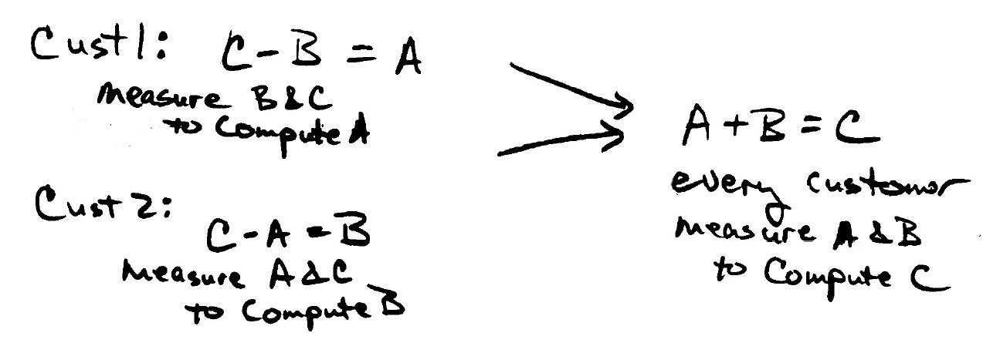

## Title

共通要件

## Patlet

共有リポジトリにある共通のコードは、それを使いたいすべてのプロジェクトチームのニーズを満たしていません。これは、要件の調整とリファクタリングによって解決されます。

## 問題

共有リポジトリにある共通コードは、それを使いたいすべてのプロジェクトのニーズを満たしていません。

## 状況

* すべてのプロジェクトがアクセスする共有リポジトリがあり、多くのプロジェクトが共通のコードを使おうとしています。
* 誰かが(またはどこかのプロジェクトが)最初にコードを書き、リポジトリにコントリビュートしました。
* 共通コードは、どのプロジェクトにおいても、成果物全体のうちのわずかな割合になります。
* 各プロジェクトには、それぞれ独自の納期、成果物があり、別の顧客がいます。
* このパターンは、これらの状況のいずれにも当てはまります。
  * **強いコードへのオーナーシップ**: つまり、共有リポジトリへのすべての変更は、リポジトリの所有者によって承認されなければなりません。
  * **弱いコードオーナーシップ**: つまり、誰も本当にコードを所有していません。
  * **慈善のスポンサー**が**いない**: つまり、インナーソースの方法で共通コードを整理するためのリソースを提供する組織や幹部がいません。

## 組織に働く力学

コードを利用可能にしたプロジェクトには、ひとつのニーズがあります。そのニーズは、一部の受けての組織が望んでいるものと似ていますが、まったく同じではありません。コードに関する要件は、実際の顧客のニーズから導き出される必要があります。

異なる顧客のニーズが非常によく似ることはよくありますが、顧客によって表現が異なったり、重みが異なったりすることがあります。例えば、ある顧客はとある方法で結果を表示し、他の顧客は逆の順序で結果を表示することを望むような場合があります。両者の変換は簡単ですが、一方のケースで追加のコーディングが必要になり、その結果として、結果を計算するモジュールを両方の顧客で再利用することができなくなります。

多くの顧客は、サプライヤーに何が必要かを知るための手助けを望んでいます。この会社では、多くの「システムエンジニア」が製品の要求事項を書いています。これらの要件は、製品の開発を導くために顧客のニーズを抽出したものであると考えられています。コードの再利用は、会社の時間とお金を節約するための重要な目標になっています。

多くの顧客は、サプライヤーが必要なものを知るのを手伝ってくれることを望んでいます。同社には、製品の要件を作成するための多くのシステムエンジニアがおり、それらの要件は製品開発の指針となる顧客ニーズの抽出物であるとされています。コードの再利用は、会社の時間とお金を節約するための重要な目標です。

## ソリューション

この問題を解決するには、2つの側面があり、並行して行う必要があります。

1. あるプロジェクトの要件を満たすコードが、他のプロジェクトのニーズも満たすように、プロジェクトの要件を調整する
1. コードをリファクタリングして、多くの使用プロジェクトが要件に同意できるような小さな断片にする。

さらに、サプライヤーに要件の解明を助けてほしい顧客を活用します。 コンポーネントを変更するのではなく、顧客との交渉中に要件の調整を行い、顧客の要件に影響を与えます。
上記の例では、サプライヤーは両方の顧客が同じことを望んでいることを認識できるように支援し、同じ形式で結果を受け入れることに同意すれば、すべての人の労力(およびお金)を節約できます。

## 結果の状況

これには、要件の変更について顧客と交渉する必要がある場合があります。そして、変更には要件を調整するために営業チームと製品マネージャーの関与が必要になる場合もあります。また、顧客は変更の同意の代わりに、割引などのインセンティブが必要になる場合があります。

これに関連する課題(新しいパターンの可能性)として、インナーソースを採用しているとある企業で報告されている「循環型ストーリーライティングの試行」があります。
これは、端的に言うと以下のようなことです。

* 開発者は、ある方法で問題を解決するためにストーリーを書きます。
* プログラムマネージャーはそのストーリーを自分たちのニーズをよりよく表現するために書き直します。しかし、開発者のもとに戻ってきたときには、開発者はそれが自分たちが最初にやりたかったことだと認識しておらず、そのため実装に躊躇してしまいます。
* このパターンの解決策は、開発者やプログラムマネージャーの陣営だけでなく、プロジェクト全体でストーリーの修正が理解されるように、プランニングの際により多くの人を巻き込むことが挙げられます。

## 事例

* 大手通信事業者

## ステータス

* Structured

## 著者

Robert Hanmer

## 謝辞

* Manrique Lopez
* Daniel Izquierdo
* Tim Yao
* Sebastian Spier

## 翻訳の履歴

- **2022-06-02** - 翻訳 [Yuki Hattori](https://github.com/yuhattor)
