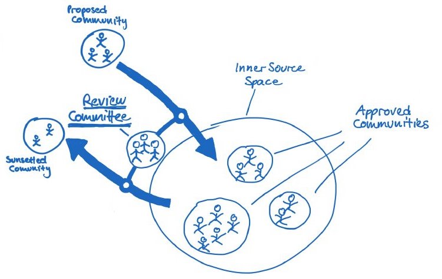

## Title

レビュー委員会

## Patlet

インナーソースの作業モデルは、開発者と管理者のための、より伝統的なアプローチからの抜本的な変革です。インナーソースイニシアチブとそれに参加するビジネスユニットのすべてのシニアマネージャーの間のインタフェースとしてレビュー委員会を確立することにより、マイクロマネジメントを助長することなく、監視と制御の一定レベルを与えるように、イニシアチブに慣れ親しみ、それをサポートできるようになる可能性が高くなります。

## 問題

管理職は、インナーソースの作業モデルを、彼らが慣れ親しんできた作業モデルからの根本的な逸脱として認識することになるでしょう。その結果、彼らはこの変化のリスクを最小限にしようとするために、インナーソースイニシアチブを拒否またはマイクロマネジメントする可能性があります。
どちらの場合も、インナーソースの利点を実現することができません。その結果、インナーソースは信用を失うことになります。

## 状況

A社は、最初のインナーソースの取り組みを導入したいと考えています。A社のほとんどのマネージャーは、オープンソースの作業モデルに慣れておらず、代わりに階層的な、トップダウンのコントロールスタイルの管理に慣れています。

## 組織に働く力学

- マネージャーがインナーソースイニシアチブでのワークをコントロールしている認識を持てば持つほど、マネージャーは事前の経験がなくてもイニシアチブをサポートする可能性が高くなります。
- マネージャーは、オープンソースのワークモデルの経験が少ないほど、マネージャーがイニシアチブのリスクを制御したいと思う可能性が高くなります。
- インナーソースの取り組みがより重労働でマイクロマネジメントされているほど、 オープンソースの作業モデルを必要な範囲で採用できる可能性は低くなります。その結果、InnerSourceのメリットは実現されません。

## ソリューション

- インナーソースイニシアチブに参加するすべてのビジネスユニットのシニアマネージャーで構成されるレビュー委員会を設立します。
- レビュー委員会メンバーには、どのインナーソースプロジェクトが一般的な支援を受け、特に資金援助を受けるかをグループとして決定する権限が与えられています。
- 申請者は、会議の前にレビュー委員によって選出され、レビュー委員会の会議でインナーソースプロジェクト案を提示することができます。
- 現在、レビュー委員会が資金を提供しているインナーソースプロジェクトのリーダーは、毎回のレビュー委員会でプロジェクトの状況について報告することが義務付けられています。
- レビュー委員は、レビュー委員会において、新規申請者と現在のプロジェクト・リーダーの両方に対して建設的なフィードバックを行う義務があります。
- すべてのインナーソースプロジェクトは、プロジェクトの早期終了を避けるために、レビュー委員会のあるセッションで受け取ったフィードバックに対して、次のセッションまで反応する機会を与えられることになっています。
- インナーソースプロジェクトのリーダーは、レビュー委員会で自発的に停止させるための動議を提示することもできます。レビュー委員会は、次に、ソフトウェアを使用するビジネスユニットが、インナーソースコミュニティによる開発の代替ソリューションが見つかるまで、コードベースの開発またはメンテナンスを継続するための手段を講じる時間を与える必要があるかどうかを決定しなければなりません (ビジネス関連またはミッションクリティカルである場合)。
- レビュー委員会は、定期的に開催されるべきです。年に2回のペースで開催するのが効果的であることが証明されています。

## 結果の状況

マネージャーは、インナーソースイニシアチブのために必要な量の情報を取得し、制御するために、使い慣れたツールをインナーソースに適用します。この親しみやすさにより、マネージャーはインナーソースイニシアチブを承認し、インナーソースプロジェクトに必要な自由度を付与する可能性が高くなります。
開発者は十分に自己組織化することができます。 レビュー委員会はあまり頻繁に招集されないため、マイクロマネジメントは行われません。

## 事例

* BIOS at Robert Bosch GmbH

## ステータス

* Structured
* _Finalized and Reviewed_ as of 8/31/17.

## 著者

- Georg Grütter, Robert Bosch GmbH
- Diogo Fregonese, Robert Bosch GmbH

## その他の呼び方

Cheese Interface

## 翻訳の履歴

- **2022-06-02** - 翻訳 [Yuki Hattori](https://github.com/yuhattor)
- **2022-06-15** - レビュー [@kanazawazawa](https://github.com/kanazawazawa)
