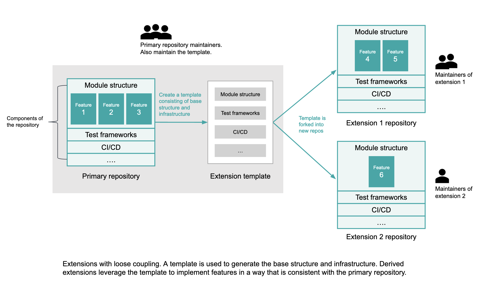

## Title

Extensões para Crescimento Sustentável

## Patlet

Um projeto InnerSource está recebendo um grande número de contribuições, tornando a manutenção difícil. Ao oferecer um mecanismo de extensão fora do projeto principal, os mantenedores possibilitam a expansão das capacidades do projeto com custos mínimos e sobrecarga de manutenção.

## Problema

À medida que o número de contribuições para um repositório InnerSource maduro aumenta rapidamente, isso gera mais carga nas revisões de código e na manutenção. Isso resulta em um grande acúmulo de revisões de código ou na rejeição prematura de novas contribuições de recursos.

Como a equipe anfitriã pode permitir um lançamento mais rápido de novos recursos, incentivando a inovação e a experimentação, ao mesmo tempo em que mantém o repositório bem mantido?

## História

Há um projeto estratégico que tem como objetivo coletar as melhores inovações dentro de um espaço de domínio em uma pilha comum, permitindo a reutilização de uma infraestrutura comum e proporcionando uma experiência do usuário padronizada. Através do InnerSource, várias equipes na organização que trabalham dentro do espaço de domínio têm a oportunidade de colaborar e contribuir com suas inovações para o código base comum.

No entanto, um grande número de contribuições em paralelo de vários desenvolvedores está tornando a manutenção do código base difícil. Isso está adicionando uma grande carga para os mantenedores do projeto, que assumem a responsabilidade pelas normas de qualidade do código e capacitam a comunidade através de várias formas de comunicação.

Os mantenedores do projeto estão em risco de esgotamento devido a:

- Um backlog interminável de solicitações de pull de colaboradores que precisam ser revisadas.
- Insatisfação no trabalho: A maioria do tempo dos mantenedores é gasta no suporte à comunidade, o que não deixa espaço para inovação.
- Percepção de falta de realização: Nem todos os recursos contribuídos têm demanda de usuários adequada e resultam em adoção subsequente.
- Liberações demoradas: Mais recursos no código base resultam em testes de longa duração.
- Aumento das atividades de manutenção: Mais bugs são relatados à medida que novas capacidades são adicionadas.

Muito tempo é gasto amadurecendo cada nova contribuição de recurso, antes mesmo que os potenciais usuários tenham a oportunidade de explorar o recurso para seus casos de uso. Se acontecer que o novo recurso não atende ao caso de uso, então todo o tempo gasto para atingir os padrões desejados de qualidade do código é desperdiçado.

## Contexto

- Um código-fonte InnerSource estratégico está crescendo rapidamente com novas contribuições de recursos de vários funcionários.
- A proporção de revisores para contribuições resulta em um crescente backlog de solicitações de pull. Isso está atrasando o lançamento de novos recursos para a comunidade.
- A qualidade do código está degradando e a experiência do usuário está sendo impactada negativamente.
- Os mantenedores do código estão sobrecarregados e não conseguem acompanhar o influxo de contribuições e o aumento do suporte à comunidade.
- Alguns dos recursos contribuídos não estão sendo adotados pelos usuários e podem até se tornar completamente inativos. No entanto, mesmo que não sejam usados, esses recursos ainda adicionam à sobrecarga de manutenção.
- A organização está investindo pesadamente na consolidação das novas contribuições de recursos para manter os padrões de qualidade antes que as ideias sejam exploradas pela comunidade.
- O padrão se aplica a ambos os cenários:
   - Os mantenedores se veem rejeitando novas ideias de recursos para limitar o escopo do projeto. Isso está prejudicando a inovação na comunidade e restringindo ainda mais a expansão.
   - Para reduzir o backlog, novos recursos estão sendo lançados sem documentação completa, consolidação ou teste detalhado, o que cria uma experiência de usuário ruim. Isso também aumenta o tamanho do código, adicionando um grande grafo de dependências e tornando a manutenção difícil.

## Forças

- Os mantenedores e proprietários do produto desejam permitir a expansão, incentivar a inovação e a experimentação sem serem excessivamente restritivos em relação às contribuições, ao mesmo tempo em que mantêm boas práticas de código e padrões de qualidade para a experiência do usuário.
- Uma grande quantidade de tempo é dedicada à consolidação e testes rigorosos de recursos para atender aos padrões do produto, mas os proprietários do produto podem querer permitir o lançamento mais rápido de novas inovações para que os produtos em adoção as explorem antes de investir tempo na consolidação das capacidades.
- Os mantenedores desejam incentivar a comunidade a compartilhar inovações que combinem as capacidades do produto com outros casos de uso, sem adicionar mais dependências ao repositório principal.

## Solução

Permitir [extensões/plugins](https://en.wikipedia.org/wiki/Extensibility) em código-fonte InnerSource em grande escala pode aliviar a carga de manutenção dos mantenedores do repositório e permitir um lançamento mais rápido de novos recursos para que produtos em adoção possam explorar. Isso transfere a manutenção das capacidades para os proprietários de extensões e permite que o repositório principal suporte capacidades que foram adotadas de forma mais ampla e são mais estratégicas.

As extensões fornecem um filtro para novas capacidades que podem eventualmente ser movidas para o núcleo do projeto. As extensões também atuam como um ambiente de incubação e consolidação da comunidade, permitindo que grande parte da consolidação aconteça organicamente, em vez de em um processo de revisão custoso.

Para que o modelo de extensões seja bem-sucedido, há algumas considerações arquiteturais a serem mantidas em mente:

1. **Fácil de criar:** Para obter a participação da comunidade, as extensões precisam ser fáceis de criar.
   - Crie um modelo de repositório que as extensões devem usar como ponto de partida. Isso permite que as extensões adicionem seus novos recursos em novos repositórios, separados do projeto principal. O modelo deve fornecer a mesma estrutura modular que o repositório principal e incluir o framework para empacotar e lançar as extensões.
      - Certifique-se de que, à medida que o repositório principal muda, os modelos sejam conservados. Os mantenedores do repositório principal são responsáveis por atualizar os modelos para garantir que sejam compatíveis com o projeto principal. Seguir boas práticas de versionamento, como [semver](https://semver.org/), torna isso mais fácil de seguir.
      - É recomendável ainda que os mantenedores do repositório principal forneçam orientações sobre como atualizar extensões com base em versões mais antigas do modelo à medida que novas versões são lançadas.
   - Adicione exemplo(s) de extensão desenvolvida(s) a partir do modelo, que os desenvolvedores do projeto podem usar como referência para entender como escrever uma extensão bem estruturada.
   - Flexibilize os requisitos para que os contribuidores criem extensões, permitindo a liberação mais rápida ou experimentação ao contornar revisões.
2. **Acoplamento flexível:** Ter componentes modulares que contenham funcionalidades pode permitir um acoplamento flexível, onde as alterações nas extensões não afetam a qualidade do código principal ou de outras extensões.
3. **Gerenciamento de dependências:** Cada extensão deve ser cuidadosa ao fixar a faixa de versão do repositório principal com o qual ela é construída (da mesma forma que faria com qualquer outra dependência) e deve ser cuidadosa em seu uso de outras dependências que possam sobrescrever dependências do repositório principal, de forma que as versões escolhidas para essas dependências sejam compatíveis com as versões selecionadas do repositório principal. Quaisquer conflitos com o repositório principal serão detectados no framework de teste da extensão.
4. **Estratégia de testes:** Como testar extensões individualmente e em combinação?
   - **Testando extensões individualmente:** O modelo de extensões fornecerá um framework de teste a ser usado pelos desenvolvedores de extensões para testar a capacidade adicionada. Isso pode incluir um framework para testes de unidade, testes de desempenho em tempo de execução e testes de qualidade.
   - **Testando extensões em combinação com o repositório principal:** Os desenvolvedores de extensões têm um método bem estruturado para testar suas extensões em relação a versões específicas do repositório principal sem envolvimento dos mantenedores do repositório principal.
   - **Testando extensões em combinação com outras extensões:** Fornecer um framework de teste para esse cenário pode ser excessivo, especialmente se houver um grande número de extensões que ainda estão sendo exploradas pelos usuários e é improvável que todas sejam usadas em combinação. Se um usuário encontrar conflitos ao usar extensões em combinação (o que deve ser improvável com um acoplamento suficientemente flexível), o usuário pode levantar um problema com os proprietários da extensão correspondente, que resolverão a situação. Conforme uma extensão atinge fases posteriores do ciclo de vida e é mesclada no repositório principal, ela será testada em combinação com o restante da biblioteca e quaisquer conflitos de dependência terão que ser resolvidos na época.
5. **Descoberta e Usabilidade:**
   - Torne as extensões facilmente descobríveis com uma página de publicação mostrando as extensões que os usuários criaram e desejam compartilhar para uso de produtos.
   - Permita o registro de extensões no projeto principal para que os usuários possam aproveitar as extensões junto com o projeto original, mantendo a mesma experiência do usuário.
6. **Ciclo de vida das extensões e manutenção:** Estabeleça o ciclo de vida das extensões, desde a criação até a migração para o código principal, juntamente com diretrizes claras de propriedade.
   - Os criadores das extensões continuam a manter a extensão, fornecendo suporte e correção de defeitos. Qualquer extensão não mantida será retirada da página de publicação.
   - Crie critérios para quando uma extensão pode ser migrada para o repositório principal, como a adoção da extensão por produtos internos e a demanda por recursos.
   - O processo de migração da extensão para o repositório principal seguirá diretrizes mais rigorosas de revisão de código estabelecidas pelos mantenedores da biblioteca.

Seguir esses princípios garante que:

- Os desenvolvedores podem adicionar novos recursos ao ecossistema de um projeto sem precisar escrever grandes quantidades de código [boilerplate](https://en.wikipedia.org/wiki/Boilerplate_code).
- As extensões são facilmente descobertas de maneira repetitiva por todos os usuários do projeto principal; apenas porque o código não está no repositório principal não significa que ele não seja valioso.
- A carga dos mantenedores é reduzida até que uma extensão tenha demonstrado que preenche uma lacuna importante no projeto principal.
- O código comum do projeto principal (por exemplo, classes base e funções de utilidade) pode ser um ponto de partida para novos desenvolvimentos que ampliam o domínio do projeto. Isso evita a necessidade de portar o trabalho inovador após o fato, reduzindo assim a carga geral de desenvolver recursos inovadores para o projeto.
- Os desenvolvedores têm mais probabilidade de contribuir e se envolver na manutenção e na construção de comunidades para sua base de código, o que também é benéfico para a saúde do ecossistema geral do projeto.

## Contexto Resultante

- O projeto é capaz de dimensionar com a adição de novos recursos, sem adicionar sobrecarga de manutenção ao repositório do projeto principal.
- Lançamento mais rápido de novos recursos para a comunidade explorar, incentivando a inovação e experimentação.
- Redução do custoso processo de revisão de código e consolidação de recursos até que o recurso seja capaz de provar sua utilidade. Isso tem benefícios de economia de custos para a organização.
- Um problema pós-introdução que pode surgir - o que acontece se uma extensão não conseguir completar o ciclo de vida inteiro?
   - Se uma extensão não for adotada ao longo do tempo e não conseguir criar uma comunidade para apoiar sua manutenção, caberá ao proprietário da extensão continuar a mantê-la pelo tempo que desejarem. Se uma extensão não for mantida, será retirada da publicação.
   - Se um desenvolvedor de extensão não puder mais manter seu projeto e outros desenvolvedores na comunidade desejarem continuar a oferecer suporte, eles podem manter a extensão no futuro.

## Instâncias Conhecidas

* **IBM Corporation** adotou essa solução para dimensionar [bibliotecas de IA InnerSource](https://youtu.be/Lz-tIc2cyRM). Usando extensões, os desenvolvedores podem ampliar as bibliotecas de IA com mais algoritmos e compartilhar suas inovações com a comunidade interna da empresa. As bibliotecas principais contêm apenas algoritmos estratégicos que foram adotados e validados, tornando mais fácil mantê-las à medida que ampliamos as contribuições.

## Alias

Extensões para Gerenciar Contribuições em Escala

## Estado

Structured

## Autores

- Sukriti Sharma, IBM
- Alexander Brooks, IBM
- Gabe Goodhart, IBM

## Histórico de Tradução

- **2023-10-26** - Tradução [Eneri Junior](https://github.com/jrcosta)
- **2023-10-26** - Tradução [Humberto Zilio](https://github.com/zilio)
