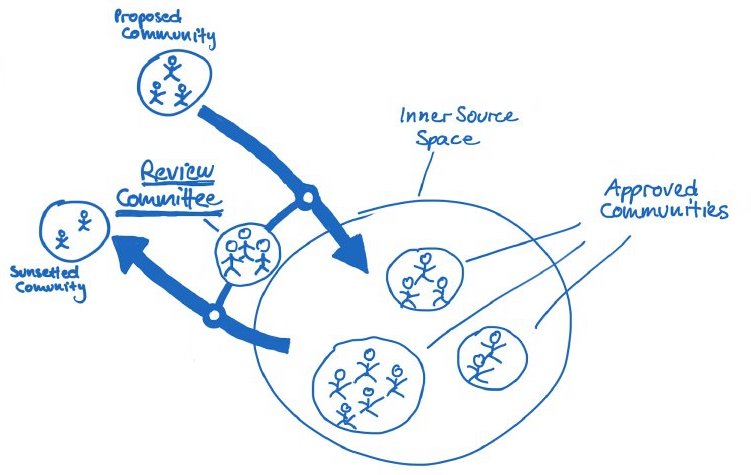

## Title

Comitê de Revisão

## Patlet

O Modelo de Trabalho InnerSource é uma ruptura radical das abordagens mais tradicionais, tanto para desenvolvedores quanto para gerentes. Ao estabelecer um Comitê de Revisão como uma interface entre a iniciativa InnerSource e todos os gerentes sêniores das unidades de negócios que participam dela, é mais provável que estes últimos se familiarizem com a iniciativa e a apoiem, uma vez que isso lhes proporciona um certo nível de supervisão e controle sem promover a microgestão.

## Problema

Os gerentes perceberão o Modelo de Trabalho InnerSource como uma ruptura radical dos modelos de trabalho aos quais estão acostumados e têm experiência. Como consequência, é provável que eles rejeitem ou façam uma microgestão da iniciativa InnerSource para tentar minimizar o risco percebido dessa mudança. Em ambos os casos, os benefícios do InnerSource não podem ser obtidos. Como resultado, o InnerSource é subsequentemente desacreditado.

## Contexto

A Empresa A deseja introduzir sua primeira iniciativa InnerSource. A maioria dos gerentes na Empresa A não está familiarizada com o modelo de trabalho de Código Aberto e, em vez disso, está acostumada com um estilo de gestão hierárquico e de controle de cima para baixo.

## Forças

- Quanto mais controle percebido um gerente tem sobre o trabalho na iniciativa InnerSource, mais provável é que ele ou ela apoie a iniciativa mesmo sem experiência prévia.
- Quanto menos experiência um gerente tem com o modelo de trabalho de Código Aberto, mais provável é que ele ou ela queira controlar o risco da iniciativa.
- Quanto mais rígidas e controladoras forem as iniciativas InnerSource gerenciadas, menos provável é que o modelo de trabalho de Código Aberto possa ser adotado na extensão necessária. Como resultado, os benefícios do InnerSource não serão obtidos.

## Solução

- Estabelecer um comitê de revisão composto por gerentes seniores de todas as unidades de negócios que participam da iniciativa InnerSource.
- Os membros do comitê de revisão têm a autoridade para decidir em grupo quais projetos InnerSource receberão suporte de forma geral e financiamento em particular.
- Os candidatos podem ser eleitos pelos membros do comitê de revisão antes das reuniões para apresentar seus projetos InnerSource propostos durante as reuniões do comitê de revisão para consideração.
- Os líderes de projetos InnerSource atualmente financiados pelo comitê de revisão são obrigados a relatar o status de seus projetos durante todas as reuniões do comitê de revisão.
- Os membros do comitê de revisão são obrigados a fornecer feedback construtivo tanto para novos candidatos quanto para os líderes de projetos atuais durante as reuniões do comitê de revisão.
- Cada projeto InnerSource deve ter a chance de reagir ao feedback recebido em uma sessão do comitê de revisão até a próxima sessão, a fim de evitar o encerramento prematuro do projeto.
- Um líder de projeto InnerSource também pode apresentar a proposta de encerramento por conta própria em uma reunião do comitê de revisão. O comitê de revisão então deve decidir se as unidades de negócios que utilizam o software precisam ter tempo para implementar medidas para garantir que o desenvolvimento e/ou manutenção do código continue até que uma solução alternativa para o desenvolvimento pela comunidade InnerSource seja encontrada (se for relevante para o negócio ou crítico para a missão).
- O comitê de revisão deve se reunir regularmente. Uma frequência de duas reuniões por ano tem se mostrado bem-sucedida.

## Contexto Resultante

- Os gerentes aplicam uma ferramenta com a qual estão familiarizados ao InnerSource para obter a quantidade necessária de informações e controle sobre o funcionamento interno da iniciativa InnerSource. Essa familiaridade tornará mais provável que eles aprovem a iniciativa InnerSource e concedam o grau necessário de liberdade para os projetos InnerSource.
- Os desenvolvedores ainda podem se auto-organizar até certo ponto. O microgerenciamento não ocorre porque o comitê de revisão se reúne com pouca frequência.

## Instâncias Conhecidas

* BIOS at Robert Bosch GmbH

## Estado

* Structured
* _Finalized and Reviewed_ as of 8/31/17.

## Autores

- Georg Grütter, Robert Bosch GmbH
- Diogo Fregonese, Robert Bosch GmbH

## Alias

Cheese Interface

## Histórico de Tradução

- **2022-08-20** - Tradução [Eneri Junior](https://github.com/jrcosta)
- **2022-08-20** - Tradução [Humberto Zilio](https://github.com/zilio)
