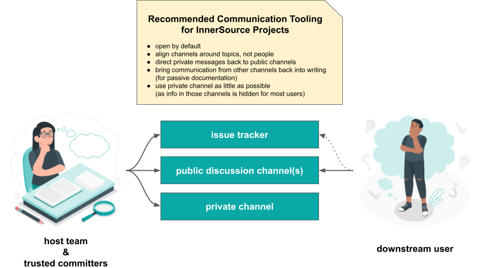

## Título

Ferramentas de Comunicação

## Patlet

Os usuários de um projeto InnerSource têm dificuldade em obter ajuda e entrar em contato com a equipe responsável pelo projeto.
Ao usar consistentemente ferramentas de comunicação assíncronas, o projeto torna as discussões visíveis, arquivadas e pesquisáveis, o que leva a um nível melhorado de suporte para os usuários.

## Problema

Uma equipe está aberta a receber contribuições dos usuários downstream do seu componente. A coordenação e comunicação acontecem de forma ad-hoc, levando a informações incoerentes sendo compartilhadas, atrasos nas respostas recebidas, e os contributors contatando múltiplos membros da equipe anfitriã antes de receberem uma resposta definitiva.

## Contexto

- Uma equipe depende do componente de outra equipe.
- Ela gostaria de fazer contribuições para esse componente.
- Mesmo quando a comunicação é feita por escrito, ela ocorre de forma individual.

## Forças

- A equipe anfitriã está interessada em receber contribuições e disposta a orientar os colaboradores.
- As equipes têm uma forte cultura de comunicação verbal e têm pouca experiência em configurar canais de comunicação assíncronos específicos do projeto.
- Os canais de comunicação podem estar alinhados a grupos específicos que devem ser alcançados, mas não por objetivo de comunicação específico.

## Solução

A equipe anfitriã deve fornecer canais de comunicação arquivados, pesquisáveis e vinculáveis ​​públicos da empresa, aos quais qualquer pessoa na empresa possa se inscrever, uma vez que existem benefícios mensuráveis ​​em apoiar canais de comunicação escritos e abertos.

O objetivo ao otimizar os canais de comunicação para projetos InnerSource deve ser alinhar a comunicação em torno de tópicos, não em torno de determinados grupos de pessoas.

Um projeto deve configurar as seguintes ferramentas de comunicação:

1. um **issue tracker dedicado** onde a comunicação estruturada, a tomada de decisões e o acompanhamento do progresso possam ocorrer de forma transparente para todos os membros da equipe anfitriã, mas também para os usuários e colaboradores downstream acompanharem. Para outras aplicações do issue tracker, consulte [Issue Tracker Use Cases](./issue-tracker.md).
2. **canal(is) de discussão pública** que possuem uma estrutura menos rígida. Normalmente, isso será listas de e-mails, fóruns on-line, sistemas de perguntas e respostas ou até mesmo canais de bate-papo arquivados. Geralmente, é suficiente começar com apenas um canal para o projeto. Se o tráfego aumentar demais, é útil separar as discussões sobre o uso do projeto das discussões sobre o desenvolvimento do projeto.
3. **um canal privado** onde a comunicação sobre tópicos sensíveis possa ocorrer entre [Trusted Committers](./trusted-committer.md) - por exemplo, adicionando mais Trusted Committers à equipe anfitriã. Esse canal deve ser usado com muito cuidado, de modo que a comunicação padrão seja aberta e seja mantida privada apenas em circunstâncias muito raras.

While communication can happen outside of those written channels, as much information as possible should be brought back to the asynchronous channels.

All communication channels should be documented in the project `README.md`. For more details on the use of this file see [Standard Base Documentation](./base-documentation.md).

Embora a comunicação possa ocorrer fora desses canais escritos, o máximo de informações possível deve ser trazido de volta para os canais assíncronos.

## Contexto Resultante

Configurar e utilizar consistentemente canais de comunicação assíncronos oficiais ajuda a criar um nível básico de [documentação passiva](https://www.oreilly.com/library/view/understanding-the-innersource/9781491986899/ch04.html) que pode ser referenciado novamente quando surgirem perguntas semelhantes no futuro.

Com a comunicação acontecendo em aberto, outros podem facilmente acompanhar o progresso do projeto e se envolver ativamente contribuindo. Outras pessoas observando e lendo reduzem a barreira para se envolver, aumentando a probabilidade de receber contribuições.

Com perguntas sendo respondidas em público, mais pessoas podem adicionar suas perspectivas levando a uma imagem completa - isso inclui não apenas membros da equipe anfitriã, mas também usuários do projeto.

Manter a comunicação em canais assíncronos permite que os participantes com diferentes horários - seja devido a fusos horários diferentes ou devido a rotinas diferentes, horários de reuniões ou rotinas de equipe - contribuam significativamente para o projeto.

Responder perguntas nesses canais significa que não apenas outros membros da equipe podem ouvir e fornecer informações adicionais, mas também significa que outros usuários com a mesma pergunta veem (ou mais tarde encontram) a resposta anterior, levando a uma menor necessidade de repetir explicações.

## Instâncias Conhecidas

* Europace AG
* Paypal Inc.
* Mercado Libre

## Autores

Isabel Drost-Fromm

## Reconhecimento

Sebastian Spier (for the visual)

## Estado

* Structured
* Drafted in December 2019.

## Créditos

[People](https://storyset.com/people) illustrations by Storyset

## Histórico de Tradução

- **2022-04-20** - Tradução [Eneri Junior](https://github.com/jrcosta)
- **2022-04-20** - Tradução [Humberto Zilio](https://github.com/zilio)
