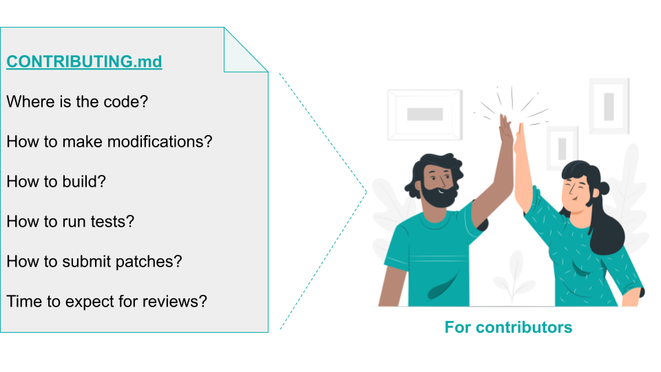

## Title

基准级的文档

## Patlet

内源项目的新贡献者很难搞清楚谁在维护这个项目，该做什么，以及如何贡献。在标准文件中提供文档，如`README.md`/`CONTRIBUTING.md`，可以为新的贡献者提供一个自助服务流程，这样他们就可以自己找到最常见问题的答案。

## 问题

一个团队希望与更广泛的组织分享一个新开始的或已经存在的项目，并接受对它的贡献。潜在的贡献者常常迷失。他们无法确定团队的首选沟通渠道。他们难以快速判断添加一个新功能是否有意义。他们很难了解到底哪些同事目前正在积极维护该项目。

## 上下文

一个项目要作为一个内源项目与他人分享。为了让其他人能够理解项目的内容以及如何做出贡献，项目需要提供一些基本的文件。到目前为止，该项目要么缺乏所有的文档，要么缺乏用户以自助服务的方式进行尝试以及贡献者快速上手所需的某些方面的内容。

## 约束

- 该项目最近才转为内源项目。以前，用户要么是内部的，要么是在个人面对面的会议上加入进来的。同样，从事项目的人员经历了入职培训，而这种入职培训并不能随着贡献者或远程贡献者人数的增加而扩大。因此，自助服务文档是缺乏的。
- 该项目是作为一个内源项目新创建的。然而，东道主团队缺乏内源的经验。因此，他们需要指导建议在文档中包括哪些信息，把文档放在哪里，以便其他人可以找到它，以及在文档中面向的是哪些类型的读者。
- 该项目是最近才转为内源项目的，东道主团队对内源的经验有限。因此，现有的文档解决了很多技术方面的问题。它不包括促进透明规划所需的沟通、协调和信息。
- 该项目是最近才转化为内源项目的。因此，很多存在于团队中的隐性知识既没有被写下来，也没有对贡献者可见。
- 文档的缺乏导致潜在的贡献者需要很长时间来设置环境和入门学习。制作文档（并保持更新）需要时间投资。即使东道主团队依靠贡献者的帮助来解决缺乏文档的问题，这些贡献仍然需要时间来评审。
- 项目成员要花大量的时间来回答入门问题。维护一个可以被认为是支持问题的综合数据库需要大量的时间和精力。
- 组织内的不同团队对于如何格式化源代码和使用何种软件模式有不同的标准。因此，贡献通常最后会被大幅修改甚至全部重写。将所有这些操作标准化并执行这些标准，需要大量的时间和工作。
- 重复解释和重写的额外工作削弱了内源方法的效用。
- 由于额外的工作和重写造成的延迟而频繁问题升级，导致了一个大奶酪的局面。

## 解决方案

解决为新的贡献者提供更清晰的文档的需求。创建此文档的目标应该是使入门尽可能成为一个自助服务的过程，用标准的文档格式来解答常见问问题。

### README.md

如果它还不存在，为你的项目创建一个`README.md`。它应该包含。

* [项目的使命](https://producingoss.com/en/producingoss.html#mission-statement)，格式要尽可能简洁。它应该回答发起项目的目的是什么，并使贡献者能够很好地初步猜测一个建议的功能是否可能在项目的范围内。
* 为项目的下游用户提供一个 "入门 指导"部分。它应该解释如何设置/整合项目的工程文件，以及为第一次使用的用户解释一些最初的典型操作步骤。
* 为项目用户提供更深层次的指导文档--或者是文档链接。
* 对项目进行修改所需的文档--或者是文档链接。
* 关于如何为项目做出贡献的文档--或者是文档链接。
* 一个 "参与 "部分，解释项目使用哪些公开的、存档的、可链接的交流渠道。这应该包括一个指向项目问题跟踪器的链接，但也包括任何进一步使用的讨论渠道。
* 一个 "我们是谁 "的部分，解释谁是项目背后的[Trusted Committer](./trusted-committer.md)--并解释应使用上述公共交流渠道而不是私下联系这些人进行交流。
* 解释项目将贡献者变成Trusted Committer的标准是什么--如果存在这种途径的话。

! [README.md](../../../assets/img/standard-base-documentation/README-for-users.png)

### CONTRIBUTING.md

如果对做出贡献的步骤的解释过于复杂，可以创建一个单独的`CONTRIBUTING.md`文档。这个文件应该回答贡献者过去经常问到的问题。没有必要预先提供全面的书籍。相反，分享已证实为贡献者所需要的信息。它可能会涉及到以下一个或多个主题。

* 如何从版本控制中签出项目的源代码。
* 如何对项目进行修改（可能包括编码指南方面的信息）。
* 如何构建项目。
* 如何运行测试以确保上述修改没有引入新的错误。
* 如何将你的修改提交给项目。
* 关于所作修改的预期周转时间的一些信息。

在各种开源项目中，有许多关于如何写 "README.md "和在 "CONTRIBUTING.md "文件中包含何种信息的好例子，
诸如[如何写好readme](https://m.dotdev.co/how-to-write-a-readme-that-rocks-bc29f279611a)的页面。
[来自GitHub的开源指南](https://opensource.guide/)以及[生产开源](https://producingoss.com/en/producingoss.html)
都有关于提供什么样的信息的宝贵信息。虽然《生产开源》一书中没有关于写好README本身的章节，但[入门章节](https://producingoss.com/en/producingoss.html#starting-from-what-you-have)确实提供了一份相当广泛的清单，列出了东道主团队成员、用户和贡献者需要的东西。InnerSource项目很可能不会从一开始就涵盖所有这些方面，该清单本身对于启发我们可以涵盖何种内容是有帮助的。

除此之外，这个模式还附带了两个非常基本的模板，可以让你马上开始。[README-template.md](../templates/README-template.md)和[CONTRIBUTING-template.md](../templates/CONTRIBUTING-template.md)

## 结果

* 贡献者上手的时间大大减少。
* 为[Trusted Committer](./trusted-committer.md)回答初始问题的时间大大减少，使他们有更多时间从事其他工作。
* 由于误解和错位导致的问题升级明显减少。

## 已知实例

* Europace AG - 见博文[InnerSource: Adding base documentation](https://tech.europace.de/post/innersource-base-documentation/)
* Paypal Inc.

## 作者

* Isabel Drost-Fromm

## 别名

通过README提供标准的基础文档

## 状态

* 结构化
* 于2019年12月起草。

## 参考

* [README-template.md](../templates/README-template.md) and
* [CONTRIBUTING-template.md](../templates/CONTRIBUTING-template.md)

## 致谢

[网络](https://storyset.com/web)和[人物](https://storyset.com/people)的插图由Storyset制作。

## 翻译校对

* **2022-12-21** 翻译[姜宁](https://github.com/willemjiang)
* **2022-12-31** 校对[孙振华](https://github.com/sunzhh02)
