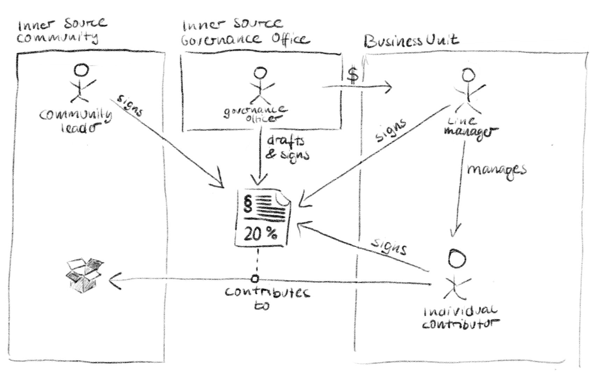

## Title

签约贡献者

## Patlet

想为内源做贡献的同事被他们的直线管理层劝阻。正式的合同和协议为这种困境提供援助。

## 问题

如果没有中层管理人员的支持，贡献者的总数以及由此产生的贡献量和内源计划产生的价值可能会低于高层管理人员的预期。
如果没有足够的资金和授权给[专职社群领袖](dedicated-community-leader.md)，这种情况可能会被放大。
这有可能导致高层管理人员放弃内源的想法。

## 背景

一家大型企业开始了一项内源计划。该计划的主要目标是提高分布式软件开发的效率，并通过允许每个员工自愿为内源项目做出贡献来促进创新，而不论其从事的领域和所在的业务部门。

最高管理层已经加入并支持内源计划。对他们来说内源计划只是促进创新和效率的众多计划中的一个。他们正在为内源提供资金和社群领导人的能力，并在很大程度上给予预算如何使用的自主权。
他们还限制了该计划的范围和持续时间，并参与定期评审，直到证明它产生了预期的结果（见[评审委员会](review-committee.md)）。
最高管理层已经在各种公司内部会议上宣布他们对 内源 的支持。

然而，高层管理人员还没有授权或激励中层管理人员允许或甚至激励他们的员工参与跨部门的内源活动。
除此之外，每个员工的工作时间通常都被分配给非 内源 项目，占到了100%。
跨组织合作尚未成为常态，部门经理通常没有自己组织以外的目标。
对内源项目的贡献应该是在工作时间内做出的，而不是在空闲时间。

## 约束

- 管理人员要对其业务部门的结果负责。让他们的员工参与内源活动，可能会花时间在他们的业务部门之外做出贡献，减少了他或她的为业务部门工作的时间。这将可能使管理人员更难达到或超过他们的目标。
- 部门经理和人力资源部门会默认其下属的表现是根据其业务部门的目标来判断的，而这些目标可能与内源社区的目标不一致。
- 部门经理认为自己的行政管理权限越小，他或她就越不可能让自己的员工参与内源活动，从而为另一个业务部门作出贡献。
- 部门经理对下属所做工作的透明度和控制力越低，就越不可能让她对外做出贡献。
- 内源工作的管理和组织越不正式，习惯于正式程序的部门经理就越不可能同意其员工对内源做出贡献。
- 一个员工花在非自己本职工作的内源项目上的时间越多，他的业务部门的队友的工作量就会增加。
- 个人贡献者可能会认为参与内源是一个机会，可以增强他们在公司内的专业网络，并获得她所贡献的技术领域的知识和经验。

## 解决方案

在贡献者、他们的部门经理、企业内统一资助和指导的内源治理办公室（ISGO）之间，建立一个正式的协议，让ISGO为履行协议落实贡献时间的业务部门提供补贴。

- 协议规定了员工在内源中工作时间的最大百分比。
- 协议中明确规定，贡献者所在业务单位的工作优先于内源的工作。
- 协议规定，不要求在内源中的工作时间达到合同中规定的最大百分比。
- 该协议由贡献者、贡献者的直接经理、治理办公室和贡献者将要贡献的社区的[专职的社群领导](dedicated-community-leader.md)签署。
- 治理办公室在贡献者和她的直接经理在贡献时间上发生冲突时提供调解。
- [专职的社群领导](dedicated-community-leader.md)对内源工作占比协议超过20%的贡献者，直接参与其绩效评估或为提供参考意见。

## 结果

一个正式的协议和统一资助的补贴，令人信服地传达了组织对内源倡议的支持，从而授权中层管理人员签署协议：

- 将公司资金配置到业务部门的开发能力补贴上，向直线经理们传递了这个信号：内源被组织认为是有价值的，已获得管理层的支持，直线经理们应该支持内源。
- 正式的签约贡献者协议表明，内源的工作得到了专业的管理并鼓励相互信任
- 一个正式的合同增加了透明度，并为业务部门和内源项目提供了一个更好的可用人力资源概述，从而减少 "超额预订/预算资源"的风险。

正式的合同对贡献者和社群也有好处。

- 有了一个稳定的贡献者群体，他们中的一些人更有可能最终获得 [Trusted Committer](./trusted-committer.md) 地位。
- 正式的协议为解决内源活动相关的冲突提供了一个基础。请注意，协议调解可能只适用在少数具有文化匹配的公司。

## 已知实例

- BIOS at Robert Bosch GmbH

## 状态

* 结构化

## 作者

- Georg Grütter (Robert Bosch GmbH)

## 致谢

- Diogo Fregonese (Robert Bosch GmbH)
- Robert Hansel (Robert Bosch GmbH)
- Jim Jagielski
- Tim Yao
- Cedric Williams
- Klaas-Jan Stol
- Padma Sudarsan
- Nick Stahl
- Ofer Hermoni
- Robert C. Hanmer

## 修改记录

- **2016-10-25** - 第一次评审
- **2017-05-09** - 返工
- **2017-09-08** - 第二次评审，最后修改和合并
- **2021-02-27** - 修复书中图案显示的问题

## 翻译校对

- **2022-12-06** 翻译[姜宁](https://github.com/willemjiang)
- **2022-12-31**校对 [陈泳](https://github.com/gzchenyong)
  